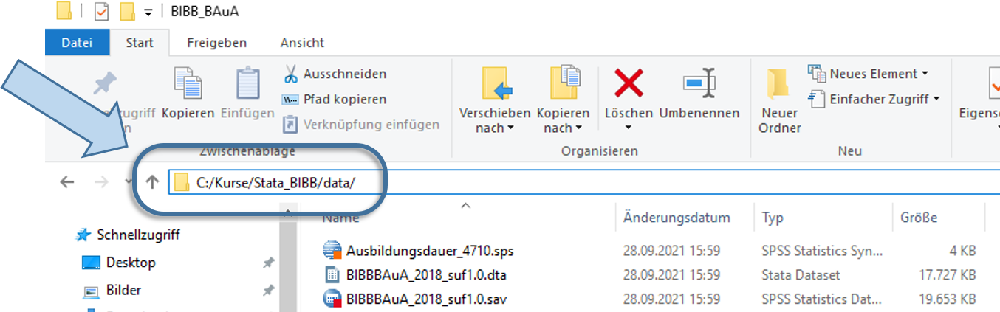

# Überblick zu Stata  {#stata}


```{r setup1, echo = F, message=F, warning = F}
if(Sys.getenv("USERNAME") == "Filser" ) .libPaths("D:/R-library4")  # set library
stataexe <- "C:/Program Files (x86)/Stata13/StataSE-64.exe"
# stataexe <- "C:/Program Files/Stata16/StataSE-64.exe"
knitr::opts_chunk$set(engine.path=list(stata=stataexe))
library(Statamarkdown)
library(tidyverse)
library(ggthemes)
```


Hier sehen wir die Startansicht von Stata:
```{r screenshot, fig.cap= "Startansicht Stata16", echo = F,out.width = "90%",fig.height= 4.5, fig.align="center"}
knitr::include_graphics("./pics/01_Stata_intro1.png")
```
Die Standardansicht von Stata besteht aus mehreren Fenstern:

  (1) Kommandos/Befehle
  (2) Ergebnisse
  (3) Variablenübersicht
  (4) Übersicht zu den geladenen Daten
  (5) Befehlshistorie


## Taschenrechner

In das Befehlsfeld (1) können wir Kommandos eingeben, z.B. eine Berechnung durchführen. Dazu geben wir zunächst den Befehl `display` und dann die gewünschte Rechnung ein und drücken dann Enter. Der Befehl wird dann im Ergebnisfenster gespiegelt und darunter das Ergebnis ausgegeben:

```{r screenshot_tr, echo = F,out.width = "90%",fig.height= 4.5, fig.align="center"}
knitr::include_graphics("./pics/01_Stata3_calc.png")
```

Wir können `display` auch mit `dis` abkürzen. 

## Darstellung in diesem Skript

Eingaben und Ergebnisse werden im weiteren Skript so dargestellt:
```{stata s_input, eval=FALSE}
display 3 + 12
```
```{stata s_input2, echo=F}
dis ""
display 3 + 12
```


```{stata s_input3, eval=FALSE}
display sqrt(9)
```

```{stata s_input4, echo=F}
dis ""
dis sqrt(9)
```

## DoFile Editor

Zwar funktioniert die direkte Eingabe in das Befehlsfeld, allerdings werden für Auswertungen sehr viel längere und komplexere Befehle und längere Befehlsfolgen verwendet. Für solche Anwendungen werden in Stata sog. DoFiles angelegt. Darin können Befehle entworfen und für eine spätere Verwendung abgespeichert werden. Um ein DoFile zu öffnen geben wir entweder `doedit` in das Befehlsfeld ein oder klicken auf das Feld "New Do-file-Editor" rechts oben:

```{r screenshot_dof_open, echo = F,out.width = "60%",fig.height= 4, fig.align="center"}
knitr::include_graphics("./pics/01_Stata_open_DOedit.png")
```
Es öffnet sich ein neues Fenster:
```{r screenshot_dof_opened, echo = F,out.width = "90%",fig.height= 4.5, fig.align="center"}

```
In diesem sog. Do-File-Editor können wir Befehle entwerfen. Wenn wir diese dann durchführen möchten, markieren wir die entsprechenden Zeilen und drücken **STRG + D**. Die ausgeführten Befehle werden wieder im Ergebnisfenster gespiegelt und jeweils darunter die Ergebnisse angezeigt:
```{r screenshot_dof_run, echo = F,out.width = "90%",fig.height= 4.5, fig.align="center"}
knitr::include_graphics("./pics/01_Stata7_dofile_routine.png")
```

Das DoFile können wir speichern, um es später wieder aufzurufen. Wichtig ist dabei, der gespeicherten Datei die Endung "`.do`" zu geben, also zum Beispiel "01_Einstieg.do". Diese DoFiles können dann einfach ausgetauscht werden, um später daran weiter zu arbeiten oder Analysen für Dritte nachvollziehbar zu machen.
```{r save1,echo = F, out.width = "60%",fig.height= 3, fig.align="center"}
knitr::include_graphics("./pics/01_Stata7_dofile_save.png")
```

## Datensätze laden

Das ist aber alles soweit sehr unspektulär - es gibt schönere und günstigere Taschenrechner als Stata. Die eigentliche Stärke von Stata ist die Analyse von Datensätzen. Diese müssen zunächst eingelesen werden. Im einfachsten Fall liegen die Daten als Stata-Datensatz (mit der Endung `.dta`) vor und wir können die Daten wie folgt einlesen:

```{stata readin, eval = F}
cd "C:/Kurse/Stata_BIBB/data/"
use "BIBBBAuA_2018_suf1.0.dta"
```

Der Einlesevorgang besteht also aus zwei Befehlen: zuerst geben wir `cd` den Pfad an, unter welchem der einzulesende Datensatz zu finden ist. Natürlich hängt der Dateipfad aber ganz davon ab, wo Sie den Datensatz gespeichert haben, hier ist es "C:/Kurse/Stata_BIBB/data/":

```{r,echo = F, out.height="80%",out.width="80%", fig.align="center"}
knitr::include_graphics("./pics/01_directory.png")
```
Um den Pfad des Ordners herauszufinden, klicken Sie bei Windows in die obere Adresszeile im Explorerfenster: 
```{r,echo = F, out.height="55%",out.width="65%", fig.align="center"}

```

:::note
In iOS (Mac) finden Sie den Pfad, indem Sie einmal mit der rechten Maustaste auf die Datei klicken und dann die ALT-Taste gedrückt halten. Dann sollte die Option "...als Pfadname kopieren" erscheinen. [**Youtube Anleitung**](https://www.youtube.com/watch?v=zcb3D6Xdv4s)
:::


Hat das funktioniert?   
Wir haben zwei Möglichkeiten zu das aktuelle Arbeitsverzeichnis überprüfen: wir sehen das aktuelle Arbeitsverzeichnis im Stata-Fenster links unten oder wir geben `pwd` ein:
```{r,echo = F, out.height="60%",out.width="60%", fig.align="center"}
knitr::include_graphics("./pics/01_Stata_directory.png")
```

Wir können diese beiden Schritte natürlich auch einfach kombinieren und den gesamten Pfad nach `use` angeben:
```{stata readin2, eval = F}
use "C:/Kurse/Stata_BIBB/data/BIBBBAuA_2018_suf1.0.dta"
```

Wenn das funktioniert hat, dann sehen wir im Fenster rechts eine Variablenübersicht:
```{r datensatz_eingelesen, echo = F,out.width = "90%",fig.height= 4, fig.align="center"}
knitr::include_graphics("./pics/01_Stata8_Datensatz.PNG")
```

## Daten, Codebücher, Fragebogen


Die Daten des hier geladenen Datensatzes enthalten die Angaben von 20012 Befragten der BIBB/BAuA-Erwerbstätigenbefragung 2018. Die BIBB/BAuA ist eine repräsentativbefragung von in Deutschland zu Arbeit und Beruf im Wandel und Erwerb und Verwertung beruflicher Qualifikation.

Das heißt, die hier geladenen Daten beruhen auf standardisierten Interviews. Derartige Datensätze werden in der Regel zusammen mit einem Codebuch, Methodenreport und dem Fragenkatalog veröffentlicht. Im Fragebogen der BIBB/BAuA 2018 finden wir den exakten Wortlaut der Fragen:

```{r Fragenb, echo = F,out.width = "90%",fig.height= 3, fig.align="center",dpi = 600}

```

Hier sind auch die Anweisungen an die Interviewenden vermerkt, z.B. dass die Vorgaben zum Schichtmodell zunächst nicht vorgelesen werden sollen. Außerdem werden im Methodenbericht weitere Variablen vorgestellt, die bereits im Datensatz enthalten sind, beispielsweise das Alter der Befragten, der Wohnort und die berufliche Stellung:

```{r 01methoden, echo = F,out.width = "90%",fig.height= 3, fig.align="center",dpi = 600}
knitr::include_graphics("./pics/01_methodenbericht.PNG")
```

Die Antworten der Befragten werden dann im Datensatz gesammelt. Dazu werden den Antworten in der Regel Zahlencodes zugewiesen (siehe die ganz linke Spalte im Fragebogen) und so abgelegt. Stata erlaubt dann in einem zweiten Schritt, dass diese Zahlen wieder mit Wertelabeln versehen werden - dazu kommen wir später. In diesem Datensatz entspricht dann jede Zeile einer befragten Person:
```{r codierung, echo = F,out.width = "100%",fig.height= 4, fig.align="center",dpi = 600}
knitr::include_graphics("./pics/01_Codierung_label.PNG")
```
In Fragebogendokumentation finden wir Kürzel links oben, welche die Variablennamen für den Datensatz angeben.

## Überblicksbefehle

Für eine erste Annäherung an die Daten helfen uns drei Überblicksbefehle:  `browse`, `describe` und `list`. Zur Erinnerung: wir haben den Datensatz geladen:

```{stata readin2x, eval = F}
cd "C:/Users/Andreas/Dokumente/Statistik/"
use "BIBBBAuA_2018_suf1.0.dta"
```

### `describe`
Mit `describe, short` bekommen wir einen Überblick zu den eingelesenen Daten:
```{stata desc1,eval = F}
describe, short
```
```{stata desc_actual, echo = F, collectcode=F}
set linesize 80
qui use "D:\Datenspeicher\BIBB_BAuA/BIBBBAuA_2018_suf1.0.dta", clear
describe, short
```
Hier wurde also ein Datensatz geladen, welcher 20012 Fälle/Zeilen (`obs`) und 683 Variablen/Spalten (`vars`) enthält. 
(Wir können den Befehl auch als `d,s` abkürzen)

Wir können den `describe` Befehl auch nutzen, um Informationen zu einer Variable zu erhalten. Dazu hängen wir einfach eine oder mehrere Variablen an `describe` an:
```{stata des_var, eval=FALSE}
describe F209
```

```{stata des_var1, echo = F, collectcode=F}
set linesize 80
qui use "D:\Datenspeicher\BIBB_BAuA/BIBBBAuA_2018_suf1.0.dta", clear
describe F209
```

Hier sehen wir also in der ersten Spalte nochmal den vollständigen Variablennamen, den Variablentypen (`storage type` - mehr dazu [hier](#var_types)) sowie - falls vorhanden - eine Beschreibung der Variable (`variable label`) sowie (ggf.) die Labels für Ausprägungen der Variable (`value label`).
Letztere können wir mit Hilfe von `labelbook` aufrufen (mehr zu Labels später):
```{stata des_var5_lab, eval=FALSE}
labelbook F209
```

```{stata des_var5_lab2, echo = F, collectcode=F}
set linesize 80
qui use "D:\Datenspeicher\BIBB_BAuA/BIBBBAuA_2018_suf1.0.dta", clear
labelbook F209
```

Wir können auch alle Variablen aufrufen, die mit `F209` beginnen, indem wir einen `*` einsetzen:
```{stata des_var5, eval=FALSE}
describe F209*
```

```{stata des_var5b, echo = F, collectcode=F}
set linesize 80
qui use "D:\Datenspeicher\BIBB_BAuA/BIBBBAuA_2018_suf1.0.dta", clear
describe F209*
```


### `browse`

Mit `browse` bekommen wir eine Ansicht des Datensatzes:
```{stata browse1, eval = F}
browse
```
```{r browse_window, echo = F,out.width = "90%",fig.height= 4.5, fig.align="center"}
knitr::include_graphics("./pics/01_Stata9_bro_Datensatz.png")
```

Wenn wir nur einige Variablen betrachten möchten, hängen wir diese einfach `browse` an:
```{stata browse2, eval = F}
browse intnr Bula gkpol Stib zpalter 
```
```{r browse_window2, echo = F,out.width = "90%",fig.height= 4.5, fig.align="center"}
knitr::include_graphics("./pics/01_Stata9_bro_Datensatz2.png")
```

Hier bekommen aber immer die gelabelte Ansicht - allerdings stehen dahinter Zahlenwerte. Die Labels helfen uns, deren Bedeutung zu verstehen. Wenn wir aber wie in den nächsten Tagen auch mit den Daten arbeiten wollen, dann beziehen sich diese Operationen immer auf die dahinterstehenden Zahlenwerte. Diese bekommen wir mit der Option `nolabel` (oft auch einfach als `nol` abgekürzt):

```{stata browse_nol, eval = F}
browse intnr Bula gkpol Stib zpalter , nolabel
```
```{r browse_window2_nol, echo = F,out.width = "90%",fig.height= 4.5, fig.align="center"}
knitr::include_graphics("./pics/01_Stata9_bro_Datensatz2_nol.png")
```

### `list`

`browse` eignet sich vor allem für größere Übersichten. Wenn wir nur einige wenige Fälle betrachten möchten, dann ist `list` eine gute Alternative, da der Output hier gleich im Ergebnisfenster (2) angezeigt wird. Die Funktionsweise von `list` ähnelt sich im Prinzip der von `browse`. Mit dem Zusatz `in 1/5` können wir die ersten 5 Zeilen anzeigen lassen (ansonsten würden alle 20012 Fälle angezeigt!):

```{stata list, eval=FALSE}
list intnr Bula gkpol Stib zpalter in 1/5
```
```{stata list1, eval = F, collectcode=F}
     | intnr     Bula     gkpol       Stib   zpalter |
     |-----------------------------------------------|
  1. |   260   Berlin   500.000   Selbstst        41 |
  2. |   361   Berlin   500.000   Angestel        51 |
  3. |   491   Berlin   500.000   Arbeiter        49 |
  4. |   690   Berlin   500.000    Beamter        63 |
  5. |   919   Berlin   500.000   Angestel        41 |
     |-----------------------------------------------|
```
 
Auch hier können wir wie bei `browse` die Zahlenwerte ohne die Labels anzeigen lassen, indem wir `, nolabel` anhängen:
 
```{stata list2, eval=FALSE}
list intnr Bula gkpol Stib zpalter in 1/5, nolabel
```
```{stata list4, eval = F, collectcode=F}
     | intnr   Bula   gkpol   Stib   zpalter |
     |---------------------------------------|
  1. |   260     11       7      4        41 |
  2. |   361     11       7      2        51 |
  3. |   491     11       7      1        49 |
  4. |   690     11       7      3        63 |
  5. |   919     11       7      2        41 |
     |---------------------------------------|
``` 
 
 
### `lookfor`

All diese Befehle setzen aber voraus, dass wir wissen, unter welchem Variablennamen die interessierende Information abgelegt wurde. Mit `lookfor "stichwort"` können wir den Datensatz nach einem Stichwort durchsuchen:
```{stata lookf, eval = F}
lookfor "schicht"
```
```{stata lookfb, echo = F}
set linesize 200
qui use "D:\Datenspeicher\BIBB_BAuA/BIBBBAuA_2018_suf1.0.dta", clear
lookfor "schicht"
```

Alternativ können wir auch in der Variablenübersicht mit Hilfe des Suchfelds nach Variablen suchen:
```{r variablen_suche, echo = F,out.width = "100%",fig.height= 2.5, fig.align="center"}
knitr::include_graphics("./pics/01_Stata8_Datensatz_suche2.PNG")
```


## Übungen 1 {#U1}

(@) Öffnen Sie Stata und öffnen Sie den DoFile Editor

(@) Führen Sie folgende (oder beliebige andere) Taschenrechneraufgaben mit Stata durch:
  + `2 * 4`
  + `2 / 8`
  + `2 ^ 2`   // (Potenz)
  + `sqrt(9)` // (Wurzel)

(@) Lesen Sie die Erwerbstätigenbefragung 2018 in Stata ein. Folgende Schritte helfen Ihnen dabei:
  + In welchem Arbeitsverzeichnis befindet sich Stata aktuell? Wo können Sie das erkennen? 
  + In welchem Ordner haben Sie den Erwerbstätigenbefragung Datensatz abgelegt? 
  + Navigieren Sie Stata mit `cd` in diesen Ordner, in dem der Datensatz abgelegt ist! 
  
(@) Nutzen Sie `describe` und `browse`, um sich einen Überblick über den Datensatz zu verschaffen.
(@) Wie viele Variablen und wie viele Fälle enthält der Datensatz?
(@) Unter welchem Variablennamen ist die Information abgelegt, ob der\*die Befrage  Kinder hat?
  + Nutzen Sie `lookfor` oder die Suchfunktion im Variablenfenster.
  + Lassen Sie sich die Informationen zur Variable mit `describe` anzeigen.
  + Wie heißt das angehängte Label? Inspizieren Sie es mit `labelbook`.
  + Lassen Sie sich diese Variable im Datenexplorer mit `browse` anzeigen.
  + Lassen Sie sich diese Variable mit den Zahlencodes (`nolabel`) anstatt der labels anzeigen.


## Profi-Übungen 1

Für alle, die noch etwas mehr machen möchten: 

+ Im zip-Ordner finden Sie auch eine SPSS-Version (.sav-Datei) der Erwerbstätigenbefragung 2018. Lesen Sie diese Dateiversion in Stata ein! (Siehe [weitere Anmerkungen](#otherfmts))


## Anhang 1


### Variablentypen {#var_types}

In Stata gibt es zwei Variablentypen:

+ Zahlenvariablentypen: `byte`,`int`,`long`,`float`,`double` - der Unterschiede zwischen diesen Variablentypen besteht vor allem in der Spannbreite der möglichen Werte: während `byte` Werte zwischen -127 und 100 annehmen kann, können in `long`  zwischen -2,147,483,647 2,147,483,620 (Stata verwaltet diese Typen in der Regel automatisch - für weitere Hinweise `help data_types`)
 
+ Textvariablen, sog. strings `strXX` - wobei `XX` die Zahl der (maximal) verwendeten Zeichen angibt
  
In der BIBB/BAuA Erwerbstätigenbefragung 2018 sind nur Zahlenvariablen enthalten.


### import anderer Dateiformate {#otherfmts}

Häufig liegen Datensätze nicht im `.dta`-Format vor, sondern beispielsweise als Excel-Tabelle (.xslx oder .xls), SPSS-Datei (.sav) oder als .csv-Datei.

Hierfür stehen alternative Importbefehle zur Verfügung:

+ `import excel` für Excel Tabellen
+ `import spss` für SPSS-Dateien
+ `import delimited` für csv-Dateien

Hier empfiehlt sich ein Blick in das Auswahlmenü unter File > Import:

```{r import_other, echo = F,out.width = "60%",fig.height= 3.5, fig.align="center"}
knitr::include_graphics("./pics/01_import_other.png")
```
Nach Klick auf das entsprechende Dateiformat öffnet sich ein Dialogfenster, in das die gewünschten Optionen eingetragen werden können. Sind alle Optionen wie gewünscht gesetzt, gibt es unten gibt es die Möglichkeit, den so zusammengestellten Befehl nicht nur durchzuführen, sondern auch zu kopieren (um ihn beispielsweise in ein DoFile einzufügen):
```{r import_other2, echo = F,out.width = "40%",fig.height= 3.5, fig.align="center"}
knitr::include_graphics("./pics/01_import_other_copy.png")
```
