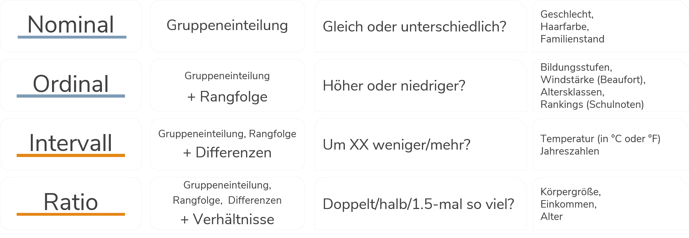

# Arbeiten mit Datensätzen in Stata {#Stata2} 

```{r setup2, echo = F, message=F, warning = F}
.libPaths("D:/R-library4")
knitr::opts_chunk$set(collapse = F)
library(Statamarkdown)
# # options(width = 200) # 157
stataexe <- "C:/Program Files (x86)/Stata13/StataSE-64.exe"
stataexe <- "C:/Program Files/Stata16/StataSE-64.exe"
knitr::opts_chunk$set(engine.path=list(stata=stataexe))
```

Nachdem wir uns in Stata etwas umgesehen haben, können wir uns jetzt dem eigentlichen Arbeiten mit Datensätzen zuwenden.
```{stata tab_su1, eval = F}
cd ....
use "BIBBBAuA_2018_suf1.0.dta"
```

## Befehlsstruktur

Ganz nebenbei haben wir in Kapitel 1 bereits die ersten Stata-Befehle verwendet. Bevor wir jetzt aber tiefer einsteigen nochmal einmal allgemein:

Die grundsätzliche Struktur von Stata-Kommandos ist immer `befehl variable, optionen`. Zunächst geben wir also immer an, was passieren soll - bisher war das eben zum Beispiel eine Auflistung (`list`) einiger Variable für einige Zeilen: 
```{stata scommand1, eval = F}
list intnr Bula gkpol Stib zpalter in 11/12
```
```{stata scommand2, eval = F}
     | intnr       Bula      gkpol       Stib   zpalter |
     |--------------------------------------------------|
 11. |  1562     Berlin    500.000   Angestel        31 |
 12. |  1955     Berlin    500.000   Angestel        58 |
```

Wie wir schon gesehen hatten, könen wir durch das Anhängen der Option `nolabel` die 'rohen' Zahlenwerte statt der beschrifteten Ausprägungen anfordern:
```{stata scommand3, eval = F}
list intnr Bula gkpol Stib zpalter in 11/12, nolabel
```
```{stata scommands4, eval = F}
     | intnr   Bula   gkpol   Stib   zpalter |
     |---------------------------------------|
 11. |  1562     11       7      2        31 |
 12. |  1955     11       7      2        58 |
```

### Zeilenumbrüche
Kommandos in Stata sind zeilenbasiert. D.h. alles was zu einem Kommando gehört, muss in der gleichen Zeile stehen. Umgekehrt wird auch alles, was in einer Zeile steht als Teil des Kommandos verstanden. Daher werden bei `list intnr Bula gkpol Stib zpalter in 11/15` auch nicht nur `intnr` sondern auch die anderen Variablen angezeigt.
Das funktioniert nicht:
```{stata rowbased2, eval = F}
list intnr Bula 
gkpol Stib zpalter in 11/12
```
> (Hier werden erstmal 20012 Zeilen von `intnr` und `Bula` ausgegeben)  

<span style="color:red">`command gkpol is unrecognized`</span>  
<span style="color:blue">`r(199);`</span>

Mit `///` können wir Zeilen verknüpfen:
```{stata rowbased3, eval = F}
list intnr Bula ///
gkpol Stib zpalter in 11/12 
```
```{stata rowbased3b, eval = F}
     | intnr   Bula   gkpol   Stib   zpalter |
     |---------------------------------------|
 11. |  1562     11       7      2        31 |
 12. |  1955     11       7      2        58 |
```

### Kommentare

Außerdem können wir mit `//` Kommentare in unsere DoFiles einfügen. `//` blendet  alles folgende am Ende der Zeile aus:
```{stata comment, eval = F}
list intnr Bula gkpol Stib zpalter in 11/15 // dies ist ein kommentar
```

`///` kann auch zum Kommentieren verwendet werden:
```{stata comment3, eval = F}
list intnr Bula /// hier kann ein kommentar stehen
gkpol Stib zpalter in 11/15 // hier geht es weiter, aber der Befehl endet mit dieser Zeile
```

Alternativ können wir mit `*` eine komplette Zeile 'deaktivieren':
```{stata comment4, eval = F}
*list intnr Bula gkpol Stib zpalter in 11/15 
```

So wird der Befehl ignoriert.

## Auszählen & Überblick erhalten

Mit `tabulate` bekommen wir eine Auszählung der Ausprägungen einer Variable, indem wir einfach den Variablennamen anhängen:
```{stata tab, eval = F}
tabulate S1
```

```{stata tabb, echo = F}
qui use "D:\Datenspeicher\BIBB_BAuA/BIBBBAuA_2018_suf1.0.dta", clear
tab S1
```
Wir sehen hier also, dass `S1` zwei Ausprägungen hat und der Datensatz 10074 Männer und 9938 Frauen enthält. `tabulate S1` kann auch mit `tab S1` abgekürzt werden.

Auch hier können wir mit `nolabel` die dahinterliegenden Zahlenwerte anzeigen lassen:
```{stata tab2, eval = F}
tabulate S1, nolabel
```

```{stata tabb2, echo = F}
qui use "D:\Datenspeicher\BIBB_BAuA/BIBBBAuA_2018_suf1.0.dta", clear
tab S1, nola
```

Für metrisch skalierte Variablen mit deutlich mehr Ausprägungen können wir `tabulate` zwar theoretisch auch verwenden, allerdings wird eine Tabelle hier sehr schnell sehr unübersichtlich:
(Zum Unterschied zwischen metrischen und kategorial skalierten Variablen kommen wir [gleich](#skalenn))
```{stata tab1, eval = F}
tabulate zpalter
```

```{stata tab1b, echo = F}
set linesize 80
qui use "D:\Datenspeicher\BIBB_BAuA/BIBBBAuA_2018_suf1.0.dta", clear
tab zpalter
```

Für metrische Variablen empfiehlt sich daher `summarize` als Überblicksbefehl:
```{stata su1, eval = F}
summarize zpalter
```
```{stata su1b, echo = F}
set linesize 80
qui use "D:\Datenspeicher\BIBB_BAuA/BIBBBAuA_2018_suf1.0.dta", clear
su zpalter
```
`summarize zpalter` kann auch mit `su zpalter` abgekürzt werden.
Hier bekommen wir die Anzahl der Beobachtungen (`Obs.`), das arithmetische Mittel (`Mean`), sowie die Minimal- und Maximalwerte ausgegeben (`Min`&`Max`). (zur Standardabweichung `Std. Dev.` kommen wir noch).

`summarize` klappt auch mit mehreren Variablen auf einmal (bei F518_SUF handelt es sich um den monatlichen Bruttoverdienst der Befragten):
```{stata su2, eval = F}
summarize zpalter F518_SUF // klappt auch mit mehreren Variablen
```
```{stata su2b, echo = F}
set linesize 80
qui use "D:\Datenspeicher\BIBB_BAuA/BIBBBAuA_2018_suf1.0.dta", clear
summarize zpalter F518_SUF // klappt auch mit mehreren Variablen
```

## Exkurs: Skalenniveau {#skalenn}

Im Zusammenhang mit Alter war gerade von metrischen Variablen die Rede. Dabei geht es um das sog. Skalenniveau von Variablen und Merkmalen.
Dabei geht es um den Informationsgehalt von Variablen: welche Informationen können wir aus einer Variable ablesen? 
Prinzipiell wird zwischen <span style="color:#7D9BB5">kategorialen</span> und <span style="color:#E38717">metrischen</span> Skalenniveaus unterschieden.
Der zentrale Unterschied besteht darin, dass bei kategorialen Variablen Zahlen_codes_ verwendet werden, wohingegen bei metrischen Variablen die Werte als tatsächliche Zahlenwerte interpretierbar sind. 
Innerhalb der kategorialen Merkmale wird wiederum zwischen nominaler und ordinaler Skalierung unterschieden, die metrischen Merkmale lassen sich in intervall- und ratio-skalierte Variablen unterscheiden.


```{r skal1, echo = F,out.width = "100%",fig.height= 2.5, fig.align="center"}

```

Sehen wir uns das einmal für die Variablen Geschlecht (`S1`), Schulbildung (`S3`), Geburtsjahr (`S2_j`) und Alter (`zpalter`) an:

```{stata skal_list, eval = F}
list S1 S3 S2_j zpalter in 1/5, nol
```

```{stata skal_list2, eval = F}
     +--------------------------+
     | S1   S3   S2_j   zpalter |
     |--------------------------|
  1. |  1    8   1976        41 |
  2. |  2    5   1966        51 |
  3. |  1    7   1968        49 |
  4. |  2    8   1954        63 |
  5. |  2    7   1976        41 |
     +--------------------------+
```


```{stata skal_list3, eval = F}
list S1 S3 S2_j zpalter in 1/5
```

```{stata skal_list4, eval = F}
     +--------------------------------------+
     |       S1         S3   S2_j   zpalter |
     |--------------------------------------|
  1. |  männlic   Abitur /   1976        41 |
  2. | weiblich   Realschu   1966        51 |
  3. |  männlic   Fachhoch   1968        49 |
  4. | weiblich   Abitur /   1954        63 |
  5. | weiblich   Fachhoch   1976        41 |
     +--------------------------------------+
```

**$\Rightarrow$ Skalenniveau bestimmt, ob `tabulate` oder `summarize` die passenden Befehle sind**


Literaturtipps:

+ S.18 *ff.* in [Diaz-Bone, R. (2019). Statistik für Soziologen (4. Auflage)](https://www.utb-studi-e-book.de/9783838550718)
+ S.12 *ff.* in [Bortz, J., & Schuster, C. (2010). Statistik für Human- und Sozialwissenschaftler (7. Auflage)](https://link.springer.com/book/10.1007/978-3-642-12770-0) (ausführliche formale Beschreibung)


## Fehlende Werte {#missv}

Wenn wir uns nochmal die Variable `zpalter` ansehen, dann fallen unrealistisch hohe Altersangaben ins Auge:

```{stata miss1, eval = F}
summarize zpalter
```
```{stata miss1b, echo = F}
set linesize 100
qui use "D:\Datenspeicher\BIBB_BAuA/BIBBBAuA_2018_suf1.0.dta", clear
su zpalter
```

Hier kann es sich natürlich nicht um Befragte mit einem Alter 9999 handeln, sondern aufgrund der fehlenden Angaben zum Geburtsdatum lässt sich für manche Befragte das Alter nicht generieren. Wie können wir das herausfinden? Beispielsweise erfahren wir mit `describe zpalter`, dass `ZPALTER` als Label für die Variable definiert ist und dieses Label mit dem Befehl `labelbook` aufrufen: 

```{stata mlab1, eval = F}
describe zpalter
labelbook  ZPALTER
```
```{stata mlab2, echo = F}
set linesize 80
qui use "D:\Datenspeicher\BIBB_BAuA/BIBBBAuA_2018_suf1.0.dta", clear
describe zpalter
labelbook  ZPALTER
```

Für Fälle ohne gültige Altersangabe wurde also 9999 als Wert in `zpalter` abgelegt. 
Stata berücksichtigt diese Tatsache aber noch nicht, wenn bspw. die Minimal- und Maximalwerte ausgegeben werden und zeigt daher 9999 als höchste Alterangaben an.  
Um das zu ändern müssen wir 9999 als *missing value* überschreiben. Diese *missing value*s werden in Stata mit `.` abgelegt und werden dann für die Berechnung von Minimal- und Maximalwerten usw. ausgeschlossen. Um also 9999 als `.` zu überschreiben, können wir zB auf den `replace` Befehl zurückgreifen:

```{stata miss2, eval = F}
summarize zpalter
replace zpalter = . if zpalter == 9999
summarize zpalter
```
```{stata miss2b, echo = F}
set linesize 80
qui use "D:\Datenspeicher\BIBB_BAuA/BIBBBAuA_2018_suf1.0.dta", clear
su zpalter
replace zpalter = . if zpalter == 9999
su zpalter
```

Wir bekommen von Stata mitgeteilt, dass wir 176 Beobachtungen verändert und auf missing gesetzt haben. Im folgenden `summarize` werden diese fehlenden Werte dann ignoriert.

Ein Spezialbefehl für die Überschreibung von bestimmten Werten ist `mvdecode`. Mit `mvdecode` können wir `9999` in mehreren Variablen gleichzeitig als missing überschreiben. Zum Beispiel in `S2_j`, `F510` und `F511_j`:
```{stata miss3, eval = F}
mvdecode S2_j F510 F511_j, mv(9999)
```
```{stata miss3b, echo = F}
qui use "D:\Datenspeicher\BIBB_BAuA/BIBBBAuA_2018_suf1.0.dta", clear
 mvdecode S2_j F510 F511_j, mv(9999)
```
(`S2_j` enthält das Geburtsjahr, `F510` das Jahr, seit dem der\*die Befragte bem jetzigen Arbeitgeber beschäftigt ist und `F511_j` das Jahr, seit dem die aktuelle Tätigkeit ausgeübt wird.)

Wir können auch mit `/` einen Wertebereich angeben, der als Missing definiert werden soll, zB. für das Bundesland der Betriebsstätte:
```{stata miss8, eval = F}
mvdecode F233, mv(98/99)
```

```{stata miss9, echo = F}
qui use "D:\Datenspeicher\BIBB_BAuA/BIBBBAuA_2018_suf1.0.dta", clear
mvdecode F233, mv(98/99)
```

Mit `mdesc` bekommen wir eine Auszählung zu fehlenden Werten. `mdesc` ist allerdings kein Standard-Stata-Befehl, sondern muss extra installiert werden. Das ist allerdings kein größerer Aufwand:
```{stata miss4, eval = F}
ssc install mdesc
```
Anschließend können wir mit `mdesc` die Zahl der missings in `zpalter`, `S2_j`, `F510` und `F511_j` ausgeben lassen:
```{stata miss5, eval = F}
mdesc zpalter S2_j F510 F511_j
```
```{stata miss5b, echo = F, collectcode=F}
set linesize 80
qui use "D:\Datenspeicher\BIBB_BAuA/BIBBBAuA_2018_suf1.0.dta", clear
qui mvdecode zpalter S2_j F510 F511_j, mv(9999)
mdesc zpalter S2_j F510 F511_j 
```

Hinweis: welche Angaben als Missing definiert werden sollen, ist teilweise von der Frage ab, die beantwortet werden soll. Bspw. wurden oben alle uneindeutigen Angaben in `F233` zum Bundesland der Betriebsstätte als missing codiert. Je nach Fragestellung ist das eine mehr oder weniger gute Idee.

In `tabulate` können wir mit der Option `, missing` die fehlenden Werte anzeigen lassen:


<!-- *Hinweis:* In diesem Skript werden wir meistens die fehlenden Werte mit `keep` oder `drop` löschen. Dies geht häufig schneller und wir kommen schneller zum Rechnen. In der Praxis empfiehlt es sich aber, die Missings wirklich mit `.` zu kennzeichnen und mit `mdesc` genauer zu betrachten, bevor sie gänzlich aus dem Speicher gelöscht werden. -->

## if-Bedingung - nur manche Zeilen ansehen

Bisher haben wir uns immer auf den gesamten Datensatz bezogen.
Häufig möchten wir aber nur bestimmte Beobachtungen berücksichtigen. 
Mit durch Anhängen einer `if`-Bedingung können wir nur bestimmte Zeilen anzeigen lassen. Zum Beispiel können wir uns mit Hilfe einer `if`-Bedingung nur die 81-jährigen Befragten anzeigen lassen:
```{stata if1, eval = F}
list S1 S3 S2_j zpalter if zpalter == 81
```
```{stata if2, eval = F}
       +--------------------------------------+
       |       S1         S3   S2_j   zpalter |
       |--------------------------------------|
 5114. |  männlic   Abitur /   1936        81 |
 5179. |  männlic   Abitur /   1936        81 |
 6118. |  männlic   Realschu   1936        81 |
 9045. |  männlic   Abitur /   1936        81 |
10517. | weiblich   Hauptsch   1936        81 |
       +--------------------------------------+
```
Wichtig ist hier `==` - ein einfaches `=` wird in Stata für die Zuweisung von Werten verwendet wie wir noch sehen werden.
Für `if`-Bedingungen stehen uns die üblichen Operatoren zur Verfügung:
`>`, `<`, `==`, `>=`, `<=`, `!=` (ungleich)

Dementsprechend können wir so Befragte auswählen, die vor 1936 geboren wurden:
```{stata if3, eval = F}
list S1 S3 S2_j zpalter if S2_j < 1936
```

Das funktioniert auch mit anderen Befehlen, wie z.B. `tabulate` - so können wir beispielsweise auszählen, wie viele 81-jährige Frauen und Männer im Datensatz vorhanden sind:
```{stata if4, eval = F}
tab S1 if zpalter == 81
```

```{stata if5, echo = F, collectcode = F}
set linesize 80
qui use "D:\Datenspeicher\BIBB_BAuA/BIBBBAuA_2018_suf1.0.dta", clear
tab S1 if zpalter == 81
```
Wir sehen unter anderem an der Fallzahl (Total) in dieser Tabelle, dass hier nicht alle Fälle aus dem Datensatz berücksichtigt werden.


Wir können auch mehrere Bedingungen setzen. Sollen beide zutreffen, verbinden wir die Bedingungen mit `&` - zB. wenn wir 81-jährige Befragte mit einem Bruttoverdienst von unter 1000 Euro auswählen möchten:
```{stata if6, eval = F}
list S1 if zpalter > 81 & F518_SUF < 1000
```

Mit `|` können wir hingegen Fälle auswählen, für welche die ein *oder* die andere Bedingung zutrifft:
```{stata if7, eval = F}
tab S1 if zpalter == 81 | inc < 1000 // 81 Jahre alt oder unter 1000EUR Einkommen
```

Mit `inrange` können wir Auswahlen auf einen Wertebereich eingrenzen - d.h. diese beiden Auswahlen führen zum gleichen Ergebnis (nur Befragte, die zwischen 20 und 30 Jahre alt sind):
```{stata tabif1, eval = F}
tab S1 if zpalter >= 20 & zpalter <= 30
tab S1 if inrange(zpalter,20,30)
```

Mit `inlist` können wir spezifische Werte angeben und so lange Folgen von `|` vermeiden:
```{stata browseif, eval = F}
browse S1 Bula if zpalter == 15 | zpalter == 79 | zpalter == 80 | zpalter == 82 
browse S1 Bula if inlist(zpalter,15,79,80,82)
```


### if-Bedingungen und fehlende Werte {#miss_if}

Eine häufige Fehlerquelle bei fehlende Werten in Stata ist deren Verhältnis zu `>`. 
Fehlende Werte werden nämlich von Stata als "unendlich groß" gewertet! 
Wenn wir uns Befragte mit einem Alter über 92 ausgeben lassen, dann bekommen wir auch diejenigen ohne Altersangabe ausgegegeben:

```{stata list_if, eval = F}
list S1 S3 zpalter if zpalter > 81
```
```{stata list_if2, eval = F}
       +-------------------------------+
       |       S1         S3   zpalter |
       |-------------------------------|
   39. | weiblich   Abitur /         . |
  514. | weiblich   Abitur /        83 |
  657. |  männlic   Hauptsch         . |
  823. | weiblich   Realschu         . |
  982. | weiblich   keine An         . |
       |-------------------------------|
       |      150 weitere Zeilen       |
```

Es gibt zwei Möglichkeiten, dies zu umgehen: 

+ entweder wir verwenden `inrange` - wobei wir hier eine Obergrenze angeben müssen und außerdem die Untergrenze immer mit eingeschlossen wird. Wenn wir also nur Fälle sehen wollen, die *älter* als 81 sind, dann müssen wir einen Wert über 81 angeben:
```{stata list_if3, eval = F}
list S1 Bula zpalter if inrange(zpalter,81.5,100)
```

+ oder wir hängen den `missing()`-Operator an die Bedingung an. Wenn wir diesen mit Hilfe eines `!` verneinen, bekommen wir nur nicht-fehlende Fälle ausgegeben:
```{stata list_if5, eval = F}
list S1 Bula zpalter if zpalter > 81 & !missing(zpalter)
```

Beide Befehle führen zum gleichen Ergebnis:
```{stata list_if6, eval = F}
       +-------------------------------+
       |       S1       Bula   zpalter |
       |-------------------------------|
  514. | weiblich    Hamburg        83 |
 6438. |  männlic   Nordrhei        82 |
11786. |  männlic     Berlin        87 |
       +-------------------------------+
```

### if-Bedingungen & Labels 

Genauso könnten wir auch vorgehen wenn wir nur männliche oder weibliche Befragte im Datensatz behalten möchten. Hier nochmal die Auszählung der Variable `S1`:
```{stata tab3, eval = F}
tabulate S1
```

```{stata tab3b, echo = F, collectcode=F}
qui use "D:\Datenspeicher\BIBB_BAuA/BIBBBAuA_2018_suf1.0.dta", clear
tab S1
```

Allerdings sind `MANN` und `FRAU` lediglich *Variablenlabels*. D.h. hier wurden Zahlencodes wieder mit Beschreibungen assoziiert. Wir können diese Labels nicht für `if`-Bedingungen verwenden:
```{stata if_lab, eval = F}
tab S1 if S1 == "weiblich"
```
<span style="color:red">`type mismatch`</span>  
<span style="color:blue">`r(109);`</span>

Im Hintergrund ist `S1` nämlich eine numerische Variable
```{stata if_lab2, eval = F}
describe S1
```
```{stata if_lab2b, echo = F, collectcode=F}
set linesize 90
qui use "D:\Datenspeicher\BIBB_BAuA/BIBBBAuA_2018_suf1.0.dta", clear
describe S1
```
Unter `value label` sehen wir, dass hier das Label `S1` angefügt wurde.

Wir können die eigentlichen Werte in `tabulate` mit der Option `,nol` ausblenden: 
```{stata if_lab3, eval = F}
tabulate S1, nol
```
```{stata if_lab3b, echo = F, collectcode=F}
qui use "D:\Datenspeicher\BIBB_BAuA/BIBBBAuA_2018_suf1.0.dta", clear
tabulate S1,nol
```
Wenn wir also nach Frauen filtern möchten, müssen wir den entsprechenden Zahlencode angeben:

```{stata keep_l3, eval = F}
tab S1 if S1 == 2
```

```{stata keep_l4, echo = F, collectcode=F}
qui use "D:\Datenspeicher\BIBB_BAuA/BIBBBAuA_2018_suf1.0.dta", clear
tabulate S1 if S1 == 2
```


Mehr zu labels [hier](#adva)

## keep & drop: Fälle dauerhaft löschen

Manchmal möchten wir nur bestimmte Beobachtungen im Datensatz behalten. Beispielsweise möchten wir für eine Analyse nur Befragte, die jünger als 30 Jahre sind, im Datensatz behalten. Dazu können wir `keep` oder `drop` die gewünschten Fälle behalten bzw. die ungewünschten ausschließen:
```{stata keep, eval = F}
keep if zpalter < 30
```
Alternativ können wir auch mit `drop` alle Befragten aus dem Datensatz löschen, die 60 Jahre oder älter sind:
```{stata drop, eval = F}
drop if zpalter >= 30
```

Mit `describe, short` sehen wir, dass wir jetzt deutlich weniger Fälle im Speicher haben:
```{stata dropdesc1, eval = F}
describe, short
```
```{stata dropdesc, echo = F}
qui use "D:\Datenspeicher\BIBB_BAuA/BIBBBAuA_2018_suf1.0.dta", clear
qui drop if zpalter >= 30
describe, short
```


## Nochmal von vorne: Daten neu laden

Fälle gelöscht, die doch nötig ist? Missings falsch codiert? Das ist zwar ärgerlich, aber ein riesen Vorteil der DoFile-basierten Datenarbeit mit Stata ist die Reproduzierbarkeit. Wir können einfach nochmal von vorne anfangen. Dazu lesen wir die Original-Daten einfach erneut mit `use` ein. Allerdings ist dann eine Besonderheit zu beachten:

```{stata re_use, eval = F}
use "BIBBBAuA_2018_suf1.0.dta"
```

`no; dataset in memory has changed since last saved`

Wir müssen erst den existierenden Datensatz mit `clear` löschen 
```{stata, eval = F, echo =T }
clear
use "BIBBBAuA_2018_suf1.0.dta"
```
oder die `clear` Option für `use` verwenden:
```{stata, eval = F, echo =T }
use "BIBBBAuA_2018_suf1.0.dta", clear
```

## Speichern

Natürlich können wir unsere Daten auch abspeichern, wenn alles wie gewünscht geklappt hat. Dafür gibt es den Befehl `save`, der analog zu `use` funktioniert. Wenn wir allerdings einfach wieder den Original-Datensatznamen angeben und in der Zwischenzeit Variablen erstellt oder gelöscht haben, dann bekommen wir folgende Fehlermeldung:

```{stata, eval = F}
cd ... 
save "BIBBBAuA_2018_suf1.0.dta"
```
<span style="color:red">`file BIBBBAuA_2018_suf1.0.dta already exists`</span>  
<span style="color:blue">`r(602);`</span>

Wir geben also entweder einen anderen Dateinamen an:
```{stata, eval = F}
save "BIBBBAuA_2018_suf1.0_NEU.dta"
```
Wir können aber auch mit der Option `replace` explizit mitteilen, dass die Datei überschrieben werden soll:
```{stata, eval = F}
save "BIBBBAuA_2018_suf1.0.dta", replace
```
**Achtung:** Damit sind die Originaldaten aber natürlich weg.

## Übungen 2

(@) Laden Sie die Erwerbstätigenbefragung in Stata. 

(@) Die Variable `gkpol` beinhaltet die Größenklasse der Wohngemeinde der Befragten in 7 Kategorien (bis 2000 Einwohner, 2000-5000 Einwohner, usw.)
      + Welches Skalenniveau hat die Variable? 
      + Sollten Sie dementsprechend eher `tabulate` oder `summarize` verwenden, um einen Überblick zu dieser Variable zu bekommen?
      + Lassen Sie sich die Zahlencodes anstelle der Labels anzeigen (`nolabel`)
      + Überschreiben Sie alle Codes für fehlende Angaben mit `.` (Denken Sie an [`labelbook`](#missv)).
      + Lassen Sie sich mit `tabulate` die Häufigkeitsauszählung erneut anzeigen. Hat sich die Fallzahl vorhin verändert?
      + Wie können Sie die fehlenden Werte auch in `tabulate` auszählen lassen? Lassen Sie sich diese Auszählung anzeigen!
      + Lassen Sie sich eine Auszählung der Wohnortgröße lediglich für die weiblichen Befragten ausgeben (Geschlecht ist Variable `S1` erfasst). Denken Sie an die Unterscheidung zwischen Labels und Zahlenwerten.
      + Lassen Sie sich eine Auszählung der Wohnortgröße lediglich für die Befragte ausgeben, die zwischen 1960 und 1950 geboren sind.

(@) Die Variable `F1104` beinhaltet das Jahr des Schulabschlusses.
      + Welches Skalenniveau hat die Variable? 
      + Sollten Sie dementsprechend eher `tabulate` oder `summarize` verwenden, um einen Überblick zu dieser Variable zu bekommen?
      + Hat die Variable `F1104` Werte, die Sie mit `.` ersetzen sollten? (Denken Sie an [`labelbook`](#missv))
      + Führen Sie ggf. die Umcodierung der problematischen Werte auf `.` durch, um sie so Stata kenntlich zu machen.
      + Lassen Sie sich `F1104` erneut mit `summarize` oder `tabulate` anzeigen: hat alles geklappt wie es soll?
      + Für wie viele Befragte liegt kein Schulabschlussjahr vor? Nutzen Sie `mdesc`.
      + Sie wollen nun die Jahre für den Schulabschluss nur für Befragte ansehen, die aus Wohnorten unter - nutzen Sie passende `if`-Bedingung! (Geschlecht ist in Variable `S1` abgelegt)
      

(@) Kommentieren Sie ihre bisherigen Befehle mit `//`! Was haben Sie jeweils gemacht? Probieren Sie auch aus, mit `///` einen Befehl über mehrere Zeilen zu verteilen!

      + Wählen Sie alle Befragten aus, die nach 1960 geboren wurden und löschen Sie alle anderen aus dem Speicher. (Siehe Kap 1.8)
      + Wie viele Spalten hat der Datensatz nach dieser Veränderung? Wie viele Zeilen? 

<!-- Filter für fehlende Werte -> yborn Missings? -->

## Profi-Übungen 2

Für alle, die noch etwas mehr machen möchten: 

(@)  Laden Sie den Datensatz `Allbus2018` erneut in Stata. 
      + Behalten Sie nur die Befragten, die zwischen 1970 und 1980 geboren wurden im Speicher!
      + Wie hilft Ihnen `inrange` hier weiter? (Siehe Kap 1.8)
      


