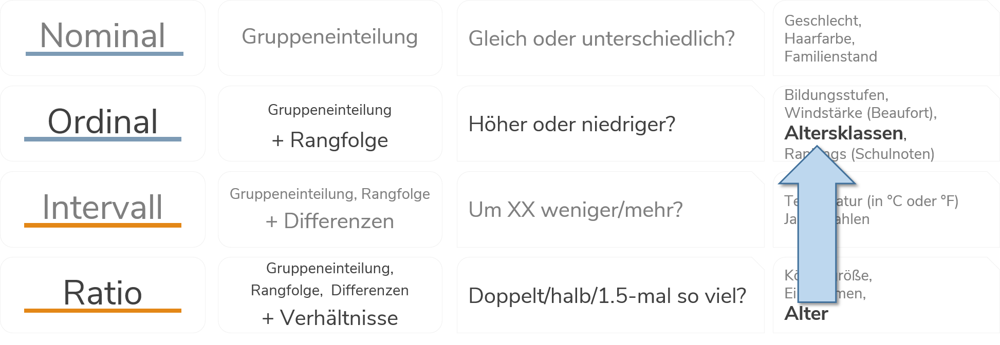

# Deskriptive Statistik {#desc1} 

```{r setup3, echo = F, message=F, warning = F}
.libPaths("D:/R-library4")
knitr::opts_chunk$set(collapse = TRUE)
knitr::opts_chunk$set(dpi=800)
library(Statamarkdown)
library(tidyverse)
library(kableExtra)
stataexe <- "C:/Program Files (x86)/Stata13/StataSE-64.exe"
knitr::opts_chunk$set(engine.path=list(stata=stataexe))
baua <- readstata13::read.dta13("D:/Datenspeicher/BIBB_BAuA/BIBBBAuA_2018_suf1.0.dta",convert.factors = F)
```

## Metrische Variablen beschreiben 

Im vorherigen Kapitel bezog sich vor allem kategoriale Variablen (mit einer begrenzten Anzahl an Ausprägungen). Für ein metrisches Merkmal, wie zum Beispiel das Alter (`zpalter`) macht eine Häufigkeitstabelle wenig Sinn, da das Alter sehr viele Ausprägungen hat und eine Tabelle unübersichtlich wäre (es gibt insgesamt 71!).

### Exkurs: Klassen bilden
Um dieses Problem zu umgehen, könnten wir die Informationen in Klassen/Gruppen zusammenzufassen.
So transformieren eine metrische Variable in eine kategoriale, ordinale Variable:

```{r skal2, echo = F,out.width = "100%",fig.height= 2.5, fig.align="center"}

```

*Hier nur ein ganz kurzes Beispiel, in Kapitel 4 werden wir uns ausführlicher mit der Erstellung von Variablen in Stata beschäftigen.*
Für diese Transformation können wir in Stata den `egen`-Befehl nutzen. 
Um die Klassen zu bilden, nutzen wir `egen` zusammen mit der Funktion `cut()`. In `cut` geben wir die zu unterteilende Variable an, außerdem legen wir in `at()` die Grenzen fest. Die so generierten Werte legen wir in einer neuen Variable `age_cat` ab: 
```{stata age_cut, eval = F}
egen age_cat = cut(zpalter), at(15 18 35 60 100 ) label
```

```{stata age_cut2, echo = F}
qui use "D:\Datenspeicher\BIBB_BAuA/BIBBBAuA_2018_suf1.0.dta", clear
qui mvdecode zpalter, mv(9999)
egen age_cat = cut(zpalter), at(15 18 35 60 100 )  label
```

Für die neue, klassierte Variable können wir dann wieder mit `tabulate` eine Häufigkeitstabelle anfordern:
```{stata, eval = F}
tabulate age_cat
```
```{stata age_cut_tab, echo = F}
set linesize 80
qui use "D:\Datenspeicher\BIBB_BAuA/BIBBBAuA_2018_suf1.0.dta", clear
qui mvdecode zpalter, mv(9999)
qui egen age_cat = cut(zpalter), at(15 18 35 60 100 ) label
tabulate age_cat
```

Bspw. erkennen wir in dieser Tabelle, dass 69.85% der Befragten zwischen 35 und 59 Jahre alt sind (`Cum.` $\Rightarrow$ 86.79% sind bis zu 59 Jahre alt).
Allerdings geht uns dadurch sehr viel Information verloren: wir 'erkaufen' uns die Übersichtlichkeit durch einen Verlust an Präzision bzgl. der Altersangaben.

### Lage- und Konzentrationsmaße

Allerdings können metrische Variablen auch direkt Hilfe von Lage- und Konzentrationsmaßen beschrieben werden.
Klassische Lagemaße zur Beschreibung von metrischen Variablen sind bspw. Minimum und Maximum, das arithm. Mittel sowie der Median und Quantile. Auch hier haben wir bereits den wichtigsten Befehl kennen gelernt: `summarize` gibt uns einen ersten Überblick zur Verteilung einer metrischen Variable:

```{stata su1F, eval = F}
summarize zpalter
```

```{stata su1T, echo = F}
set linesize 80
qui use "D:\Datenspeicher\BIBB_BAuA/BIBBBAuA_2018_suf1.0.dta", clear
qui mvdecode zpalter, mv(9999)
summarize zpalter
```
Wir erfahren also, dass die Befragten im Mittel 47.19228 Jahre alt sind, die jüngsten Befragten 15 Jahre alt und ältesten Befragten sind 87 Jahre alt.

Mit der Option `,detail` bekommen wir eine deutlich umfangreichere Auskunft:
```{stata su2F, eval = F}
summarize zpalter, detail
```

```{stata su2T, echo = F}
set linesize 80
qui use "D:\Datenspeicher\BIBB_BAuA/BIBBBAuA_2018_suf1.0.dta", clear
qui mvdecode zpalter, mv(9999)
summarize zpalter, detail
```

Hier wird eine ganze Menge auf einmal angezeigt - die Kennzahlen sind dabei in drei Spalten organisiert: 

+ Aus der ersten Spalte erfahren wir die Quantile (`Percentiles`). Ein Quantil einer Verteilung trennt die Daten so in zwei Teile, dass `x`\% der Daten darunter und 100-`x`\% darüber liegen. Hier können wir zB ablesen, dass 25% der Befragten 38 Jahre oder jünger sind. 95% der Befragten sind <= 63 Jahre alt. Dementsprechend sind 5% der Befragten 63 Jahre oder älter. Die 50%-Grenze für das Alter (*der Median*) liegt bei 49 Jahren.[Mehr zu Perzentilen](#perc)

+ die zweite Spalte gibt uns jeweils die 4 kleinsten und größten Werte für das Alter aus: die 4 kleinsten Alterswerte sind jeweils 15,16,16,16 die größten Werte sind 81,82,83 und 87.

+ in der dritten Spalte bekommen wir eine Reihe weiterer Informationen:
  + die Zahl der Beobachtungen (`Obs`) und das arithmetische Mittel (`Mean`) [mehr zum arithm. Mittel](#mean)
  + die Streuung anhand der Standardabweichung (`Std. Dev.`) und Varianz (`Variance`) [mehr dazu](#variance)
  + sowie die Schiefe (`Skewness`) und Wölbung (`Kurtosis`) [mehr dazu](#sk_kur)


### `tabstat`

Häufig möchten wir aber vielleicht nur eine bestimmte Information. Dafür ist `tabstat` eine gute Lösung. Mit `tabstat` können wir eine ganze Reihe statistischer Kennzahlen für metrische/kontinuierliche Merkmale berechnen. Die Syntax hat dabei das folgende Format: `tabstat zpalter, s(*kennzahl*)`

Hier eine Übersicht der Kennzahlen:
```{r, ft.align = "center",message=F,warning=F, echo = F}
library(kableExtra)
opts <- options(knitr.kable.NA = "")

readxl::read_xlsx("03_tabstat.xlsx",sheet = 1) %>% 
  kable() %>% 
  kable_styling(bootstrap_options = "condensed", full_width = F,font_size = 9) %>% 
  column_spec(1,monospace = TRUE)
```

Hier ein Bespielbefehl für die Berechnung des arith. Mittels, des Medians, der Varianz und des Varianzkoeffizienten mit `tabstat`:
```{stata tabstatF, eval = F}
tabstat zpalter, s(mean median var cv)
```

```{stata tabstatT, echo = F}
set linesize 80
qui use "D:\Datenspeicher\BIBB_BAuA/BIBBBAuA_2018_suf1.0.dta", clear
qui mvdecode zpalter, mv(9999)
tabstat zpalter, s(mean median var cv)
```

Allerdings lassen sich mit `tabstat` nicht beliebige Quantil-Grenzen (nur für 5,10,25,50,75,90,95,99) berechnen, dafür können wir `centile` nutzen:
```{stata centileF, eval = F}
centile age, centile(35)
```

```{stata centileT, echo = F}
set linesize 80
qui use "D:\Datenspeicher\BIBB_BAuA/BIBBBAuA_2018_suf1.0.dta", clear
qui mvdecode zpalter, mv(9999)
centile zpalter, centile(35)
```
Aus den Angaben unter `Centile` erfahren wir, dass 35% der Befragten im Datensatz sind 44 Jahre alt oder jünger sind. Dementsprechend sind 65% der Befragten 44 Jahre oder älter.

### Kennzahlen vergleichen mit `tabstat` {#by_vgl}

Interessant sind diese Kennzahlen auch wieder erst im Vergleich zwischen Gruppen. Hierfür steht uns die `by()`-Option von `tabstat` zur Verfügung. Bspw. können wir die Altersangaben von Männern und Frauen vergleichen, indem wir in `tabstat` die Option `by(S1)` verwenden:

```{stata bytabstF, eval = F}
tabstat zpalter, s(mean median var cv) by(S1)
```
```{stata bytabstT, echo = F}
set linesize 80
qui use "D:\Datenspeicher\BIBB_BAuA/BIBBBAuA_2018_suf1.0.dta", clear
qui mvdecode zpalter, mv(9999)
tabstat zpalter, s(mean median var cv) by(S1)
```

Wir sehen hier also, dass sowohl das arith. Mittel als auch der Median des Befragtenalters bei Frauen höher ist als bei Männern. Außerdem ist die Streuung bei Männern höher als bei Frauen.

Eine andere Option ist es, auf den `if`-Befehl zurückzugreifen - siehe [hier](#if_vgl)


### Streuungsmaße: Varianz, Standardabweichung, Variationskoeffizient {#streu}

Streuungsmaße helfen uns zu beurteilen, wie groß die Unterschiede in unseren Daten sind. Je größer das Streuungsmaß, desto mehr Unterschiede gibt es zwischen den beobachteten Werten.

Die häufigste Kennzahl zur Beschreibung von Streuung ist aber die **Varianz**. Die Varianz ist definiert als die durchschnittliche quadrierte Abweichung vom arith. Mittel: $$var(x) = \frac{\sum_{i=1}^{n} (x_{i}-\bar{x})^2}{n}$$    
[Was bedeutet diese Formel?](#variance)    

Wir können die Varianz mit `tabstat , s(var)` berechnen:
```{stata varF, eval = F}
tabstat zpalter, s(var)
```
```{stata varT, echo = F}
set linesize 80
qui use "D:\Datenspeicher\BIBB_BAuA/BIBBBAuA_2018_suf1.0.dta", clear
qui mvdecode zpalter, mv(9999)
tabstat zpalter, s(var)
```
```{r, echo = F}
var <- var(baua$zpalter[baua$zpalter<100])
```

In unseren Datensatz beträgt der Varianz des Alters also `r format(var,big.mark = ".",decimal.mark = ",")` Jahre². Auf der Varianz beruhen noch zwei weitere Streuungsmaße. Die **Standardabweichung** entspricht der Wurzel der Varianz und hat somit die gleiche Maßeinheit wie die Variable (hier also Jahre): 
```{stata std2, echo=T}
dis sqrt(128.5417)
```
Wir können die Standardabweichung auch mit `tabstat , s(sd)` berechnen:
```{stata stdF, eval = F}
tabstat zpalter, s(sd)
```
```{stata stdT, echo = F}
set linesize 80
qui use "D:\Datenspeicher\BIBB_BAuA/BIBBBAuA_2018_suf1.0.dta", clear
qui mvdecode zpalter, mv(9999)
tabstat zpalter, s(sd)
```

Der **Variationskoeffizient**  entspricht `sd`/`mean` und dient dem Vergleich verschiedener Streuungen relativ zum jeweiligen Mittelwert, `tabstat , s(cv)` übernimmt die Berechnung für uns:
```{stata cvF, eval = F}
tabstat zpalter, s(cv)
```
```{stata cvT, echo = F}
set linesize 80
qui use "D:\Datenspeicher\BIBB_BAuA/BIBBBAuA_2018_suf1.0.dta", clear
qui mvdecode zpalter, mv(9999)
tabstat zpalter, s(cv)
```

Somit können wir bspw. mit Hilfe von `,by(S1)` die Streuung des Alters bei männlichen und weiblichen Befragten vergleichen:
```{stata cvF2, eval = F}
tabstat zpalter, s(cv) by(S1)
```

```{stata cvT2, echo = F}
set linesize 80
qui use "D:\Datenspeicher\BIBB_BAuA/BIBBBAuA_2018_suf1.0.dta", clear
qui mvdecode zpalter, mv(9999)
tabstat zpalter, s(cv) by(S1)
```

***

> $\Rightarrow$ Für welches Geschlecht ist die Streuung also größer?[^034]

***


[^034]: Da der Variationskoeffizient für Männer mit `0.2554795` etwas größer ist als für Frauen (`0.2236982`), ist die Streuung bei den Männern etwas größer.


### Gini-Koeffizient {#gini}

Zur Beschreibung der (Ungleich-)Verteilung von metrischen Variablen, insbesondere bei Einkommens- und Vermögensdaten wird häufig der Gini-Koeffizient verwendet. Der Gini-Koeffizient beruht auf der Fläche zwischen der Lorenzkurve und der Gleichverteilung. Auf der x-Achse werden die kumulierten Perzentile der Befragten abgetragen, auf der y-Achse die Perzentile des HH-Einkommens:


```{r gini_plot1, echo=F, warning=F, message=F, out.height="75%", out.width="75%", fig.align="center"}
gdf2 <- 
  data.frame(id = 1:5) %>% 
  mutate(eq = 1, ineq = id/5*5/3, w = 6-id ) %>% 
  mutate(across( matches("eq"), ~ cumsum(.x),.names = "{col}_{fn}")) %>% 
  uncount(w,.id = "x") %>% 
  mutate(eq2 = ifelse(lead(id)==id | id == 5,NA,eq_1))

  gdf2 %>% 
  ggplot(.,aes(x = 6-x,y = ineq)) +
  geom_col(color = "grey25", aes(fill = factor(id,levels=5:1))) +
  geom_line(data = data.frame(x=1:5),  aes(y = 1:5,x=1:5), color = "#EEDA9DFF", size = .5) +
  geom_point(data = data.frame(x=1:5),  aes(y = 1:5,x=1:5), fill = "#EEDA9DFF", size = 3, shape= 21, color = "grey25", stroke = .25)+
  geom_text(aes(label = id,y = ineq_1-ineq/2, color = factor(id,levels=5:1) )) + 
    scale_x_continuous(breaks = 1:5, labels = c("kleinster","2.kleinster","3","zweitgrößter","größter")) +
    scale_y_continuous(breaks = 0:5, labels = paste0(seq(0,100,20),"%") ) +
    scale_fill_manual(values = paletteer::palettes_d$dutchmasters$pearl_earring[2:6]) +
    scale_color_manual(values = c("grey25","grey25","grey98","grey25","grey25")) +
    guides(fill = "none", color = "none") +
    labs(y = "Anteil am Gesamtwert", x = "Sortierte Beobachtungen") +
    theme_minimal(base_size = 11) +
    theme(panel.grid.major.x = element_blank(),panel.grid.minor.x = element_blank())
```

```{r gini_plot, echo=F, warning=F, message=F, out.height="75%", out.width="75%", fig.align="center"}
gdf <- baua %>% 
  mutate(across(F518_SUF,~ifelse(.x %in% 99998:99999,NA,.x)) ) %>%  
  select(intnr, F518_SUF) %>% 
  na.omit() %>% 
  arrange(F518_SUF) %>% 
  mutate(pct_id = 1:n()/n(),
         pct_di05 = cumsum(F518_SUF/sum(F518_SUF)),
         sampl = runif(n = nrow(.)))

gini_ann_df <- gdf %>% 
  filter(sampl<.0025, between(pct_id,.5,.6 ) ) %>% slice(1) %>%
  mutate(lab_lo = "Lorenzkurve", 
         labl = paste0("Lorenzkurve (aus Beobachtungen):\n\"",
                       round(pct_id*100,0),"% der Befragten verfügen über\n",
                       round(pct_di05*100,0),"% des gesamten HH-Einkommens\""),
         labl1 = paste0("(Theoretische) Diagonale:\n\"",
                       round(pct_id*100,0),"% der Befragten verfügen über\n",
                       round(pct_id*100,0),"% des gesamten HH-Einkommens\""),
         labl2 = "Gini Koeffizient:\nFläche zwischen Diagonale und Lorenzkurve\nim Verhältnis zu Fläche unter Lorenzkurve (weiß)\n(0=Gleichverteilung,1=Maximale Konzentration)")

ggplot(gdf, aes(x = pct_id, y = pct_di05)) + 
  geom_ribbon(aes(ymin = pct_di05, ymax = pct_id, xmin = pct_id, xmax = pct_id), fill = "#1BB6AF" ) +
  geom_line(aes(y = pct_id), linetype = 2, size = .95, color = "#172869") + # Diagonale
  geom_line(size = .5, color = "#9ED80B") + # Lorenzkurve
  geom_segment(data = gini_ann_df, aes(xend = pct_id, x = pct_id , y = 0, yend = pct_id), size = .35, linetype = 2) + # gestrichelte Linie
  geom_segment(data = gini_ann_df, aes(xend = pct_id, x = 0 , y = pct_id, yend = pct_id), size = .35, linetype = 2) + # gestrichelte Linie
  geom_segment(data = gini_ann_df, aes(xend = pct_id+.0035, x = pct_id+.05 , y = pct_di05- .15, yend = pct_di05-.0075), arrow = arrow(length = unit(.02,"npc"),type = "closed")) + # lorenzkurve pfeil
  geom_label(data = gini_ann_df, aes(label=labl,x = pct_id+.05, y = pct_di05- .15), hjust = 0, fontface = "italic", size = 3.2, 
             color = "grey25", fill = alpha("#9ED80B",.75)) + # lorenzkurve label
  geom_segment(data = gini_ann_df, aes(xend = pct_id, x = pct_id-.05 , y = pct_id + .3, yend = pct_id), arrow = arrow(length = unit(.02,"npc"),type = "closed")) + # diagonale pfeil
  geom_label(data = gini_ann_df, aes(label=labl1,x = pct_id-.05, y = pct_id + .3), hjust = 1, fontface = "italic", size = 3.2, 
             color = "grey95", fill = "#172869") + # diagonale label
  geom_segment(data = gini_ann_df, aes(y = .62, x = .03, xend = .4, yend = .3)) + # Fläche / Gini Linie
  geom_point(data = gini_ann_df, aes(y = .3, x = .4), shape = 15, size = 2.75) + # Fläche / Gini -> Rechteck statt Pfeil
  geom_label(data = gini_ann_df, aes(label=labl2,  y = .62, x = .025), hjust = 0, fontface = "italic", size = 3.2, 
             color = "grey15", fill = "#1BB6AF") + # Gini Label
  geom_point(data= filter(gdf,sampl<= 0.0151), size = 1.5, color = "#FF5300") +
  scale_x_continuous("Kumulierter Befragtenanteil", labels = scales::percent_format(accuracy = 1L)) +
  scale_y_continuous("Kumulierter Einkommensanteil", labels = scales::percent_format(accuracy = 1L)) +
  theme_minimal(base_size = 11) +
  coord_cartesian(x =c(0,1),y =c(0,1),expand = F)
```
Den Gini-Koeffizienten können wir mit `fastgini` berechnen, allerdings müssen wir diesen Befehl erst (einmalig) installieren:
```{stata giniF, eval = F}
ssc install fastgini
fastgini F518_SUF
```
```{stata giniT, echo = F}
set linesize 80
qui use "D:\Datenspeicher\BIBB_BAuA/BIBBBAuA_2018_suf1.0.dta", clear
qui mvdecode F518_SUF, mv(99998/99999)
fastgini F518_SUF
```

Leider funktioniert `by(S1)` bei `fastgini` nicht, wir müssen hier auf die Variante mit [`if`](#if_vgl) zurückgreifen:

```{stata gini2F, eval = F}
fastgini F518_SUF if S1 == 1
```
```{stata gini2T, echo = F}
set linesize 80
qui use "D:\Datenspeicher\BIBB_BAuA/BIBBBAuA_2018_suf1.0.dta", clear
qui mvdecode F518_SUF, mv(99998/99999)
fastgini F518_SUF if S1 == 1
```

```{stata gini3F, eval = F}
fastgini F518_SUF if S1 == 2
```
```{stata gini3T, echo = F}
set linesize 80
qui use "D:\Datenspeicher\BIBB_BAuA/BIBBBAuA_2018_suf1.0.dta", clear
qui mvdecode F518_SUF, mv(99998/99999)
fastgini F518_SUF if S1 == 2
```
$\Rightarrow$ *Wo sind die Haushaltseinkommen also ungleicher verteilt?*[^033]

[^033]: Der etwas höhere Wert des Gini-Koeffizienten legt nahe, dass die Haushaltseinkommen in den alten Bundesländern (`eastwest`=1) etwas stärker ungleich verteilt als in den neuen Bundesländern (`eastwest`=2).


Anmerkung: hier wurden die Missings in `di05` mit `mvdecode di05, mv(-50 -32 -7)` ausgeschlossen.


## Übungen 3

### Übung 3-1 {#met}  


(@) Laden Sie den Allbus 2018 (`Allbus2018.dta`). Vergleichen Sie die Einkommensangaben (`inc`) von Frauen und Männern!
    + Betrachten Sie die HH-Einkommensverteilungen mit `summarize` (Variable `inc`) 
    + Denken Sie daran, die negativen Werte für `inc` mit `.` zu überschreiben! (Entweder mit `replace` oder `mvdecode`, sehen Sie mit `labelbook` oder im Codebuch nach)
    + Berechnen Sie das arithm. Mittel, den Median, das 25%- und 75%-Quartil sowie die Varianz und den Variationskoeffizienten zunächst für alle Fälle - was sagen Ihnen die Werte jeweils?
    + Berechnen Sie nun alle Werte getrennt für Männer und Frauen (Variable `sex`) - welche Werte erhalten Sie jeweils für die Kennzahlen?
    + Vergleichen Sie die Werte!
    + Berechnen Sie den Gini-Koeffizenten! (Denken Sie daran, vor der ersten Verwendung `fastgini` zu installieren - siehe [hier](#gini))
    + Vergleichen Sie auch hier jeweils die Werte für Männer und Frauen!


+ Sie wollen nun die Jahre für den Schulabschluss nur für Befragte ansehen, die aus Wohnorten unter - nutzen Sie passende `if`-Bedingung! (Geschlecht ist in Variable `S1` abgelegt)
      + Wählen Sie alle Befragten aus, die nach 1960 geboren wurden und löschen Sie alle anderen aus dem Speicher. (Siehe Kap 1.8)
      + Wie viele Spalten hat der Datensatz nach dieser Veränderung? Wie viele Zeilen? 

## Weitere Übungen 3


Forschungsfrage: Vergleichen Sie die Haushaltseinkommensverteilung in Ost und West!

(@) Laden Sie den **kumulierten** Allbusdatensatz (`Allbus_1980-2018.dta`).
    + Fokussieren Sie zunächst auf das Befragungsjahr 1994 mit Hilfe von `keep if year == 1994` oder `drop if year != 1994`.
    + Betrachten Sie die HH-Einkommensverteilungen (Variable `di05`) 
    + Denken Sie daran, die negativen Werte für `di05` mit `.` zu überschreiben! (Entweder mit `replace` oder `mvdecode`, sehen Sie mit `labelbook` oder im Codebuch nach)
    + Berechnen Sie das arithm. Mittel, den Median, das 25%- und 75%-Quartil sowie die Varianz zunächst für alle Fälle aus dem Jahr 1994 - was sagen Ihnen die Werte jeweils?
    + Berechnen Sie nun alle Werte getrennt nach Ost und West (Variable `eastwest`) - welche Werte erhalten Sie jeweils für die Kennzahlen in Ost und West?
    + Berechnen Sie den Gini-Koeffizenten! (Denken Sie daran, vor der ersten Verwendung `fastgini` zu installieren - siehe [hier](#gini))
    + Vergleichen Sie auch hier jeweils die Werte für die neuen und alten Bundesländer!


(@) Laden Sie den Allbus 2018 (`Allbus2018.dta`). Erstellen Sie eine Kontingenztabelle für `sex` und `educ`. Welche Merkmalskombination ist die häufigste? Denken Sie daran, fehlende Werte auszuschließen.
    + Erstellen Sie für die folgenden Fragen jeweils die passende Variante der Kontingenztabelle mit relativen Häufigkeiten als  Zeilen- oder Spaltenprozenten. 
    + Welcher Anteil der Befragten mit Fachhochschulreife ist männlich?
    + Wie hoch ist der Anteil der Frauen an Befragten mit Hauptschulabschluss?
    + Welcher Anteil der Frauen hat Abitur (die allgemeine Hochschulreife)?
    + Wie hoch ist der Anteil der Realschulabsolventen an allen befragten Männern?

(@) Laden Sie den kumulierten Allbusdatensatz (`Allbus_1980-2018.dta`) in Stata und analysieren Sie, wie sich die Anteile der geschiedenen Befragten über die Befragungsjahre verändert haben!
    + Das Befragungsjahr finden Sie in der Variable `year`, `mstat` ist die Variable für den Familienstand.
    + Überschreiben Sie die Missings für `mstat`.
    + In welchem Jahr gab es den höchsten Anteil an geschiedenen Befragten? Sie können so eine Variable generieren, welche 1 annimt wenn `mstat` = 4 (geschieden) und 0 für alle andere Familienstände: `gen divorce = (mstat == 4)`
    + Aus welchem Jahr stammen die Angaben der meisten geschiedenen Befragten?
    + In welchem Jahr ist der Anteil der geschiedenen Befragten am höchsten?


## Anhang Kap 3

### Arithmetisches Mittel {#mean}

Das arithmetische Mittel wird häufig auch einfach als Durchschnitt bezeichnet:

$$\bar{x} = \frac{\sum_{i=1}^{n}{x_i}}{n}$$

Setzt metrische Daten (also mind. Intervallskalenniveau) voraus: wir interpretieren die Abstände zwischen den Werten.


### Median {#median}

+ Anordnung aller Werte einer Variable nach Größe
+ Da Rangfolge nötig: mindestens Ordinalskalenniveau
+ Median  ist mittlerer Wert dieser geordneten Variable (zentraler Wert)
+ 50% der Werte sind niedriger, 50% der Werte sind höher


### Perzentile erklärt {#perc}

+ Verallgemeinerung des Konzepts des Medians (auch: Quantile)
+ Ein p-Quantil teilt die Daten in zwei Teile, so dass mindestens ein Anteil p der Daten kleiner/ gleich und ein Anteil 1–p grösser/ gleich dem p-Quantils-Wert xp ist.
+ Die Ermittlung von p-Quantilen erfolgt analog zur Bestimmung des Medians (der Median entspricht dem 50%-Quantil).
+ Häufig verwendete Quantilsarten: Quartile (25%-, 50%-, 75%-Grenzen), Quintile (20%-, 40%-, 60%-, 80%-Grenzen), Dezile (10%,20%,30%,...)

+ Datensatz 1:  1,2,3,4,5
  + Mean: `r mean(1:5)`
  + Median: `r median(1:5)`
  + 20%-Perzentil: `r quantile(1:5,probs = .2,type = 1)` 
  
+ Datensatz 2:  1,2,3,4,10
  + Mean: `r mean( c(1:4,10))`
  + Median: `r median(c(1:4,10))`
  + 20%-Perzentil: 2


```{r percplot1, echo=F, warning=F, message=F, out.height="38%", out.width="100%", fig.align="center"}
m_df <-  data.frame(y= 1:5, y2 = c(1:4,10),id=1:5)
library(patchwork)
pp1 <- 
  m_df %>% 
  ggplot(aes(y=id,x=y)) +
  geom_col(color = "grey25", aes(fill = factor(id,levels=5:1))) +
  geom_segment(data=data.frame(x=3,y1=1.1,y2=4.9),size = 1,
               aes(xend=y2,x=y1,yend=3,y=3), color = "#48211A") + # median linie
  geom_segment(data=data.frame(y1=1.05,y2=4.9), size = 1, linetype = 2,
                aes(xend=y2,x=y1,yend=3,y=3), color = "orange") + # mean linie
  geom_label(data= data.frame(lab1="Median"), size = 3,
             aes(y=3.15,x=0,label=lab1),fill= "#48211A",color="grey96",label.size = 0,hjust=0,label.padding = unit(.3,"lines")) +  # median label
  geom_label(data= data.frame(lab1="arithm. Mittel"), size = 3,
               aes(y=3.15,x=4.1,label=lab1),fill= "orange",color="grey20",label.size = 0,hjust=0,label.padding = unit(.3,"lines")) + # mean label
  geom_segment(data=data.frame(x=2,y1=1.1,y2=4.9), size = 1,
               aes(xend=y2,x=y1,yend=2,y=2), color = "#376597") + #20% linie
  geom_label(data= data.frame(lab1="20% Perzentil"),size = 3,
             aes(y=1.65,x=3.5,label=lab1),fill= "#376597",color="grey96",label.size = 0,hjust=0,label.padding = unit(.3,"lines")) + # 20% label
  scale_fill_manual(values = paletteer::palettes_d$dutchmasters$milkmaid[6:13]) +
  scale_x_continuous(breaks = 1:5, labels = c("kleinster","2.kleinster","3","zweitgrößter","größter")) +
  labs(y = "Ausprägungwert", x = "Sortierte Beobachtungen", title = "") +
  guides(fill = "none", color = "none") +
  theme_minimal(base_size = 11) +
  coord_cartesian(ylim = c(0,10))+
  theme(panel.grid.major.x = element_blank(),panel.grid.minor.x = element_blank(),
        axis.text.x = element_text(size=rel(.5)))
  
  
pp2 <-  
  m_df %>% 
    ggplot(aes(y=y2,x=y)) +
    geom_col(color = "grey25", aes(fill = factor(id,levels=5:1))) +
    geom_segment(data=data.frame(y1=.95,y2=5.1), size = 1, 
                 aes(xend=y2,x=y1,yend=4,y=4), color = "orange") + # mean linie
    geom_segment(data=data.frame(x=3,y1=.95,y2=5.1),size = 1,
                 aes(xend=y2,x=y1,yend=3,y=3), color = "#48211A") + # median linie
    geom_segment(data=data.frame(x=2,y1=.95,y2=5.1), size = 1,
                 aes(xend=y2,x=y1,yend=2,y=2), color = "#376597") + #20% linie
    geom_label(data= data.frame(lab1="arithm. Mittel"),size = 3,
               aes(y=4.15,x=4.1,label=lab1),fill= "orange",color="grey20",
               label.size = 0,hjust=0,label.padding = unit(.3,"lines")) + # mean label
    geom_label(data= data.frame(lab1="Median"),size = 3,
               aes(y=3.15,x=0,label=lab1),fill= "#48211A",color="grey96",
               label.size = 0,hjust=0,label.padding = unit(.3,"lines")) + # median label
    geom_label(data= data.frame(lab1="20% Perzentil"),size = 3,
               aes(y=1.65,x=3.5,label=lab1),fill= "#376597",color="grey96",
               label.size = 0,hjust=0,label.padding = unit(.3,"lines")) + # 20% label
    scale_fill_manual(values = paletteer::palettes_d$dutchmasters$milkmaid[6:13]) +
    scale_x_continuous(breaks = 1:5, labels = c("kleinster","2.kleinster","3","zweitgrößter","größter")) +
    labs(y = "Ausprägungwert", x = "Sortierte Beobachtungen") +
    guides(fill = "none", color = "none") +
    theme_minimal(base_size = 11) +
    theme(panel.grid.major.x = element_blank(),panel.grid.minor.x = element_blank(),
        axis.text.x = element_text(size=rel(.5)))

pp1 + pp2 + plot_layout(ncol= 2)
```


### Varianz erklärt {#variance}
Die häufigste Kennzahl zur Beschreibung von Streuung ist aber die **Varianz**. Die Varianz ist definiert als die durchschnittliche quadrierte Abweichung vom arith. Mittel: $$var(x) = \frac{\sum_{i=1}^{n} (x_{i}-\bar{x})^2}{n}$$    


Schauen wir erst in den Zähler des Bruchs: $(x_{i}-\bar{x})^2$
Es geht also um die Abstände der einzelnen Datenpunkte ($x_{i}$) zum arithmetischen Mittel ($\bar{x}$) - mathematisch die Differenz zwischen den einzelnen Datenpunkten $x_{i}-\bar{x}$ - hier eingezeichnet als gestrichelte Linien:
```{r var_graph,dpi = 800, echo = F, out.height="70%", out.width="70%", fig.align="center"}
pfad <- "D:/Studium/01_Oldenburg/Lehre/Datensaetze/"
  a18 <- read.csv(paste0(pfad,"allbus_2018.csv"),sep = ";",stringsAsFactors = F,header=T)

eq <-  substitute(italic(bar(x))) # formel erstellen

a18 %>% 
  select(respid,age) %>% 
  filter(age > 0) %>% 
  na.omit() %>%  
  sample_n(30) %>% 
  select(respid, age) %>% 
  mutate(mean = mean(a18$age,na.rm = T), id = 1:n()) %>% 
  ggplot(.,aes(x = id, y = age)) +
  geom_segment(aes(yend= mean, xend = id ),
               size = .45, linetype = 2, color = "#1BB6AF") +
  geom_point(size = 1.95, color = "#172869") +
  geom_hline(aes(yintercept = mean), color = "#AF6125", size = .75) +
  geom_label(aes(x = min(id)-.75, y = mean, label = as.character(as.expression(eq))), label.size = .01, hjust = 0.5, color = "#AF6125", fill = "white", parse = T, size = 4.5) +
  guides(color = "none") +
  labs(y = "Alter", x = "") +
  theme_minimal(base_size = 13) +
  expand_limits(y = 15) +
  theme(axis.text.x = element_blank(), plot.caption = element_text(size = rel(.75)), plot.caption.position = "plot")
```
Für Punkte, die über dem arith. Mittel liegen, erhalten wir für die Differenz einen positiven Wert (wir ziehen ja jeweils das arith. Mittel vom Wert für den Datenpunkt ab). Für Punkte mit Werten, die kleiner als das arith. Mittel sind, erhalten wir einen negativen Wert.     
Würden wir die Abstände (gestrichelten Linien) einfach aufsummieren, erhielten wir als Ergebnis immer Null! Das arithmetische Mittel liegt ja per Definition immer genau "in der Mitte": die Abstände nach oben sind in der Summe genauso groß wie die Abstände nach unten. Daher wird zunächst jeder Abstand quadriert: $(\bar{x} - x_{i})^2$   
Der Rest der Formel gibt dann an, dass alle quadrierten Differenzen aufsummiert ($\sum_{i=1}^{n}$) und dann durch die Anzahl der Beobachtungen geteilt werden ($\frac{}{n}$)- zusammengefasst hier nochmal die Formel:  $$var(x) = \frac{\sum_{i=1}^{n} (x_{i}-\bar{x})^2}{n}$$

[Zurück zu Streuungsmaße](#streu)    

### Schiefe & Wölbung {#sk_kur}

Die Schiefe (skewness) ist ein Maß für die Asymmetrie einer Verteilung. Bei einer symmetrischen Verteilung beträgt die Schiefe 0. Ein negativer Wert für die Schiefe deutet darauf hin, dass Median > Mean und Verteilung wird als links-schief/rechts-steil bezeichnet. Bei einem positiven Wert der Schiefe ist Median < Mean und die Verteilung ist rechts-schief/links-steil. 


```{r skewplot1, echo=F, warning=F, message=F, out.height="25%", out.width="100%", fig.align="center"}
sk_df <-  
  data.frame(x= 1:10) %>%
  mutate(y1 = round(4/x*4)+ 2,
         y2 = round(4*x/4)+ 2,
         y3 = as.numeric(round(20 - abs(scale(x))*9.5)),
         y4 = 5) %>% 
  bind_rows(data.frame(x=0,y1=12,y2=2,y3=1,y4=5),
            data.frame(x=11,y1=2,y2=9,y3=1,y4=5)) 

skew1 <- 
  sk_df %>% 
  ggplot(aes(x=x,y=y2)) +
  geom_col(fill = paletteer::paletteer_d("dutchmasters::pearl_earring")[1]) +
  labs(title = "negative Schiefe (rechtssteil/linksschief)" ) + 
  theme_minimal(base_size = 11) +
  theme(panel.grid.major.x = element_blank(),panel.grid.minor.x = element_blank(),
        axis.title = element_blank(), axis.text = element_blank(),
        plot.title = element_text(hjust = .5, size = rel(.8)))
skew2 <- 
  sk_df %>% 
  ggplot(aes(x=x,y=y3)) +
  geom_col(fill = paletteer::paletteer_d("dutchmasters::pearl_earring")[3]) +
  coord_cartesian(ylim=c(0,19)) +
  labs(title = paste0("Schiefe = 0")) +
  theme_minimal(base_size = 11) +
  theme(panel.grid.major.x = element_blank(),panel.grid.minor.x = element_blank(),
        axis.title = element_blank(), axis.text = element_blank(),
        plot.title = element_text(hjust = .5, size = rel(.8)))

skew3 <- 
  sk_df %>% 
  ggplot(aes(x=x,y=y2)) +
  geom_col(fill = paletteer::paletteer_d("dutchmasters::pearl_earring")[4]) +
  labs(title = "positive Schiefe (linkssteil/rechtsschief)") +
  theme_minimal(base_size = 11) +
  theme(panel.grid.major.x = element_blank(),panel.grid.minor.x = element_blank(),
        axis.title = element_blank(), axis.text = element_blank(),
        plot.title = element_text(hjust = .5, size = rel(.8)))

  
  
skew1 + skew2 + skew3 + plot_layout(ncol = 3)
```

Die Wölbung (Kurtosis) ist ein Maß für die Steilheit bzw. "Spitzigkeit" einer Verteilung. Je kleiner der Wert der Kurtosis, desto desto flacher die Verteilung. Bspw. hat die Normalverteilung hat eine Kurtosis von 3.
```{r kurtplot, echo=F, warning=F, message=F, out.height="25%", out.width="100%", fig.align="center"}
kurt1 <- round(sk_df %>% uncount(weights = y3) %>% pull(x) %>% moments::kurtosis(.),2)
pkurt1 <- 
  sk_df %>% 
  ggplot(aes(x=x,y=y3)) +
  geom_col(fill = paletteer::paletteer_d("dutchmasters::pearl_earring")[7]) +
  labs(title = paste0("Wölbung = ",kurt1)) +
  theme_minimal(base_size = 11) +
  theme(panel.grid.major.x = element_blank(),panel.grid.minor.x = element_blank(),
        axis.title = element_blank(), 
        plot.title = element_text(hjust = .5))

kurt2 <- round(sk_df %>% uncount(weights = y4) %>% pull(x) %>% moments::kurtosis(.),2)
pkurt2 <- 
  sk_df %>% 
  ggplot(aes(x=x,y=y4)) +
  geom_col(fill = paletteer::paletteer_d("dutchmasters::pearl_earring")[8]) +
  labs(title = paste0("Wölbung = ",kurt2)) +
  coord_cartesian(ylim = c(0,10)) + 
  theme_minimal(base_size = 11) +
  theme(panel.grid.major.x = element_blank(),panel.grid.minor.x = element_blank(),
        axis.title = element_blank(), 
        plot.title = element_text(hjust = .5))
pkurt1 + pkurt2 + plot_layout(ncol = 2)
```


In Stata bekommen wir die Schiefe und Wölbung einer Verteilung mit `summary varname,detail` oder mit `tabstat varname, s(skewness kurtosis)` angezeigt.

Mit `hist variablenname` bekommen wir ein Histogramm ausgegeben,

### Kombination von `summarize` mit dem `by`-Präfix {#bys_su}

Bspw. können wir die Altersangaben aus den alten (`eastwest`=1) und neuen Bundesländern (`eastwest`=2) vergleichen, indem wir das Befehls-Präfix `bys varX:` verwenden. `bys` steht für "by sort" und damit sagen wir Stata, dass die folgende Berechnung getrennt nach den Werten für `varX` ausgeführt werden soll. Wenn wir also `summarize` für beide Ausprägungen von `eastwest` berechnen möchten, gehen wir wir folgt vor:
```{stata bysuF, eval = F}
bys eastwest: summarize age 
```
```{stata bysuT, echo = F}
set linesize 80
qui use "D:\Datenspeicher\BIBB_BAuA/BIBBBAuA_2018_suf1.0.dta", clear
qui mvdecode zpalter, mv(9999)
bys eastwest: summarize age 
```
In den neuen Bundesländern sind die Befragten im Schnitt also um 53.90083 - 50.66093 = `r 53.90083 - 50.66093` Jahre älter.

### Kennzahlvergleiche mit `if` {#if_vgl}

Neben der Variante [`bys var:`](#by_vgl) können wir auch mit Hilfe der `if`-Option Kennzahlen miteinander vergleichen:

```{stata ifF, eval = F}
summarize age if eastwest == 1
summarize age if eastwest == 2
```
```{stata ifT, echo = F}
set linesize 80
qui use "D:\Datenspeicher\BIBB_BAuA/BIBBBAuA_2018_suf1.0.dta", clear
qui mvdecode zpalter, mv(9999)
su age if eastwest == 1
su age if eastwest == 2
```
Das führt natürlich im Kern zum gleichen Ergebnis wie die oben gezeigte Variante:
```{stata bysu3F, eval = F}
bys eastwest: summarize age 
```
```{stata bysu3T, echo = F}
set linesize 80
qui use "D:\Datenspeicher\BIBB_BAuA/BIBBBAuA_2018_suf1.0.dta", clear
qui mvdecode zpalter, mv(9999)
bys eastwest: summarize age 
```

### Kennzahlvergleich mit `tabulate` und der Option `summarize()` 

Wir können aber auch zwei Variablen für den Kennzahlenvergleich verwenden. Bspw. sind neben Ost-West-Vergleichen auch häufig Geschlechterunterschiede von Interesse. Stata stellt uns damit mit der `summarise`-Option eine einfache Möglichkeit zur Verfügung:

```{stata tabsuF, eval = F}
tab sex eastwest, summarize(age)
```
```{stata tabsuT, echo = F}
set linesize 80
qui use "D:\Datenspeicher\BIBB_BAuA/BIBBBAuA_2018_suf1.0.dta", clear
qui mvdecode zpalter, mv(9999)
tab sex eastwest, summarize(age)
```

Wir sehen hier, dass 1222 Männer aus den alten Bundesländern befragt wurden, die im Durchschnitt 50.5982 alt sind. Die Standardabweichung des Alters in dieser Gruppe beträgt 18.177659 Jahre. Außerdem wurden 539 Frauen aus den neuen Bundesländern befragt, die im arith. Mittel 54.58256 alt sind und deren Altersangaben eine Standardabweichung 16.720148 aufweisen.

Je nach Präferenz können wir eine der drei Kennzahlen (Anzahl der Beobachtungen, arith. Mittel und Standardabw.) ausblenden in dem wir die entsprechende Option verwenden:

+ `nofreq`               Häufigkeiten ausblenden
+ `nomeans`              arith. Mittel ausblenden
+ `nostandard`           Standardabw. ausblenden
  
`tab sex eastwest, summarize(age) nofreq` würde uns also nur die arith. Mittel und Standardabweichungen ausgeben.  


