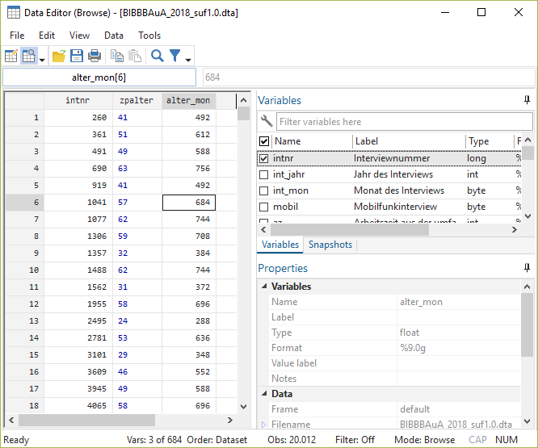
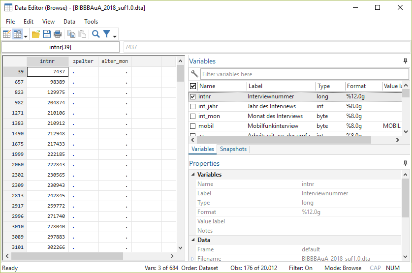

# Variablen erstellen und verändern {#gen} 

```{r setup5, echo = F, message=F, warning = F}
.libPaths("D:/R-library4")
knitr::opts_chunk$set(collapse = TRUE)
knitr::opts_chunk$set(dpi=800)
library(Statamarkdown)
library(tidyverse)
library(kableExtra)
# stataexe <- "C:/Program Files (x86)/Stata13/StataSE-64.exe"
stataexe <- "C:/Program Files/Stata16/StataSE-64.exe"
knitr::opts_chunk$set(engine.path=list(stata=stataexe))
# baua <- readstata13::read.dta13("D:/Datenspeicher/BIBB_BAuA/BIBBBAuA_2018_suf1.0.dta",convert.factors = F)
```


Natürlich sind wir nicht nur darauf beschränkt, bestehende Variablen anzusehen, sondern wir können auch neue Variablen erstellen. Das geht mit `gen`. Dazu geben wir erst den neuen Variablennamen an und nach `=`, wie die neue Variable bestimmt werden soll:
```{stata gen, echo = T, eval = F }
gen alter_mon = zpalter * 12
su zpalter
```

```{stata gen_b, echo = F}
set linesize 80
qui use "D:\Datenspeicher\BIBB_BAuA/BIBBBAuA_2018_suf1.0.dta", clear
qui mvdecode zpalter, mv(9999)
gen alter_mon = zpalter * 12
su alter_mon
```

Wenn wir eine Variable überschreiben möchten, dann müssen wir diese erst mit `drop` löschen, bevor wir sie überschreiben. Würden wir den `gen` Befehl von gerade nochmal verwenden, dann bekommen wir eine Fehlermeldung:
```{stata gen2, eval = F}
gen alter_mon = zpalter * 12
```
```{stata gen2_b, echo = F}
set linesize 80
qui use "D:\Datenspeicher\BIBB_BAuA/BIBBBAuA_2018_suf1.0.dta", clear
qui mvdecode zpalter, mv(9999)
qui gen alter_mon = zpalter * 12
gen alter_mon = zpalter * 12
```
Wir müssen den Namen `age_mon` also erst wieder frei machen, dann funktioniert der Befehl auch:
```{stata, eval = F}
drop alter_mon
gen alter_mon = zpalter * 12
```

## gen ist gut, Kontrolle ist besser

Wie gerade gesehen gibt uns Stata aber keinerlei Erfolgsmeldungen. Nach der Bearbeitung oder Neuurstellung von Variablen sollte ein Blick in die Daten folgen. Dazu empfiehlt es sich, wieder auf den `browse` Befehl zurückzugreifen:

```{stata bro_ansicht_cmd, eval = F}
browse intnr zpalter alter_mon 
```

```{r bro_ansicht, echo = F,out.width = "90%",fig.height= 3.5, fig.align="center"}

```  

In Kombination mit `if` können wir auch einige Spezialfälle betrachten, z.B. ob die Missings richtig verarbeitet wurden:
```{stata bro_ansicht_cmd2, eval = F}
browse intnr zpalter alter_mon  if missing(zpalter)
```
```{r bro_ansicht2, echo = F,out.width = "90%",fig.height= 3.5, fig.align="center"}

```  

Häufig empfiehlt sich auch ein `summarize` und ein Vergleich der Missingszahl der alten und neuen Variable mit `mdesc`:
```{stata check, eval = F}
summarize zpalter alter_mon
mdesc zpalter alter_mon
```


```{stata check2, echo = F}
set linesize 80
qui use "D:\Datenspeicher\BIBB_BAuA/BIBBBAuA_2018_suf1.0.dta", clear
qui mvdecode zpalter, mv(9999)
qui gen alter_mon = zpalter * 12
summarize zpalter alter_mon
mdesc zpalter alter_mon
```

## Dummy-Variablen erstellen {#dummyvar}

Wir können auch die Operatoren aus den if-Bedingungen verwenden, um eine Variable zu generieren. Beispielsweise könnten wir eine Dummy-Variable bilden, ob die Befraten im gleichen Bundesland wohnen (`Bula`) und arbeiten (`F233`), indem wir den `==` Operator verwenden. Die entstehende Variable enthält dann immer eine 1 wenn beide Werte gleich sind, unterschiedliche Werte ergeben eine 0:
```{stata penl1, eval = F}
mvdecode Bula F233, mv(97/99)
gen ao_wo = Bula ==  F233
```
**Die Ergebnisse solcher Veränderungen sollten immer überprüft werden!**
```{stata penl2, eval = F}
tab ao_wo
browse Bula F233 ao_wo
```

```{stata penl2c, eval = F}
list Bula F233 ao_wo in 157/160
```

```{stata penl2d, echo = F}
set linesize 80
qui use "D:\Datenspeicher\BIBB_BAuA/BIBBBAuA_2018_suf1.0.dta", clear
qui mvdecode Bula F233, mv(97/99)
qui gen ao_wo = Bula ==  F233
list Bula F233 ao_wo in 157/160, noobs
```

Allerdings haben wir für `F233` doch missings definiert - was passiert mit denen?
```{stata penlMiss, eval = F}
mdesc Bula F233 ao_wo 
```
```{stata penl2Miss, echo = F}
set linesize 80
qui use "D:\Datenspeicher\BIBB_BAuA/BIBBBAuA_2018_suf1.0.dta", clear
qui mvdecode Bula F233, mv(97/99)
qui gen ao_wo = Bula ==  F233
mdesc Bula F233 ao_wo
```


Leider gleicht Stata auch Missings mit gültigen Werten ab und vergibt dann dementsprechend 0 oder 1. 
Um die Missings als Missing zu behalten, müssen wir mit entsprechenden `if`-Bedingungen die Zeilen mit Missings in `Bula` und `F233` ausschließen:

```{stata penl3Miss, eval= F}
drop ao_wo // löschen
gen ao_wo =  Bula ==  F233 if !missing(F233) & !missing(Bula)
mdesc Bula F233 ao_wo
```

```{stata penl4Missb, echo = F}
set linesize 80
qui use "D:\Datenspeicher\BIBB_BAuA/BIBBBAuA_2018_suf1.0.dta", clear
qui mvdecode Bula F233, mv(97/99)
qui gen ao_wo =  Bula ==  F233 if !missing(F233) & !missing(Bula)
mdesc Bula F233 ao_wo
```


```{stata penl40, eval= F}
tab ao_wo
```


```{stata penl40b, echo= F}
set linesize 80
qui use "D:\Datenspeicher\BIBB_BAuA/BIBBBAuA_2018_suf1.0.dta", clear
qui mvdecode Bula F233, mv(97/99)
qui gen ao_wo =  Bula ==  F233 if !missing(F233) & !missing(Bula)
tab ao_wo
```

## Neue Variablen labeln {#label}

Die so erstellte Dummy-Variable können wir auch labeln. 
Dazu definieren wir zunächst ein Wertelabel. 
Dazu verwenden wir `label define`, gefolgt von einem Objektnamen für dieses Label (hier `aowo_lab`) und dann jeweils die Ausprägungen zusammen mit dem entsprechenden Label in "". Dieses Label-Objekt wenden wir dann mit `label values` auf die Variable `ao_wo` an:

```{stata penl4, eval= F}
label define aowo_lab 0 "ungleich" 1 "gleich"
label values ao_wo aowo_lab
tab ao_wo
```


```{stata penl4b, echo= F}
set linesize 80
qui use "D:\Datenspeicher\BIBB_BAuA/BIBBBAuA_2018_suf1.0.dta", clear
qui mvdecode Bula F233, mv(97/99)
qui gen ao_wo =  Bula ==  F233 if !missing(F233) & !missing(Bula)
label define aowo_lab 0 "ungleich" 1 "gleich"
label values ao_wo aowo_lab
tab ao_wo
```

Wenn wir das Label verändern, sehen wir das anschließend auch in `tabulate`:
```{stata penl5, eval= F}
label define aowo_lab 0 "Ungleich" 1 "Gleich", replace
tab ao_wo
```

```{stata penl5b, echo= F}
set linesize 80
qui use "D:\Datenspeicher\BIBB_BAuA/BIBBBAuA_2018_suf1.0.dta", clear
qui mvdecode Bula F233, mv(97/99)
qui gen ao_wo =  Bula ==  F233 if !missing(F233) & !missing(Bula)
label define aowo_lab 0 "Ungleich" 1 "Gleich", replace
label values ao_wo aowo_lab
tab ao_wo
```

*** 

[Übung 5-1](#ue51)

*** 

## Bestehende Variablen verändern

Natürlich können wir auch bestehende Variable verändern, ein Beispiel hatten wir mit [`mvdecode`]() bereits kennen gelernt. Während es bei `mvdecode` ja aber nur um Missings geht, gibt es auch Möglichkeiten die gültigen Werte zu verändern.

### `recode` {#recode}

Mit `recode` können wir Werte in einer bestehenden Variable verändern. Die veränderten Werte können wir in der bestehenden Variable überschreiben. Die häufig bessere Variante ist aber, die Originalwerte zu behalten und die veränderten Werte in einer neuer Variable abzulegen. Das geht mit der Option `,into(neuer_variablenname)`

Beispielsweise könnten wir `gkpol` zu weniger Kategorien zusammenfassen - zur Erinnerung, das waren die Originalausprägungen:
```{r gkpoltab, echo=F}

 tibble::tribble(~"Wert",~"Label", 
 1 , "unter 2.000 Einwohner",
 2 , "2.000 bis unter 5.000 Einwohner",
 3 , "5.000 bis unter 20.000 Einwohner",
 4 , "20.000 bis unter 50.000 Einwohner",
 5 , "50.000 bis unter 100.000 Einwohner",
 6 , "100.000 bis unter 500.000 Einwohner",
 7 , "500.000 und mehr Einwohner") %>% 
  bind_cols(data.frame("Kategorien"=c(rep("1 - Klein",3),rep("2 - Mittel",2),rep("3 - Groß",2)))) %>% 
  kable() %>% 
  kable_styling(bootstrap_options = "condensed", full_width = F,font_size = 10) %>% 
  column_spec(1,monospace = TRUE) %>% 
  collapse_rows(columns = 3, valign = "top") %>% 
  add_header_above(c("gkpol" = 2, "neue Variable" = 1))
```

Mit `recode` können wir diese Ausprägungen zusammenfassen, indem wir immer (`alt`=`neu`) angeben. Umcodierungen sollten immer mit `tab alt neu` überprüft werden:
```{stata recode1, eval = F}
recode gkpol (2=1) (3=1) (4=2) (5=2) (6=3) (7=3), into(gkpol2)
tab gkpol gkpol2
```

```{stata recode1a, echo = F}
set linesize 80
qui use "D:\Datenspeicher\BIBB_BAuA/BIBBBAuA_2018_suf1.0.dta", clear
recode gkpol (2=1) (3=1) (4=2) (5=2) (6=3) (7=3), into(gkpol2)
tab gkpol gkpol2
```
Nicht erwähnte Ausprägungen werden einfach übernommen - daher ist `1` hier nicht aufgeführt.

Ein Vorteil von recode ist, dass wir direkt Labels vergeben können, die wir einfach in `""` anhängen - nochmal der gleich Befehl mit direkten Labels:
```{stata recode2, eval = F}
drop gkpol2 // nochmal neu
recode gkpol (2=1 "Klein") (3=1 "Klein") (4=2 "Mittel") (5=2 "Mittel") (6=3 "Groß") (7=3 "Groß"), into(gkpol2)
```
```{stata recode2a, echo = F}
set linesize 80
qui use "D:\Datenspeicher\BIBB_BAuA/BIBBBAuA_2018_suf1.0.dta", clear
recode gkpol (2=1 "Klein") (3=1 "Klein") (4=2 "Mittel") (5=2 "Mittel") (6=3 "Groß") (7=3 "Groß"), into(gkpol2)
tab gkpol gkpol2
```

**Tricks**, die alle aber zum gleichen Ergebnis führen:

Wir können auch mehrere Werte vor dem `=` angeben:
```{stata recode3, eval = F}
drop gkpol2
recode gkpol (1 2 3=1 "Klein") (4 5=2 "Mittel") (6 7=3 "Groß"), into(gkpol2)
```

Außerdem können wir mit Hilfe von `/` auch Wertebereiche ansprechen:
```{stata recode4, eval = F}
drop gkpol2
recode gkpol (1/3=1 "Klein") (4/5=2 "Mittel") (6/7=3 "Groß"), into(gkpol2)
```


*** 

[Übung 5-2](#ue52)

*** 

### `replace`: Informationen aus mehreren Variablen in einer Variable zusammenführen

Ein weiterer nützlicher Befehl ist `replace`. Hier können wir bestehende Variable verändern. Das ist inbesondere in Zusammenspiel mit `if`-Bedingungen hilfreich.
Manchmal liegt eine interessierende Information aufgeteilt auf mehrere Variablen vor. Ein Beispiel hierfür ist die Erwerbskonstellation von Paaren in der Erwerbstätigenbefragung. Wir können aus den Informationen `F1600` (Familienstand), `F1601` (leben die Befragten mit der\*der Partner\*in zusammen?) und `F1603` (ist Partner\*in berufstätig?) eine Variable mit 3 Ausprägungen bauen:

+ 1 "nicht verh./alleine lebend" 
+ 2 "verh. & 2 Erwerbspersonen im HH" 
+ 3 "verh. & 1 Erwerbsperson"

```{stata replace1, eval = F}
gen erw_hh = . 			// leere Variable erstellen
replace erw_hh = 1 if F1601 == 2 // alleine -> leben nicht zusammen
replace erw_hh = 2 if F1601 == 1 & F1603 == 1 // zusammenlebend, Partner*in erwerbstätig
replace erw_hh = 3 if F1601 == 1 & F1603 == 2 // zusammenlebend, Partner*in nicht erwerbstätig

replace erw_hh = 1 if inlist(F1600,2,3,4) // keine Partnerschaft -> auch auf 1
*! unverheiratete werden hier nicht als Partnerschaften behandelt

lab define erw_lab 1 "nicht verh./alleine lebend" 2 "verh. & 2 Erwerbspersonen im HH" 3 "verh. & 1 Erwerbsperson"
lab values erw_hh erw_lab
tab erw_hh
```

*** 

[Übung 5-3](#ue53)

*** 

## Übungen 5 {#genue}

(@) Laden Sie den BIBB/BAuA Erwerbstätigenbefragung 2018 (`BIBBBAuA_2018_suf1.dta`). 

### Übung 5-1 {#ue51}

(@) Erstellen Sie eine Dummy-Variable, die erfasst, ob die Befraten in der gleichen NUTS-2-Region leben und arbeiten
  + `nuts2` enthält den Wohnort, `F233_nuts2` enthält den Ort der Betriebsstätte
  + Schließen Sie die Missings aus (`99996` bis `99999`)
  + Erstellen Sie die Variable mit `gen`. Denken Sie an den `==` Operator.
  + Kontrollieren Sie das Ergebnis mit `browse`
  + Definieren Sie Labels für diese Dummyvariable: "Wohnort = Arbeitsort" "Wohnort != Arbeitsort" 

(@) Verändern Sie das Label `S1` von 1 = "männlich" und 2=  "weiblich" auf 1 = "Männer" und 2 = "Frauen".
  + Lassen Sie sich mit `tab S1` die Variable ausgeben.
  + Verändern Sie die Labels mit  `label define .... , replace`
  + Lassen Sie sich mit `tab S1` die Variable erneut ausgeben - hat das geklappt wie gedacht?

### Übung 5-2 {#ue52}

(@) Fassen Sie die Variable "Gesamtnote Schulabschluss" (`F1108`)  in drei Kategorien zusammen:
```{r F1108tab, echo=F}

 tibble::tribble(~"Wert",~"Label", 
           1,   "sehr gut",
           2,   "gut",
           3,   "befriedigend",
           4,   "ausreichend",
           7,   "keine Note vorgesehen",
           8,   "weiß nicht",
           9,   "keine Angabe"
) %>% 
  data.frame("neu"=c( rep("1 - (sehr) gut",2),rep("2 - bestanden",2), rep("3 - fehlend",3) ) ) %>% 
  kable() %>% 
  kable_styling(bootstrap_options = "condensed", full_width = F,font_size = 10) %>% 
  column_spec(1,monospace = TRUE) %>% 
  collapse_rows(columns = 3, valign = "top") %>% 
  add_header_above(c("F1108" = 2, "neue Variable" = 1))
```

  + Nutzen Sie die Label-Funktion von [`recode`](#recode)

### Übung 5-3 {#ue53}

(@) Fassen Sie die Variablen `F209` ( Arbeitszeit normalerweise zwischen 7 und 19 Uhr?) und `F223` (mindestens einmal im Monat Sonntagsarbeit) zu einer Variable `a_zeit` mit folgenden Ausprägungen zusammen:

    > 1 zwischen 7-19 Uhr & keine Sonntagsarbeit              
    > 2 nicht zwischen 7-19 Uhr, aber keine Sonntagsarbeit    
    > 3 zwischen 7-19 Uhr aber Sonntagsarbeit                 
    > 4 nicht zwischen 7-19 Uhr und Sonntagsarbeit            
  
  (Für Tipp weiter nach unten Scrollen)


****
    > 1 zwischen 7-19 Uhr & keine Sonntagsarbeit              (`F209` == 1, `F223` == 2)       
    > 2 nicht zwischen 7-19 Uhr, aber keine Sonntagsarbeit    (`F209` == 2, `F223` == 2)
    > 3 zwischen 7-19 Uhr aber Sonntagsarbeit                 (`F209` == 1, `F223` == 1)
    > 4 nicht zwischen 7-19 Uhr und Sonntagsarbeit            (`F209` == 2, `F223` == 1)
  
  