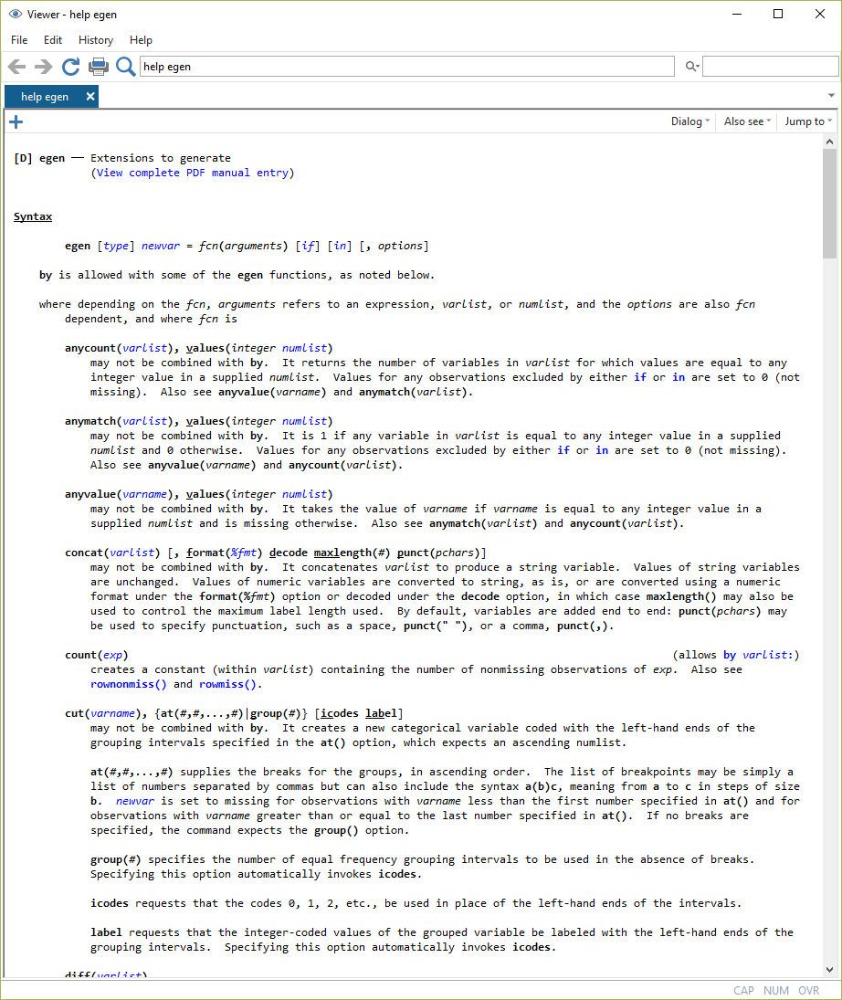
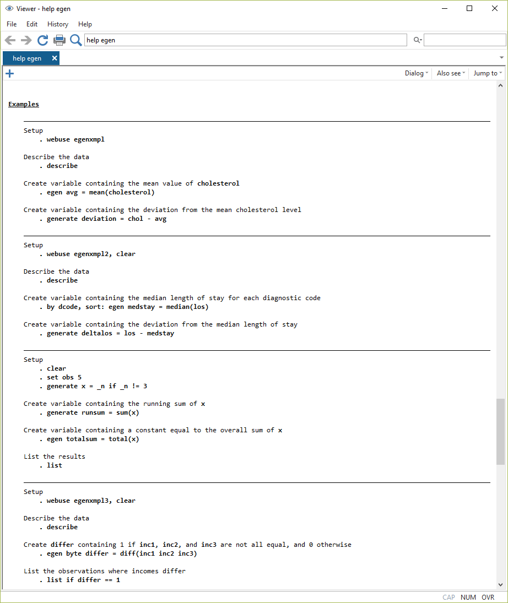

# Variablen erstellen (2), Hilfe verwenden {#egen} 

```{r setup6, echo = F, message=F, warning = F}
.libPaths("D:/R-library4")
knitr::opts_chunk$set(collapse = TRUE)
knitr::opts_chunk$set(dpi=800)
library(Statamarkdown)
library(tidyverse)
library(kableExtra)
# stataexe <- "C:/Program Files (x86)/Stata13/StataSE-64.exe"
stataexe <- "C:/Program Files/Stata16/StataSE-64.exe"
knitr::opts_chunk$set(engine.path=list(stata=stataexe))
# baua <- readstata13::readhttp://127.0.0.1:8264/rmd_output/0/appendix.html#.dta13("D:/Datenspeicher/BIBB_BAuA/BIBBBAuA_2018_suf1.0.dta",convert.factors = F)
```


## `egen`

Mit `egen`, den "Extensions to generate", stehen eine ganze Menge an Funktionen zur Verfügung. In [Kapitel 4](#cut) hatten wir schon die Option `cut` zur Einteilung in Gruppen (`cut`) kennengelernt:
```{stata age_cut4, eval = F}
egen age_cat = cut(zpalter), at(15 18 35 60 100 ) label
tab age_cat
```

```{stata age_cut5, echo = F}
qui use "D:\Datenspeicher\BIBB_BAuA/BIBBBAuA_2018_suf1.0.dta", clear
qui mvdecode zpalter, mv(9999)
egen age_cat = cut(zpalter), at(15 18 35 60 100 )  label
tab age_cat
```

Außerdem könnten wir bspw. eine Variable `durchschnittsalter` mit dem Mittelwert für `zpalter` erstellen:
```{stata egenmean1, eval = F}
egen durchschnittsalter = mean(zpalter)
```

Oder wir könnten den Vergleich des Wohn- und Arbeitsbundeslandes aus [Kapitel 5](#dummyvar) mit `diff()` durchführen:
```{stata egendiff, eval = F}
gen ao_wo =  Bula ==  F233 if !missing(F233)
egen ao_wo2 = diff( Bula F233_Bula) if !missing(F233) 
```
Das führt zum gleichen Ergebnis, allerdings könnten wir in `diff()` noch weitere Variablen für einen Abgleich einfügen (bspw. weitere Arbeitsorte).

Eine Liste aller Optionen für `egen` findet sich unter `help egen`:


```{r egenhelp1, echo = F,out.width = "80%", fig.align="center"}

```

## Erklärungen für `help` und Stata-Begriffe

### numlist, varlist, varname

Eine `numlist` ist eine Liste von Zahlen, die je nach Anwendungsfall durch Leerzeichen oder Kommas getrennt sind. Es gibt eine ganze Reihe von Möglichkeiten, eine `numlist` zu erzeugen. Im `cut`-Beispiel oben haben wir einfach in `at()` direkt die Zahlen angegeben und so eine `numlist` mit den Werten `15 18 35 60 100` erstellt. Wir können aber mit `(start(intervall)stop)` auch eine Zahlenreihe anlegen, bspw. mit `(0(2)8)` die Zahlenreihe `r seq(0,8,2)`. Eine `numlist` kann auch einer Reihe und einem Wert bestehen: `0(1)5 8` führt zu `r c(seq(0,5,1),8)`. Mehr Tricks unter  `help numlist`.

Eine `varlist` ist hingegen eine Liste an Variablennamen. Wenn wir eine solche aufrufen, werden die Namen mit den im Datensatz vorhandenen Variablen abgeglichen (und ggf. eine Fehlermeldung ausgegeben). Wir können `varlist`en einfach direkt angeben, bspw. wie in `diff(bula F233)`, wir können aber auch Verallgemeinerungen, sog. 'wild cards' für die Auswahl von Variablen verwenden:


```{r egen_helpers, echo =F}
tribble(~"v",~"l",
  "myvar"         , "nur Variable `myvar`",
  "myvar*"        , "Variablen, deren Name mit `myvar` beginnt, alsp bspw. auch `myvar2` oder `myvariable`",
  "*var"          , "Variablen, deren Name mit `var` endet, alsp bspw. auch `yourvar`",
  "my*var"        , "Variablen deren Name mit `my` beginnt und mit `var` endet - mit einer beliebigen Zahl an Zeichen dazwischen",
  "my?var"        , "Variablen deren Name mit `my` beginnt und mit `var` endet - mit nur einem Zeichen dazwischen",
  "myvar1-myvar6" , "myvar1, myvar2, ..., myvar6 (je nachdem, welche Variablen vorhanden sind - in der Reihenfolge aus dem Variablenexplorer)"
        ) %>% 
    kable() %>% 
  kable_styling(bootstrap_options = "condensed", full_width = F,font_size = 12) %>% 
  column_spec(1,monospace = TRUE) %>% 
  row_spec(0, color = "white")
```


Weiteres unter `help varlist`

`#` steht in den Hilfe-Dateien immer für eine Zahl. 


### Beispielsyntax in den `help` Dateien

Ganz unten finden sich in den Hilfen immer Beispiele:

```{r egenhelp2, echo = F,out.width = "100%",fig.height= 3.5, fig.align="center"}

```

Diese beruhen auf Datensätzen, die lokal vorhanden sind (`sysuse ...`) oder direkt aus dem Internet geladen werden können (`webuse`). Oft ist es hilfreich, die Beispiele Schritt für Schritt durchlaufen zu lassen und im `browse`-Modus zu beobachten, was passiert.

***

**[Übung 1](#egenue)**

***

## `by`

Mit dem Präfix `by` können Berechnungen getrennt für verschiedene Gruppen durchgeführt werden. 
Das ist insbesondere in Kombination mit `egen` ein sehr vielseitiges Werkzeug.
So können wir beispielsweise das Durchschnittsalter in unserem Datensatz getrennt für Frauen und Männer berechnen:
```{stata by1, eval = F}
by S1: egen mean_byS1 = mean(zpalter)
```
<span style="color:red">`not sorted`</span>  
<span style="color:blue">`r(5);`</span>

Allerdings setzt das immer voraus, dass der Datensatz nach den in `by` angegebenen Variablen sortiert ist - sonst bekommen wir eine Fehlermeldung. 
Sortieren können wir entweder mit `sort varname`:
```{stata sort1, eval= F}
sort S1
by S1: egen mean_byS1 = mean(zpalter)
```
...oder alles in einem Befehl:
```{stata sort2, eval = F}
bysort S1: egen mean_byS1 = mean(zpalter)
```


```{stata by2, echo = F}
quietly{
  set linesize 120
  qui use "D:\Datenspeicher\BIBB_BAuA/BIBBBAuA_2018_suf1.0.dta", clear
	mvdecode zpalter, mv(9999 )
}
bysort S1: egen mean_byS1 = mean(zpalter)
sort intnr
list S1 zpalter mean_byS1 in 1/5, noobs abbrev(10)
```

> Anmerkung für die Ausgabe der Fälle wurde nach `by S1,sort: egen mean_byS1 = mean(zpalter)` mit `sort intnr` wieder die ursprüngliche Reihenfolge hergestellt.


Wir könnten aber auch die geschlechts- und schulbildungsspezifischen Durchschnittseinkommen berechnen, indem wir beide Variablen im `by`-Befehl angeben:
```{stata bys3, eval = F}
bysort S1 S3: egen mean_byS1S3 = mean(zpalter)
```

```{stata bys4, echo = F}
quietly{
  set linesize 120
  qui use "D:\Datenspeicher\BIBB_BAuA/BIBBBAuA_2018_suf1.0.dta", clear
	mvdecode zpalter, mv(9999 )
}
qui bysort S1: egen mean_byS1 = mean(zpalter)
qui bysort S1 S3: egen mean_byS1S3 = mean(zpalter)
qui sort intnr
list S1 S3 zpalter mean_byS1 mean_byS1S3 in 1/5, noobs abbrev(14)
```

***

**[Übung 2](#byue)**

***


## Übungen 6 {#egenue}

(@) Laden Sie den BIBB/BAuA Erwerbstätigenbefragung 2018 (`BIBBBAuA_2018_suf1.dta`). 

### Übungen 6-1 {#egenue1}

(@) Bilden Sie mit Hilfe von `egen` verschiedene Einkommensklassen (bspw. ab 0EUR in 500EUR-Schritten bis 72000EUR). Nutzen Sie die `numlist`-Funktion mit `(start(intervall)stop)`. Verändern Sie Labels.


(@) Welche Variablen bekommen Sie mit `describe` angezeigt, wenn Sie entweder `describe F21`, `describe F21*`, `describe F21?`, `describe F2*4` oder `describe F2?4` verwenden?


### Übungen 6-2 {#byue}

(@) Berechnen Sie das Durchschnittseinkommen (basierend auf `F518_SUF`) getrennt für Männer und Frauen und legen Sie es in einer neuen Variable `m_inc_byS1` ab.
  + mit `mvdecode F518_SUF, mv(99998/99999)` können Sie die Missings ausschließen
  + Denken Sie daran, dass Sie die Daten sortieren müssen.

(@) Wie würden Sie jetzt für jede\*n Befragten berechnen, um wieviel ihr\*sein Einkommen vom geschlechtsspezifischen Durchschnittswert unterscheidet?

### Profiaufgabe 

(@) Öffnen Sie die Hilfe für `egen` und lassen Sie ein Beispiel Schritt für Schritt durchlaufen - beobachten Sie was passiert, indem Sie mit `browse` den Datensatz betrachten.


## Anhang

### Kombination von `summarize` mit dem `by`-Präfix {#bys_su}

Mit `bysort` können wir auch Gruppenvergleiche erstellen. Bspw. können wir die Altersangaben für Männer (`S1`=1) und Frauen (`S1`=2) vergleichen, indem wir das Befehls-Präfix `bys varX:` verwenden. Stata sortiert also den Datensatz entsprechend der angegebenen Variable und die folgende Berechnung wird getrennt nach den Werten für `varX` ausgeführt. Wenn wir also `summarize` für beide Ausprägungen von `S1` berechnen möchten, gehen wir wir folgt vor:
```{stata bysuF, eval = F}
bysort S1: summarize zpalter 
```
```{stata bysuT, echo = F}
set linesize 80
qui use "D:\Datenspeicher\BIBB_BAuA/BIBBBAuA_2018_suf1.0.dta", clear
qui mvdecode zpalter, mv(9999)
bys S1: summarize zpalter 
```

