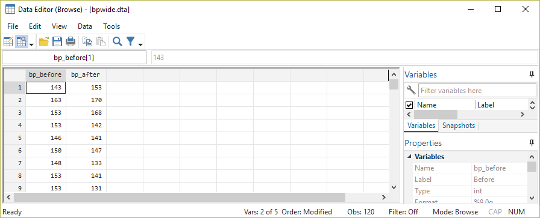

# Inferenzstatistik {#infer} 

```{r setup7, echo = F, message=F, warning = F}
.libPaths("D:/R-library4")
knitr::opts_chunk$set(collapse = TRUE)
knitr::opts_chunk$set(dpi=800)
library(Statamarkdown)
library(tidyverse)
library(kableExtra)
# stataexe <- "C:/Program Files (x86)/Stata13/StataSE-64.exe"
stataexe <- "C:/Program Files/Stata16/StataSE-64.exe"
knitr::opts_chunk$set(engine.path=list(stata=stataexe))
# baua <- readstata13::readhttp://127.0.0.1:8264/rmd_output/0/appendix.html#.dta13("D:/Datenspeicher/BIBB_BAuA/BIBBBAuA_2018_suf1.0.dta",convert.factors = F)
z_wert <-2.5804
```


## Inferenz: von der Stichprobe zur allgemeinen Aussage

Bisher haben wir die Angaben aus unserem Datensatz immer als fix angesehen. 
Ziel einer statistischen Auswertung ist aber meistens, Aussagen über die *Grundgesamtheit* oder *Population* zu treffen. 
Im Fall der ETB 2018 wären das also alle Erwerbstätigen in Deutschland.
In der ETB 2018 wurde eine Zufallsstichprobe erhoben, um eine repräsentative Datengrundlage zu schaffen. 
Das heißt, es wurde ein Verfahren gewählt, das potenziell allen Erwerbstätigen die gleiche Chance gibt, in der Befragung zu landen.
Damit ist unser Datensatz eine "verkleinerter Ausschnitt" aus der großen Gesamtpopulation, die wir dann für Aussagen über eben diese Gesamtpopulation verwenden können.

Wenn wir uns jetzt beispielsweise das Durchschnittsalter in der Erwerbstätigenbefragung ansehen:
```{stata inf1, eval = F}
summarize zpalter
```

```{stata inf1t, echo = F}
set linesize 80
qui use "D:\Datenspeicher\BIBB_BAuA/BIBBBAuA_2018_suf1.0.dta", clear
qui mvdecode zpalter, mv(9999)
summarize zpalter
```

Natürlich ist relativ intuitiv, dass das Durchschnittsalter *aller Erwerbstätigen in Deutschland* nicht exakt `47.19228` betragen wird. Wir wären uns aber relativ sicher, dass es nicht 30 oder 60 sein wird. 
Bei 47.4 ist das aber nicht ganz so klar. 
Vielleicht haben wir ja nur etwas "Pech gehabt" und liegen mit unserer Stichprobe eben etwas neben dem wahren Wert. 
Das Problem ist aber natürlich, dass wir den wahren Wert nicht kennen - wir kennen das Alter für alle Erwerbstätigen in Deutschland schlicht nicht.

Da wir nun aber davon ausgehen müssen, dass wir mit unserer Stichprobe den exakten wahren Wert wohl nicht getroffen haben, geben wir ein Intervall innerhalb dessen wir den wahren Wert mit einigem Selbstbewusstsein verorten können.
Dieses Intervall wird in der Regel als Konfidenzintervall bezeichnet.
Aber wie bestimmen wir die Grenzen für dieses Intervall?

Um die Grenzen sinnvoll zu bestimmen, benötigen wir eine Annahme wie sich der Stichprobenwert zum wahren Wert in der Grundgesamtheit verhält.

> Übrigens: Stichprobenmittelwerte werden häufig mit $\bar{x}$ bezeichnet, wohingegen der wahre Mittelwert in der Grundgesamtheit mit $\mu$ bezeichnet wird. 
> Also: lateinischer Buchstabe für die Stichprobe, griechischer für die Grundgesamtheit.
> Für eine Schätzung von $\mu$ auf Basis eines Stichprobenwerts wird $\hat{x}$ verwendet ("Dach").

Wie kommen wir also von $\bar{x}$ zu $\mu$ oder zumindest zu $\hat{x}$? 
Wie viel Schwankungsbreite sollten wir ansetzen? 
Dabei hilft uns die Streuung in der Stichprobe: wenn die Werte in der Stichprobe alle sehr nahe beieinander liegen, dann liegt es nahe, dass auch die Streuung in der Grundgesamtheit eher gering ist.
Dementsprechend kann das Intervall um unsere Schätzung eher eng sein.
Sollten wir beispielsweise im Extremfall 22000 identische Angaben im Datensatz haben, dann ist unser Selbstbewusstsein natürlich sehr viel kleiner als für Werte, die sehr weit auseinander liegen (= mit einer großen Varianz).
Außerdem sind wir bei einer größeren Stichprobe vielleicht etwas sicherer als bei einer kleineren Datenbasis. 
Die Fallzahl sollte also auch berücksichtigt werden.

Diese Überlegungen sind in folgender Formel eingebaut:

$$\bar{x}\,\pm\,t\times\frac{s}{\sqrt{n}}$$
Wir bestimmen also  auf Basis einer Stichprobe das Konfidenzintervall einer Schätzung, indem wir um den Punktschätzer (den Stichproben-Mittelwert, also die `47.19228 Jahre`) mit Hilfe des eines geeigneten $t$-Werts und des Standardfehlers ($\frac{s}{\sqrt{n}}$[^11]) einen Wertebereich um den Mittelwert $\bar{x}$ konstruieren.

[^11]: Also die Standardabweichung ($s$) dividiert durch die Wurzel der Stichprobengröße ($n$)

Das $t$ kommt dabei aus der Student-t-Verteilung bzw. als $z$-Wert aus der Standard-Normalverteilung ([Illustration](#distr)). $t$ wählen wir dabei so, dass bei wiederholter Stichprobenziehung 95% der resultierenden KI den wahren Wert aus der Grundgesamtheit beinhalten würden:
```{r, out.height="25%", out.width="100%", fig.align='center', echo=F}
data1 <- data.frame(z = seq(-4,4,.01)) # dataframe erstellen mit Zahlenfolge zwischen -4 & 4
data1$t.var <- dt(x=data1$z,df =  9999) 


ki95 <- 
  ggplot(data = data1, aes(x=z, y =t.var)) + 
  theme_minimal(base_size = 10) +
  labs(y = "Häufigkeitsdichte", x = "t",title ="95% Konfidenzintervall") +
  geom_ribbon(data=filter(data1,z <= - 1.960201), aes(ymin=0, ymax = t.var), fill = "#F5CC71") + # fläche links
  geom_segment(data = data.frame(z = - 1.960201,y1 = dt(x=- 1.960201,df =  1757)) , 
            aes(x=z,y=y1,xend = z, yend = 0), color = "#404040", size = .5, linetype = 2) + # grenze links
  geom_ribbon(data=filter(data1,z >=  1.960201), aes(ymin=0, ymax = t.var), fill = "#F5CC71") + # fläche rechts
  geom_segment(data = data.frame(z =  1.960201,y1 = dt(x= 1.960201,df =  1757)) , 
            aes(x=z,y=y1,xend = z, yend = 0), color = "#404040", size = .5, linetype = 2) + # grenze rechts
  geom_segment(data = data.frame(z = 0,y1 = dt(x=0,df = 9999)) , 
            aes(x=z,y=y1,xend = z, yend = 0), color = "grey50", size = .5, linetype = 3) + # mittellinie
  geom_segment(data = data.frame(z = 0,y1 = dt(x=0,df = 9999)) , 
            aes(x=z,y=-0.0125,xend = -1.85, yend = -0.0125), color = "grey25", size = .5,
            arrow = arrow(length = unit(0.5, "lines"), type = "closed")) + # pfeil nach links
  geom_segment(data = data.frame(z = 0,y1 = dt(x=0,df = 9999)) , 
            aes(x=z,y=-0.0125,xend = 1.85, yend = -0.0125), color = "grey25", size = .5,
            arrow = arrow(length = unit(0.5, "lines"), type = "closed")) + #pfeil nach rechts
  geom_label(data=data.frame(z = 0 , y1 = -0.0125, lab1 = "+/- 1.96", t.var = 0),aes(label = lab1), size = 3.5 ) +
  geom_line(color = "navy")  +   
  scale_x_continuous(breaks = seq(-3,3,1),minor_breaks = seq(-3,3,1))+
  theme(aspect.ratio = 1, panel.grid = element_line(size = rel(.25))) +
  geom_text(data=data.frame(z = c(-3,3), t.var = 0.015, label = rep(paste0(round(pt(q = -1.959964,df = 9999)*100,2),"%"),2) ), 
                            aes(x = z, y = t.var, label = label),
                            size = 3.25,vjust= 0, hjust = c(1,0))  +
  theme(plot.margin = margin(0, 0.1, 0, 0.1, "cm"))


ki90 <- ggplot(data = data1, aes(x=z, y =t.var)) + 
  theme_minimal(base_size = 10) +
  labs(y = "Häufigkeitsdichte", x = "t",title ="90% Konfidenzintervall") +
  geom_ribbon(data=filter(data1,z <= qt(p = .05, df = 9999)), aes(ymin=0, ymax = t.var), fill = "#FCE8CE") + # fläche links
  geom_segment(data = data.frame(z = qt(p = .05, df = 9999),y1 = dt(x=- qt(p = .05, df = 9999),df =  1757)) , 
               aes(x=z,y=y1,xend = z, yend = 0), color = "#404040", size = .5, linetype = 2) + # grenze links
  geom_ribbon(data=filter(data1,z >=  qt(p = .95, df = 9999)), aes(ymin=0, ymax = t.var), fill = "#FCE8CE") + # fläche rechts
  geom_segment(data = data.frame(z =  qt(p = .95, df = 9999),y1 = dt(x= qt(p = .05, df = 9999),df =  1757)) , 
               aes(x=z,y=y1,xend = z, yend = 0), color = "#404040", size = .5, linetype = 2) + # grenze rechts
  geom_segment(data = data.frame(z = 0,y1 = dt(x=0,df = 9999)) , 
               aes(x=z,y=y1,xend = z, yend = 0), color = "grey50", size = .5, linetype = 3) + # mittellinie
  geom_segment(data = data.frame(z = 0,y1 = dt(x=0,df = 9999)) , 
               aes(x=z,y=-0.0125,xend = -1.64, yend = -0.0125), color = "grey25", size = .5,
               arrow = arrow(length = unit(0.5, "lines"), type = "closed")) + # pfeil nach links
  geom_segment(data = data.frame(z = 0,y1 = dt(x=0,df = 9999)) , 
               aes(x=z,y=-0.0125,xend = 1.64, yend = -0.0125), color = "grey25", size = .5,
               arrow = arrow(length = unit(0.5, "lines"), type = "closed")) + #pfeil nach rechts
  geom_label(data=data.frame(z = 0 , y1 = -0.0125, lab1 = paste0("+/- ",round(qt(p = .95, df = 9999),3)), t.var = 0),aes(label = lab1), size = 2.75 ) +
  geom_line(color = "#263056")  +   
  scale_x_continuous(breaks = seq(-3,3,1),minor_breaks = seq(-3,3,1))+
  theme(aspect.ratio = 1, panel.grid = element_line(size = rel(.25))) +
  geom_text(data=data.frame(z = c(-3,3), t.var = 0.015, label = rep(paste0(round(pt(q = -1.645,df = 9999)*100,3),"%"),2) ), 
            aes(x = z, y = t.var, label = label),
            size = 3.25,vjust= 0, hjust = c(1,0))+
  theme(plot.margin = margin(0, 0.1, 0, 0.1, "cm"))

ki99 <- ggplot(data = data1, aes(x=z, y =t.var)) + 
  theme_minimal(base_size = 10) +
  labs(y = "Häufigkeitsdichte", x = "t",title ="99% Konfidenzintervall") +
  geom_ribbon(data=filter(data1,z <= qt(p = .005, df = 9999)), aes(ymin=0, ymax = t.var), fill = "#FFABC2") + # fläche links
  geom_segment(data = data.frame(z = qt(p = .005, df = 9999),y1 = dt(x=- qt(p = .005, df = 9999),df =  1757)) , 
               aes(x=z,y=y1,xend = z, yend = 0), color = "#404040", size = .5, linetype = 2) + # grenze links
  geom_ribbon(data=filter(data1,z >=  qt(p = .995, df = 9999)), aes(ymin=0, ymax = t.var), fill = "#FFABC2") + # fläche rechts
  geom_segment(data = data.frame(z =  qt(p = .995, df = 9999),y1 = dt(x= qt(p = .005, df = 9999),df =  1757)) , 
               aes(x=z,y=y1,xend = z, yend = 0), color = "#404040", size = .5, linetype = 2) + # grenze rechts
  geom_segment(data = data.frame(z = 0,y1 = dt(x=0,df = 9999)) , 
               aes(x=z,y=y1,xend = z, yend = 0), color = "grey50", size = .5, linetype = 3) + # mittellinie
  geom_segment(data = data.frame(z = 0,y1 = dt(x=0,df = 9999)) , 
               aes(x=z,y=-0.0125,xend = -2.55, yend = -0.0125), color = "grey25", size = .5,
               arrow = arrow(length = unit(0.5, "lines"), type = "closed")) + # pfeil nach links
  geom_segment(data = data.frame(z = 0,y1 = dt(x=0,df = 9999)) , 
               aes(x=z,y=-0.0125,xend = 2.55, yend = -0.0125), color = "grey25", size = .5,
               arrow = arrow(length = unit(0.5, "lines"), type = "closed")) + #pfeil nach rechts
  geom_label(data=data.frame(z = 0 , y1 = -0.0125, lab1 = paste0("+/- ",round(qt(p = .995, df = 9999),3)), t.var = 0),aes(label = lab1), size = 2.75 ) +
  geom_line(color = "#263056")  +   
  scale_x_continuous(breaks = seq(-3,3,1),minor_breaks = seq(-3,3,1))+
  theme(aspect.ratio = 1, panel.grid = element_line(size = rel(.25))) +
  geom_text(data=data.frame(z = c(-3,3), t.var = 0.015, label = rep(paste0(round(pt(q = -2.576321,df = 9999)*100,3),"%"),2) ), 
            aes(x = z, y = t.var, label = label),
            size = 3.25,vjust= 0, hjust = c(1,0)) +
  theme(plot.margin = margin(0, 0.1, 0, 0.1, "cm"))

library(patchwork)
ki95 + ki90 + ki99
```

Die t-Werte sind allerdings nicht fix, sondern hängen von der Stichprobengröße ab, mit `invttail( n-1,  .025)` bekommen wir bspw. den t-Wert für das 95%-Konfidenzintervall:

+ $n = 3$       
  `display invttail( 3-1,  .025)`     = `r abs(qt(p = .025, df = 3-1))`
+ $n = 30$        
  `display invttail( 30-1,  .025)`    = `r abs(qt(p = .025, df = 30-1))`
+ $n = 300$     
  `display invttail( 300-1,  .025)`   = `r abs(qt(p = .025, df = 300-1))`
+ $n = 3000$    
  `display invttail( 3000-1,  .025)`  = `r abs(qt(p = .025, df = 3000-1))`
+ $n = 19836$   
  `display invttail( 19836-1,  .025)` = `r abs(qt(p = .025, df = 19836-1))`


Also würden für das 95%-Konfidenzintervall folgendes einsetzen - zur Erinnerung die Formel:
$$\bar{x}\,\pm\,t\times\frac{s}{\sqrt{n}}$$

```{stata ki_manual, eval = F}
dis 47.19228 + 1.960084* 11.33762 / sqrt(19836) // obere Grenze
```
```{stata ki_manualt, echo = F}
dis 2 // verschluckt
dis 47.19228 + 1.960084* 11.33762 / sqrt(19836) // obere Grenze
```


```{stata ki_manual2, eval =F}
dis 47.19228 - 1.960084* 11.33762 / sqrt(19836) // untere Grenze
```
```{stata ki_manual2t, echo =F}
dis 2 // verschluckt
dis 47.19228 - 1.960084* 11.33762 / sqrt(19836) // untere Grenze
```


Aber nicht erschrecken - das macht alles Stata für uns:
```{stata kistata, eval =F}
mean zpalter
```

```{stata kistata2, echo = F}
set linesize 80
qui use "D:\Datenspeicher\BIBB_BAuA/BIBBBAuA_2018_suf1.0.dta", clear
qui mvdecode zpalter, mv(9999)
mean zpalter
```

## Hypothesentests {#ttest}

Neben Aussagen über Parameter in einer Grundgesamtheit auf Basis einer Stichprobe ist das eigentliche Ziel statistischer Auswertungen  aber in der Regel, allgemeine Zusammenhänge/Hypothesen zu testen.

Ausgangsszenario: wir betrachten ein Merkmal und möchten durch eine Stichprobe überprüfen, ob der Mittelwert mit unserer Vermutung übereinstimmt bzw. größer/kleiner ist. Testen wir auf Übereinstimmung, verwenden wir einen sog. beidseitigen Test, bei einem einseitigen Test testen wir ob der Stichprobenwert signifikant größer bzw. kleiner als der vermutete Populationswert ist.
Auch hier bleiben wir beim Durchschnittsalter der Erwerbstätigen - mit welcher Sicherheit können wir ausschließen, dass das Durchschnittsalter 47.4 Jahre ist?

Wie wir eben gesehen haben, sollten wir uns nicht allein auf den Punktschätzer verlassen, sondern auch die Streuung in der Stichprobe mitberücksichtigen. 
Dies leisten die Hypothesentests. 
Dabei werden immer zwei sich widersprechende Hypothesen formuliert, die sog. $H_0$ - die Nullhypothese und die $H_A$ - die Alternativhypothese. 
Die $H_0$ beschreibt dabei immer den bisherigen Kenntnisstand und die $H_A$ formuliert die zu testende Aussage. Die Hypothesen unterscheiden sich dann je nachdem ob wir einen gerichteten oder einen ungerichteten Test durchführen: 

Zunächst müssen wir uns entscheiden ob wir eine gerichtete oder ungerichtete Hypothese testen möchten:    

+ ungerichtete Hypothese: "das wahre Durchschnittsalter der Erwerbstätigen in D ist ungleich 47.4 Jahre"
+ gerichtete Hypothese: "das wahre Durchschnittsalter der Erwerbstätigen in D ist **kleiner**/**größer** als 47.4 Jahre"   

Formal werden die Hypothesen dann wie folgt festgehalten:

+ ungerichtete Hypothesen: $H_0: \mu = 47.4\;Jahre$ und $H_A: \mu \neq 47.4\;Jahre$  
+ gerichtete Hypothesen:
  + rechtsseitig  $H_0: \mu \leqslant 47.4\;Jahre$ und $H_A: \mu > 47.4\;Jahre$  
  $\Rightarrow$ die $H_A$ postuliert, dass der wahre Wert **größer** als der Wert aus der $H_0$ ist
  + linksseitig   $H_0: \mu \geqslant 47.4\;Jahre$ und $H_A: \mu < 47.4\;Jahre$  
  $\Rightarrow$ die $H_A$ postuliert, dass der wahre Wert **kleiner** als der Wert aus der $H_0$ ist

Die grundlegende Idee des Hypothesentests ist, dass wir uns nur dann für die Alternativhypothese entscheiden, wenn wir eine ausreichend große Abweichung von dem in der $H_0$ postulierten Wert feststellen. Dazu berechnen wir den $t$-Wert für den SP-Mittelwert entsprechend dieser Formel:  

$$t = \frac{\bar{x}-\mu_{0}}{\frac{s_{x}}{\sqrt{n}}}$$

Wir berechnen also, mit welcher Irrtumswahrscheinlichkeit wir die $H_0$ verwerfen können. Anders formuliert: wie wahrscheinlich ist es, das $\bar{x}$ in einer Stichprobe zu erhalten obwohl $\mu_0$ in der Grundgesamtheit richtig ist?

In der Wissenschaft hat sich als Konvention etabliert, von einem signifikanten Unterschied zu sprechen wenn die Irrtumswahrscheinlichkeit unter 5% liegt. Das bedeutet:

> *Assuming that the null hypothesis is true and the study is repeated an infinite number times by drawing random samples from the same populations(s), less than 5% of these results will be more extreme than the current result.*[^1]

[^1]: [Failing Grade: 89% of Introduction-to-Psychology Textbooks That Define or Explain Statistical Significance Do So Incorrectly. Advances in Methods and Practices in Psychological Science, 2515245919858072.](https://doi.org/10.1177/2515245919858072)

### beiseitiger t-Test {#ttest1}

Ein **beid**seitiger Test testet die $H_0$ im Vergleich zur folgenden Aussage der $H_A$: "die wahren Mietausgaben der Studierenden in Oldenburg sind *ungleich* 47.4 Jahre". Dazu formalisieren wir zunächst die $H_0$ und $H_A$:

$H_0: \mu = 47.4\;Jahre \qquad H_A: \mu \neq 47.4\;Jahre$  

Für die Berechnung können wir in Stata die Funktion `ttest` nutzen. 
Neben den zu testenden Werten geben wir mit `mu` den in der Nullhypothese festgehaltenen Mittelwert an:
```{stata ttest1a, eval = F}
ttest zpalter==47.4
```
```{stata ttest1b, echo = F}
set linesize 80
qui use "D:\Datenspeicher\BIBB_BAuA/BIBBBAuA_2018_suf1.0.dta", clear
qui mvdecode zpalter, mv(9999)
ttest zpalter==47.4
```

```{r ttest_bsp_beid_illu, out.height="60%", out.width="60%", fig.align='center', echo=F}
data1 <- data.frame(z = seq(-4,4,.01)) ## dataframe erstellen mit Zahlenfolge zwischen -4 & 4
data1$t.var <- dt(x=data1$z,df =  19836) 

z_wert <-2.5804

ggplot(data = data1, aes(x=z, y =t.var)) + 
  theme_minimal(base_size = 15) +
  labs(y = "Häufigkeitsdichte", x = "t") +
  geom_ribbon(data=filter(data1,z <= - z_wert), aes(ymin=0, ymax = t.var), fill = "#F5CC71") + ## fläche links
  geom_segment(data = data.frame(z = - z_wert,y1 = dt(x=- z_wert,df =  1757)) , 
            aes(x=z,y=y1,xend = z, yend = 0), color = "#404040", size = .5, linetype = 2) + ## grenze links
  geom_ribbon(data=filter(data1,z >=  z_wert), aes(ymin=0, ymax = t.var), fill = "#F5CC71") + ## fläche rechts
  geom_segment(data = data.frame(z =  z_wert,y1 = dt(x= z_wert,df =  1757)) , 
            aes(x=z,y=y1,xend = z, yend = 0), color = "#404040", size = .5, linetype = 2) + ## grenze rechts
  geom_segment(data = data.frame(z = 0,y1 = dt(x=0,df = 9999)) , 
            aes(x=z,y=y1,xend = z, yend = 0), color = "grey50", size = .5, linetype = 3) + ## mittellinie
  geom_segment(data = data.frame(z = 0,y1 = dt(x=0,df = 9999)) , 
            aes(x=z,y=-0.0125,xend = -z_wert, yend = -0.0125), color = "grey25", size = .5,
            arrow = arrow(length = unit(0.5, "lines"), type = "closed")) + ## pfeil nach links
  geom_segment(data = data.frame(z = 0,y1 = dt(x=0,df = 9999)) , 
            aes(x=z,y=-0.0125,xend = z_wert, yend = -0.0125), color = "grey25", size = .5,
            arrow = arrow(length = unit(0.5, "lines"), type = "closed")) + #pfeil nach rechts
  geom_label(data=data.frame(z = 0 , y1 = -0.0125, lab1 = paste0("+/- ", z_wert), t.var = 0),aes(label = lab1), size = 3.5 ) +
  geom_line(color = "navy")  +   
  scale_x_continuous(breaks = seq(-3,3,1),minor_breaks = seq(-3,3,1))+
  theme(aspect.ratio = 1, panel.grid = element_line(size = rel(.25))) +
  geom_text(data=data.frame(z = c(-3,3), t.var = 0.015, label = rep(paste0(round(pt(q = -z_wert,df = 19836)*100,2),"%"),2) ), 
                            aes(x = z, y = t.var, label = label),
                            size = 3.25,vjust= 0, hjust = c(1,0))
```

Das Ergebnis liegt also deutlich unter 0,05. Wir würden also die $H_0$ verwerfen $\Rightarrow$ die Aussage "das wahre Durchschnittsalter der Erwerbstätigen in D ist gleich 47.4 Jahre" kann als (vorläufig) widerlegt gelten.

Außerdem werden auch gleich die Ergebnisse für den linksseitigen und rechtsseitigen Test angezeigt. Diese sehen uns noch genauer an:

### linksseitiger t-Test

Ein **links**seitiger Test testet die $H_0$ im Vergleich zu folgender Aussage: "das wahre Durchschnittsalter der Erwerbstätigen in D ist *kleiner* als 47.4 Jahre". Formal sehen die $H_0$ und $H_A$ so aus:

$H_0:\, \mu \geqslant 47.4\;Jahre \qquad H_A:\, \mu < 47.4\;Jahre$

```{stata ttest2a, eval = F}
ttest zpalter==47.4
```
```{stata ttest2b, echo = F}
set linesize 80
qui use "D:\Datenspeicher\BIBB_BAuA/BIBBBAuA_2018_suf1.0.dta", clear
qui mvdecode zpalter, mv(9999)
ttest zpalter==47.4
```

Der Wert unter `mean < 47.4` ist mit `r round(pt(q = -z_wert, df = 19836),4)` kleiner als 0,05, dementsprechend würden wir auf Basis eines linksseitigen Hypothesentests die $H_0$ verwerfen.


```{r ttest_bsp_links_illu, out.height="60%", out.width="60%", fig.align='center', echo=F}
data1 <- data.frame(z = seq(-4,4,.01)) ## dataframe erstellen mit Zahlenfolge zwischen -4 & 4
data1$t.var <- dt(x=data1$z,df =  19836) 

z_wert <-2.5804


ggplot(data = data1, aes(x=z, y =t.var)) + 
  theme_minimal(base_size = 15) +
  labs(y = "Häufigkeitsdichte", x = "t") +
  geom_ribbon(data=filter(data1,z <= - z_wert), aes(ymin=0, ymax = t.var), fill = "#F5CC71") + ## fläche links
  geom_segment(data = data.frame(z = - z_wert,y1 = dt(x=- z_wert,df =  1757)) , 
            aes(x=z,y=y1,xend = z, yend = 0), color = "#404040", size = .5, linetype = 2) + ## grenze links
  geom_segment(data = data.frame(z = 0,y1 = dt(x=0,df = 9999)) , 
            aes(x=z,y=y1,xend = z, yend = 0), color = "grey50", size = .5, linetype = 3) + ## mittellinie
  geom_segment(data = data.frame(z = 0,y1 = dt(x=0,df = 9999)) , 
            aes(x=z,y=-0.0125,xend = -z_wert, yend = -0.0125), color = "grey25", size = .5,
            arrow = arrow(length = unit(0.5, "lines"), type = "closed")) + ## pfeil nach links
  geom_label(data=data.frame(z = 0 , y1 = -0.0125, lab1 = paste0("- ",z_wert), t.var = 0),aes(label = lab1), size = 3.5 ) +
  geom_line(color = "navy")  +   
  scale_x_continuous(breaks = seq(-3,3,1),minor_breaks = seq(-3,3,1))+
  theme(aspect.ratio = 1, panel.grid = element_line(size = rel(.25))) +
  geom_text(data=data.frame(z = -3, t.var = 0.015, label = paste0(round(pt(q = -z_wert,df = 19836)*100,2),"%") ), 
                            aes(x = z, y = t.var, label = label),
                            size = 3.25,vjust= 0, hjust = 1)
```

### rechtsseitiger t-Test 

Ein **rechts**seitiger Test testet die $H_0$ im Vergleich zu folgender Aussage: "das wahre Durchschnittsalter der Erwerbstätigen in ist *größer* als 47.4 Jahre". Formal sehen die $H_0$ und $H_A$ so aus:

$H_0: \mu \leqslant 47.4\;Jahre \qquad H_A: \mu > 47.4\;Jahre$

```{stata ttest3a, eval = F}
ttest zpalter==47.4
```
```{stata ttest3b, echo = F}
set linesize 80
qui use "D:\Datenspeicher\BIBB_BAuA/BIBBBAuA_2018_suf1.0.dta", clear
qui mvdecode zpalter, mv(9999)
ttest zpalter==47.4
```

Wir sehen unter `mean > 47.4` dass der Wert `r round(pt(q = z_wert, df = 19836),4)` deutlich größer als 0,05 ist - dementsprechend würden wir auf Basis eines rechtsseitigen Hypothesentests die $H_0$ **verwerfen**.

```{r ttest_bsp_rechts_illu, out.height="60%", out.width="60%", fig.align='center', echo=F}
data1 <- data.frame(z = seq(-4,4,.01)) ## dataframe erstellen mit Zahlenfolge zwischen -4 & 4
data1$t.var <- dt(x=data1$z,df =  19836) 
z_wert <-2.5804

ggplot(data = data1, aes(x=z, y =t.var)) + 
  theme_minimal(base_size = 15) +
  labs(y = "Häufigkeitsdichte", x = "t") +
  geom_ribbon(data=filter(data1,z >=  z_wert), aes(ymin=0, ymax = t.var), fill = "#F5CC71") + ## fläche rechts
  geom_segment(data = data.frame(z =  z_wert,y1 = dt(x= z_wert,df =  1757)) , 
            aes(x=z,y=y1,xend = z, yend = 0), color = "#404040", size = .5, linetype = 2) + ## grenze rechts
  geom_segment(data = data.frame(z = 0,y1 = dt(x=0,df = 9999)) , 
            aes(x=z,y=y1,xend = z, yend = 0), color = "grey50", size = .5, linetype = 3) + ## mittellinie
  geom_segment(data = data.frame(z = 0,y1 = dt(x=0,df = 9999)) , 
            aes(x=z,y=-0.0125,xend = z_wert, yend = -0.0125), color = "grey25", size = .5,
            arrow = arrow(length = unit(0.5, "lines"), type = "closed")) + #pfeil nach rechts
  geom_label(data=data.frame(z = 0 , y1 = -0.0125, lab1 = paste0("+ ",z_wert), t.var = 0),aes(label = lab1), size = 3.5 ) +
  geom_line(color = "navy")  +   
  scale_x_continuous(breaks = seq(-3,3,1),minor_breaks = seq(-3,3,1))+
  theme(aspect.ratio = 1, panel.grid = element_line(size = rel(.25))) +
  geom_text(data=data.frame(z = 3, t.var = 0.015, label = paste0(round(pt(q = -z_wert,df = 19836)*100,2),"%") ), 
                            aes(x = z, y = t.var, label = label),
                            size = 3.25,vjust= 0, hjust = 0 )
```


***

[**Übung 1**](#tvsmu)

***

## Mittelwertvergleiche mit dem t-Test {#mittelwertttest}

Diese Testlogik können wir auch dazu verwenden, Kennzahlen für verschiedene Gruppen zu vergleichen. 

### Unverbundener t-Test
Eine häufige Frage zielt darauf ab zu analysieren, ob sich die Durchschnittswerte eines Merkmals zwischen zwei Gruppen unterscheiden.
Beispielsweise könnten wir das Durchschnittsalter zwischen erwerbstätigen Männern und Frauen vergleichen.

Auch für Gruppenvergleich müssen zunächst Hypothesen aufgestellt werden. 

+ Für einen beidseitigen Test ist die Alternativhypothese, dass es einen Gruppenunterschied gibt:  

    $H_0: \mu_1 - \mu_2 = 0 \qquad H_A: \mu_1 - \mu_2 \neq 0$
 
+ Ein linksseitiger Test hätte entsprechend die Alternativhypothese, dass der Gruppenunterschied *kleiner* als 0 ist:  

    $H_0: \mu_1 - \mu_2 \geqslant 0 \qquad H_A: \mu_1 - \mu_2 < 0$

+ Ein rechtssseitiger Test hätte entsprechend die Alternativhypothese, dass der Gruppenunterschied *größer* als 0 ist:  

    $H_0: \mu_1 - \mu_2 \leqslant 0 \qquad H_A: \mu_1 - \mu_2 > 0$

Für den Altersvergleich zwischen Frauen und Männern ergeben sich folgende Hypothesen:

+ ungerichtete Hypothese: $H_0: Alter_{m} - Alter_{f} = 0 \qquad H_A: Alter_{m} - Alter_{f} \neq 0$
+ linksseitige Hypothese: $H_0: Alter_{m} - Alter_{f} \geqslant 0 \qquad H_A: Alter_{m} - Alter_{f} < 0$
+ rechtsseitige Hypothese: $H_0: Alter_{m} - Alter_{f} \leqslant 0 \qquad H_A: Alter_{m} - Alter_{f} > 0$


<!-- bezieht sich das natürlich wieder nur auf die *Punkt*schätzer für die Stichprobe: -->
<!-- ```{stata ttest5a, eval = F} -->
<!-- tabstat zpalter,s(mean) by(S1)  -->
<!-- ``` -->

<!-- ```{stata ttest5b, echo = F} -->
<!-- set linesize 80 -->
<!-- qui use "D:\Datenspeicher\BIBB_BAuA/BIBBBAuA_2018_suf1.0.dta", clear -->
<!-- qui mvdecode zpalter, mv(9999) -->
<!-- tabstat zpalter,s(mean) by(S1)  -->
<!-- ``` -->

<!-- Aber ist diese, in der Stichprobe festgestellte Differenz auch bezogen auf die **Grundgesamtheit** von Bedeutung? Dazu  -->
Wenn wir nun die beiden Mittelwerte für Männer und Frauen vergleichen, greifen wieder auf den `ttest` zurück, aber hier geben wir anstelle von `== XYZ` mit `by(sex)` die Gruppenvariable an. Mit `unequal` lassen wir zudem zu, dass die Varianz des Alters in beiden Gruppen unterschiedlich ist (was sehr häufig der Fall ist):
```{stata ttest6, eval = F}
ttest zpalter, by(S1) unequal
```
```{stata ttest6b, echo=F}
set linesize 80
qui use "D:\Datenspeicher\BIBB_BAuA/BIBBBAuA_2018_suf1.0.dta", clear
qui mvdecode zpalter, mv(9999)
ttest zpalter, by(S1) unequal
```

Für die jeweiligen Tests ergeben sich folgende Entscheidungen:

  + beidseitiger Test: Da der p-Wert für den beiseitigen Test (unter `Ha: diff != 0`) deutlich unter 0,05 liegt, können wir hier die $H_0$ verwerfen und gehen von signifikanten Altersunterschieden aus.  
  + rechtsseitiger Test: für einen rechtsseitigen Test achten wir auf `Ha: diff > 0`- die erwerbstätigen Männer sind also nicht signifikant *älter* als die erwerbstätigen Frauen.
 + linksseitiger Test: für einen linksseitigen Test ist hingegen `Ha: diff < 0` ausschlaggebend: erwerbstätigen Männer sind also signifikant *jünger* als erwerbstätige Frauen.

***

[**Übung 7.2**](#tgroup)

***

### Verbundener t-Test

Möchten wir Werte vergleichen, welche in einer Verbindung zueinander stehen, ist der verbundene t-Test die richtige Wahl. Beispiele für verbundene Stichproben sind beispielsweise experimentelle Untersuchungen, welche Daten vor und nach einer Maßnahme/Treatment/Intervention messen. Anschließend soll anhand des Vergleichs der Ergebnisse und die Wirkung der Maßnahme evaluiert werden. Hier sind die Messwerte aus den beiden Gruppen ("vorher" und "nachher") miteinander *verbunden* - bspw. wird eine Person mit Bluthochdruck auch nach der Maßnahme in der Tendenz einen höheren Blutdruck haben als eine Person, welche bereits zuvor einen niedrigeren Blutdruck hatte.

Ein fiktionales Beispiel:

```{stata , eval = F}
webuse bpwide
browse bp_before bp_after 
```


```{r bpwide_shot, echo = F,out.width = "60%",out.height="60%", fig.align="center"}

```

Diese vorher/nachher Werte können wir jetzt mit einem verbundenen t-Test vergleichen:
```{stata, eval = F}
ttest bp_before==bp_after
```

```{stata, echo = F}
set linesize 200
qui clear
qui webuse bpwide,clear
ttest bp_before==bp_after
```

Auch hier sehen wir wieder die Ergebnisse für einen links- (` Ha: mean(diff) < 0 `) beid- (`Ha: mean(diff) != 0`) und rechtsseitigen (`Ha: mean(diff) > 0`) Test. Wir erkennen aus den Ergebnissen, dass der Blutdruck der Patient\*innen:

  + nach dem Treatment nicht signifikant höher ist - linksseitiger Test (*bp_before < bp_after*), linke Spalte
  + sich vor und nach dem Treatment signifikant unterscheidet - beiseitiger Test (*bp_before != bp_after*), mittlere Spalte
  + nach dem Treatment signifikant niedriger ist - rechtsseitiger Test (*bp_before > bp_after*), rechte Spalte

    


## Übersicht zu Varianten für `ttest`

Für alle `ttest`-Varianten können wir mit `, level(..)` auch ein anderes Signifikanzniveau wählen. Standardmäßig wird $\alpha=0,05\%$ verwendet.

+ Vergleich zu einem Referenzwert: `ttest testvariable == referenzwert`

Für Mittelwertvergleich gibt es insgesamt zwei Aspekte, anhand derer sich t-Tests unterscheiden:

+ Die Varianz der Messwerte in den verglichenen Gruppen ist ...
  + gleich: $\Rightarrow$ `ttest testvariable, by(gruppenvariable)` 
  + verschieden: $\Rightarrow$ `ttest testvariable, by(gruppenvariable) unequal` (wie oben)
  
+ Verbundene oder unverbundene Stichprobe?
  + Sind die einzelnen Messwerte voneinander unabhängig? D.h. ein Messwert steht in keinem direkten Zusammenhang mit einem anderen $\Rightarrow$ `ttest testvariable, by(gruppenvariable)` für eine unverbundene Stichprobe (mit ggf. `unequal`)
  + Stehen die einzelnen Messwerte in einem Zusammenhang? D.h. ein Messwert steht in einem direkten Zusammenhang mit einem anderen
    $\Rightarrow$ Werte für beide Variablen sollten "nebeneinander" abgelegt sein (*wide*-Format), dann kann mit `ttest vorher==nachher` ein verbundener `ttest` durchgeführt werden.


## Gewichtung in Stata

> Bei der Datenanalyse ist man oft mit einer Stichprobe aus einer größeren Population konfrontiert und man möchte aus dieser Stichprobe Rückschlüsse auf die größere Population ziehen. Die meisten statistischen Verfahren für diese sog. „Inferenzstatistik“ beruhen dabei auf der Annahme, dass die Stichprobe eine einfache Zufallsstichprobe ist. Bei einer solchen Stichprobe gelangen alle Elemente der Grundgesamtheit mit der gleichen Wahrscheinlichkeit in die Stichprobe. In der Praxis sind solche Stichproben aber die große Ausnahme. Häufig haben bestimmte Gruppen von Personen höhere Auswahlwahrscheinlichkeiten als andere. [Kohler/Kreuter, S.1](https://doi.org/10.1515/9783110469509)

Grundsätzlich sind in Stata drei Arten der Gewichtung verfügbar:

+ `pweight` $\Rightarrow$ die Beobachtungen aus der Grundgesamtheit haben eine unterschiedliche Wahrscheinlichkeit, in der Stichprobe zu sein
+ `fweight` $\Rightarrow$ jede Beobachtung kommt mehrfach vor (Hochrechnungsfaktor)
+ `aweight` $\Rightarrow$ jede Beobachtung im Datensatz ist eigentlich ein Gruppenmittelwert, der auf mehreren Beobachtungen basiert

[*Weiterlesen*](https://www.parisschoolofeconomics.eu/docs/dupraz-yannick/using-weights-in-stata(1).pdf)


Wir können Gewichtungen in Stata auf zwei Weisen anwenden:

Zum einen können die Daten mit dem Befehl `svyset` als Surveydaten definiert werden. Hierbei können Variablen spezifiziert werden, die Informationen über das Survey-Design enthalten, wie die Stratifizierung und die anzuwendende Gewichtungsvariable. Anschließende Analyseverfahren werden mit dem Befehlspräfix `svy` durchgeführt. In diesem Beispiel:
```{stata weight1, eval = F}
tabulate S1 // ungewichtet
```
```{stata weight1b, echo = F}
qui use "D:\Datenspeicher\BIBB_BAuA/BIBBBAuA_2018_suf1.0.dta", clear
tabulate S1
```

```{stata weight1a, eval = F}
svyset _n [pweight=gew2018]
svy: tabulate S1 , col count
```

```{stata weight1ab, echo = F}
set linesize 100
qui use "D:\Datenspeicher\BIBB_BAuA/BIBBBAuA_2018_suf1.0.dta", clear
svyset _n [pweight=gew2018]
svy: tabulate S1 , col count
```

Mit `format(%10.3f)` können wir die Darstellung als *scientific notation* (`1.1e+04`) umgehen: 
```{stata weight1a1, eval = F}
svy: tabulate S1 , col count format(%10.3f)
```

```{stata weight1ab1, echo = F}
set linesize 100
qui use "D:\Datenspeicher\BIBB_BAuA/BIBBBAuA_2018_suf1.0.dta", clear
qui svyset _n [pweight=gew2018]
svy: tabulate S1 , col count format(%10.3f)
```

Allerdings steht das `svy`-Präfix  nicht für jeden Befehl zur Verfügung. 
Außerdem können kein weiteren Präfixe neben `svy` verwendet werden - beispielsweise [`by`](#by). 
Daher steht auch eine Alternative zur Verfügung, bei der wir die Gewichtung bei jedem Auswertungsschritt einzeln angeben. 
In unserem Beispiel also 
```{stata weight2, eval = F}
tabulate S1 [fweight=gew2018]
```
<span style="color:red">`may not use noninteger frequency weights`</span>  
<span style="color:blue">`r(401);`</span>

Allerdings akzeptiert Stata bei Häufigkeitsgewichten "frequency weights", keine Gewichtungswerte mit Nachkommastellen.
Leider führt ein einfaches Auf- oder Abrunden führt aber häufig zu falschen Ergebnissen: 
```{stata weight2b, eval = F}
tabulate S1 [fweight=round(gew2018)] // runden führt zu Abweichung - Vergleich mit svy: Ergebnis
```

```{stata weight2ab, echo = F}
qui use "D:\Datenspeicher\BIBB_BAuA/BIBBBAuA_2018_suf1.0.dta", clear
tabulate S1 [fweight=round(gew2018)] // runden führt zu Abweichung - Vergleich mit svy: Ergebnis
```
Eine mögliche Lösung dieser Problematik ist es, zunächst die Gewichtungsvariable mit einer hohen Zahl (bspw.100 000) zu multiplizieren
und anschließend auf ganze Werte zu runden:

```{stata weight3, eval =F}
tabulate S1 [fweight=round(gew2018*100 000)]
```

Das führt zu korrekten Verteilungen. 
Allerdings ist für die Ergebnisse jedoch zu beachten, dass die zu Grunde liegende Fallzahl anschließend wieder korrigiert werden muss (also in diesem Beispiel durch 100 000 geteilt werden muss).

Der eigentliche Zweck von `fweight` ist aber, die Auszählung "hochzugewichten".
In der Erwerbstätigenbefragung können wir das mit `gew2018_hr17`, dem Hochrechnungsfaktor auf dem Mikrozensus 2017 erreichen:
```{stata fweight1a1, eval = F}
tabulate S1 [fweight = round(gew2018_hr17)]
```

```{stata fweight1ab1, echo = F}
set linesize 100
qui use "D:\Datenspeicher\BIBB_BAuA/BIBBBAuA_2018_suf1.0.dta", clear
tabulate S1 [fweight = round(gew2018_hr17)]
```

Die Fallzahl ist also hier dann deutlich größer als die im Datensatz vorhandenen Fälle $\Rightarrow$ jeder Fall im Datensatz steht für eine Vielzahl an Fällen.

## Übungen 7 

Laden Sie den BIBB/BAuA Erwerbstätigenbefragung 2018 (`BIBBBAuA_2018_suf1.dta`). 

##### Übung 7.1 {#tvsmu}

(@) Berechnen Sie das Konfidenzintervall für die durchschnittliche Arbeitszeit (`az`)

(@) Testen Sie die Hypothese, dass die eigentliche durchschnittliche Arbeitszeit 38.5 Stunden beträgt. Interpretieren Sie die Ergebnisse im Sinne einen rechts-, links- und beidseitigen Tests!


##### Übung 7.2 {#tgroup}

(@) Testen Sie die Hypothese, dass ein signifikanter Unterschied in der Arbeitszeit zwischen Männern und Frauen besteht (`S1`)

##### Übung 7.3 {#weight}

(@) Erstellen Sie eine Häufigkeitsauszählung der Ausbildungsabschlüsse (`m1202`) - zunächst ohne und dann mit Gewichtung. Verwenden Sie sowohl die `pweights`  als auch die `fweights` an.


## Anhang

### Student-t vs. Normalverteilung {#distr}

```{r, out.height="60%", out.width="60%", fig.align='center', echo = F}
data1 <- data.frame(z = seq(-4,4,.01)) # dataframe erstellen mit Zahlenfolge zwischen -4 & 4
data1$nv.var <- dnorm(x=data1$z,mean = 0 ,sd =  1) # Dichtefunktion der Std-NV
data1$t.var <- dt(x=data1$z,df =  2) # Dichtefunktion der t-Verteilung mit df=2
data1$t.var10 <- dt(x=data1$z,df =  10) # Dichtefunktion der t-Verteilung mit df=10
data2 <- data1 %>% pivot_longer(cols = contains("var"),values_to = "nv",names_to = "Verteilung") %>% 
  mutate(Verteilung = case_when(grepl("nv",Verteilung)~ "Standard-NV",
                                grepl("t\\.var$",Verteilung)~ "Student-t mit df = 2",
                                grepl("t\\.var10$",Verteilung)~ "Student-t mit df = 10")) 

ggplot(data = data2, aes(x=z, color = Verteilung)) +   
  geom_line(aes(y= nv), size = .75) +
  scale_color_manual(values =c("#3B64A1","#3B414F","#B3875C"), name = "") +
  theme_minimal() +
  labs(y = "Häufigkeitsdichte", x = "") +
  theme(legend.position = "top",
        panel.grid.major = element_line(size = .1),panel.grid.minor = element_blank()) +
  guides(colour = guide_legend(override.aes = list(shape = 15 ,size = 6) ,
                               label.position ="right" , ncol = 3,reverse = T) )
```

$$\text{Normalverteilung:}\;\mathcal{N}(\mu,\sigma)$$

$$\text{Student-t-Verteilung:}\;\;\; t_n=\frac{\mathcal{N}(0,1)}{\sqrt{\frac{\chi^{2}_{n}}{n}}}$$

Der wesentlich Punkt ist, dass die Normalverteilung voraussetzt, dass wir $\sigma^2$ kennen - die Varianz (Streuung) der Altersangaben in der Grundgesamtheit. 
Aber wir kennen $\sigma^2$ genauso wenig wie $\mu$, sondern nur die Stichprobenmittelwerte $\bar{x}$ und -varianz $s^2$.
Daher halten wir uns an die Student-t-Verteilung, die quasi eine etwas lockerere Normalverteilung ist bei unbekannter Populationsvarianz.


Die Bedeutung der Normalverteilung ergibt sich daraus, dass wichtige statistische Maßzahlen, die man aus Stichproben berechnen kann, unter bestimmten Bedingungen normalverteilt sind.

Literaturtipps:  

+ S.133 *ff.*, Kapitel 6 "Zufallsstichproben und Schätzen" in [Diaz-Bone, R. (2019). Statistik für Soziologen (4. Auflage)](https://www.utb-studi-e-book.de/9783838550718)

+ S.79 *ff.* Kapitel 6 "Stichprobe und Grundgesamtheit" in [Bortz, J., & Schuster, C. (2010). Statistik für Human- und Sozialwissenschaftler (7. Auflage)](https://link.springer.com/book/10.1007/978-3-642-12770-0) (ausführliche formale Beschreibung)