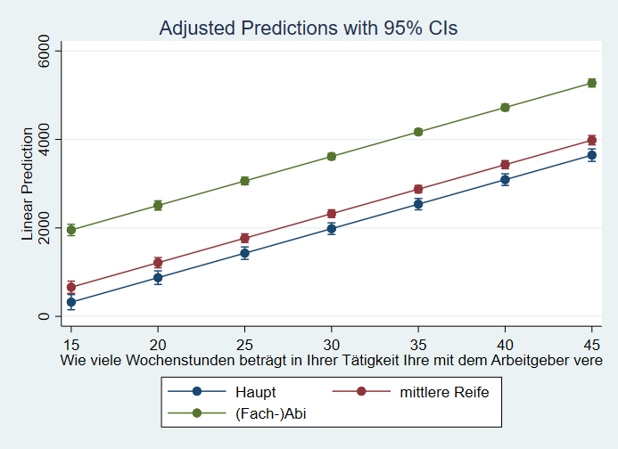
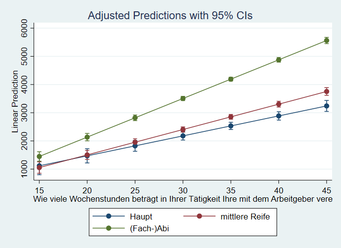
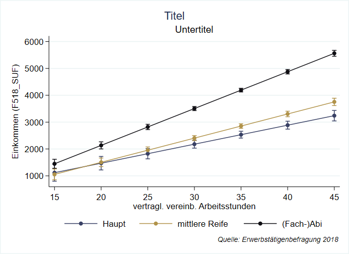

# Regressionsmodelle {#regression} 

```{r setup9, echo = F, message=F, warning = F}
.libPaths("D:/R-library4")
knitr::opts_chunk$set(collapse = TRUE)
knitr::opts_chunk$set(dpi=800)
library(Statamarkdown)
library(tidyverse)
library(kableExtra)
library(scico)
stataexe <- "C:/Program Files (x86)/Stata13/StataSE-64.exe"
# stataexe <- "C:/Program Files/Stata16/StataSE-64.exe"
knitr::opts_chunk$set(engine.path=list(stata=stataexe))
options(width = 200)
df <- data.frame(var1 = c(1,2,7,8),
                 var2 = c(2,4,7,6))

# path <- "D:/oCloud/RFS/"
# ak <- readr::read_delim(paste0(path,"allbus_kumuliert_1980-2018.csv"), delim = ";", col_types = cols(.default = col_double())) %>%  
#   mutate_all(~ifelse(.<0,NA,.))
```


## Regressionsmodelle - Grundlagen {#reg_intro}

Regressionsmodelle zeigen uns den (linearen) Trend zwischen zwei Variablen. Hier geht es darum, um wie sich im Durchschnitt `var2` verändert, wenn sich `var1` um eine Einheit erhöht. `var2` ist also unsere abhängige, `var1` unsere unabhängige Variable - wir möchten `var2` mit `var1` vorhersagen. Im Folgenden sehen wir, dass Regressionsmodelle mit `reg` erstellt werden können und wie wir den Output interpretieren können. Falls Sie nochmal mehr zu den Grundlagen erfahren wollten, findet sich [hier](#bg_reg) eine ausführlichere Erklärung. 
  
  Wir betrachten einen kleinen Beispieldatensatz mit lediglich 4 Fällen und zwei metrischen Variablen `var1` und `var2`:
```{stata use_data, eval = F}
use "https://github.com/filius23/Stata_Skript/raw/master/regression_bsp.dta", clear
```
  
```{r regp1,out.width = "80%",fig.height= 3.5, echo=T, fig.align="center" , echo = F,warning=F,message=F}
m1 <- lm(var2~ var1, data = df)  
df$pred_vorher <- m1$fitted.values
ggplot(df, aes(x = var1, y = var2)) +
  geom_point(size = 3) + 
  geom_smooth(method = "lm", color = "darkblue" , se = FALSE) +
  ggthemes::theme_stata() +
    expand_limits(y=c(0,8),x=c(0,8)) +
    theme(aspect.ratio = 1)
```
  
Mit Regressionsmodellen können wir lineare Zusammenhänge zwischen zwei metrischen Merkmalen untersuchen. In Stata können wir eine Regression mit dem `reg` Befehl berechnen:
    
```{stata reg_bsp, eval=F}
reg var2 var1
```

```{stata reg_bsp2, collectcode=F, echo = F}
use "regression_bsp.dta", clear
egen mean_var2 = mean(var2)
gen m_abw = var2 - mean_var2
qui reg var2 var1
predict pred_vorher, xb
gen res = var2 - pred_vorher 
gen res2 = res^2
set linesize 90
reg var2 var1
```

Hier steht jetzt eine ganze Menge an Informationen, die wir uns im Folgenden genauer ansehen werden. 

Allgemein sieht unsere Regressionformel wie folgt aus:

$$\widehat{var2}=\texttt{_cons} + \beta1 \times \texttt{var1} = 2.1351 + 0.5810 \times \texttt{var1}$$  

***
Ein positiver Wert unter `Coef.` in der Zeile von `var1` bedeutet, dass unsere Gerade von links nach rechts ansteigt und ein negativer eine fallende Linie bedeuten würde. Der Wert unter `var1` gibt an, um *wieviel sich die Gerade pro "Schritt nach rechts" nach oben/unten verändert*. 
  
> Die Gerade steigt also pro Einheit von `var1` um `r m1$coefficients[2]`.
  
Der Wert neben `_cons` gibt uns Auskunft darüber, wie hoch der vorhergesagte Wert für `var2` wäre, wenn `var1` = 0.
  
> Für `var1` = 0 würden wir `var2` = 2.135135 vorhersagen.
  
Außerdem erkennen wir unter `R-squared` die [Modellgüte](#r2) unseres Regressionsmodells. $R^2$ gibt die prozentuale Verbesserung der Vorhersgen durch die Gerade aus `reg` im Vergleich zum arithmetische Mittel an. $R^{2}$ bezieht sich auf die Verringerung der [Residuen](#resid2) durch das `reg`-Modell im Vergleich zur Mittelwertregel. 
    
> Unser Regressionsmodell kann also 84,7\% der Streuung um den Mittelwert erklären. 
    
Außerdem sehen wir oben links in der Spalte `SS` die ["Sum of Squares"](#quad_res): unter `Total` ist die Summe der quadrierten Abweichungen der beobachteten Werte vom arith. Mittel angegeben (die Abstände zwischen den orangen und schwarzen Punkten: `14.75`). Residual gibt die Summe der Abweichungsquadrate zwischen den beobachteten Werten und den vorhergesagten Werten der Regression (die Abstände zwischen den schwarzen und den blauen Punkten:`2.256..`). 
      
      
In der Spalte `P>|t|` und `t` sehen wir die Ergebnisse eines t-Tests für die jeweiligen Koeffizienten. Hier wird der Koeffizient (sprich: die Steigung der Geraden) "gegen Null" getestet. Ist der Zusammenhang zwischen dem Alter der Befragten und ihrem Fernsehkonsum in der Population nicht eigentlich 0?
        
$$H_0:\, \mu_{Koeff(var1)} = 0  \qquad H_A: \mu_{Koeff(var1)} \neq 0$$


Was hier also gemacht wird, ist ein t-Test für `0.5810811` vs. $\mu=0$. Unter `P>|t|` erkennen wir hier aber, dass die Irrtumswahrscheinlichkeit für die Ablehnung der $H_0$ größer als 0,05 ist. Dementsprechend verwerfen wir die Nullhypothese nicht (wonach $\beta1$ = 0 ist) und können hier nicht einen statistisch signifikanten Zusammenhang sprechen.
      
***
      
```{r reg_graph,out.width = "80%",fig.height= 3.5, echo=T, fig.align="center" , echo = F,warning=F,message=F}
df$mean_var2 <- mean(df$var2)
ggplot(df, aes(x = var1, y = var2)) + geom_point(size = 3) + ggthemes::theme_stata() +
      geom_hline(aes(yintercept = mean_var2), color = "grey50", size = .75, linetype = "dashed") +
      geom_point(aes(x = var1, y = mean_var2), col = "darkorange", size = 3) +
      geom_segment(aes(x = var1, xend = var1, y = var2, yend = mean_var2), color = "red", size = .65, linetype = "dotted")  +
      geom_smooth(method = "lm", color = "darkblue" , se = FALSE) +
      geom_point(aes(x = var1, y = pred_vorher), color = "dodgerblue3", size = 3) +
      geom_segment(aes(x = var1, xend = var1, y = var2, yend = pred_vorher), color = "dodgerblue3", size = .65, linetype = 1) +
      expand_limits(y=c(0,8),x=c(0,8)) +
      theme(aspect.ratio = 1)
```
      
      
### vorhergesagte Werte

Die vorhergesagten Werte aus `reg var2 var1` entsprechen einfach der Summe aus dem Wert neben `_cons` und dem Koeffizienten neben `var1` multipliziert mit dem jeweiligen Wert für `var1`. Wir starten also sozusagen bei `var2`=0  und gehen dann eben x Schritte entlang der Geraden.
      
```{stata vorhw1, eval=F}
reg var2 var1, noheader /// noheader macht den Output übersichtlicher
```


```{stata vorhw2, echo=F}
use "regression_bsp.dta", clear
qui egen mean_var2 = mean(var2)
qui gen m_abw = var2 - mean_var2
qui reg var2 var1
qui predict pred_vorher, xb
qui gen res = var2 - pred_vorher 
qui gen res2 = res^2
qui set linesize 90
reg var2 var1, noheader
```
      
Vorhergesagte Werte für `var2` werden mit $\widehat{var2}$  bezeichnet - das $\widehat{}$ steht dabei für "geschätzt":
        
$$\widehat{var2}=\texttt{_cons} + \beta1 \times \texttt{var1} = 2.1351 + 0.5810 \times \texttt{var1}$$  
Für die erste Zeile ergibt sich also folgender vorhergesagter Wert: $2.1351+0.5811\times1$= `r 2.1351+0.5811*1`
Wir könnten also auch einen vorhergesagten Wert für einen beliebigen Wert von `var1` berechnen, für 5: $2.1351+0.5811\times5$= `r 2.1351+0.5811*5`
 
Wir können dafür `display 2.1351+0.5811*5` nutzen.
Alternativ können wir uns die Tipparbeit auch sparen, indem wir erst `reg` laufen lassen und dann mit `_b` auf die Ergebnisse zugreifen:
```{stata pre_dis2, eval = F}
display _b[_cons] + _b[var1] * 5
```
```{stata pre_dis2T, echo=F, collectcode = F}
use "regression_bsp.dta", clear
qui reg var2 var1
display _b[_cons] + _b[var1] * 5
```
      
      
Mit `predict` können wir jeweils die vorhergesagten Werte für die Ausprägungen von `var1` im Datensatz berechnen und in einer neuen Variable `pred_vorher` ablegen:
```{stata pred1, eval = F}
predict pred_vorher, xb
```
Hier wird also gerechnet:
        
+ `2.1351 + 0.5810811 * 1 = 2.716216`  
+ `2.1351 + 0.5810811 * 2 = 3.297297`  
+ `2.1351 + 0.5810811 * 7 = 6.202703`  
+ `2.1351 + 0.5810811 * 8 = 6.783784`  
        
```{r predx, echo=F}
m1 <- lm(var2~ var1, data = df)  
df$manual_vorhers = 2.1351 + 0.5811 * df$var1
df$pred_vorher <- m1$fitted.values
df %>% select(matches("(var|pred_)"))
```

Die Grafik oben zeigt wie Vorhersagen auf Basis des Regressionsmodells aussehen: Sie entsprechen den Werten auf der blauen Geraden (der sog. Regressionsgeraden) an den jeweiligen Stellen für `var1`. 
      
### Korrelation und Regression
```{r reg_korr,out.width = "100%", fig.align="center" , echo = F,warning=F,message=F, dpi = 900}
set.seed(26131)
df <- 
  tibble(x = seq(-20,20,.25)) %>% 
        mutate(e = runif(nrow(.),-20,20),
               y1 = 2.1225 + 1.12*x + e,
               yhat = predict(lm(y1~x),newdata = data.frame(x)),
               yres = y1 - yhat,
               y2 = yhat + 3* yres,
               y3 = 16.2 - 1.12*x + e*-1,
               yhat3 = predict(lm(y3~x),newdata = data.frame(x)),
               yres3 = y3 - yhat3,
               y4 = yhat3 + 3*yres3) 

df2 <- 
  df %>% 
  pivot_longer(cols = matches("y\\d"),names_to = "set", values_to = "y") %>% 
  group_by(set) %>% 
  mutate(cor =  sprintf("%.3f",cor(x,y)),
         my= mean(y),
         mx= mean(x))  %>% 
  group_by(set) %>% nest() %>% 
  mutate(m = map(data,~lm(y~x,data=.x) %>% broom::tidy(.)),
         r2 = map(data,~summary(lm(y~x,data=.x))$r.squared ) %>% unlist(.) ) %>% 
  unnest(data) %>% 
  unnest(m) %>% 
  mutate(term = ifelse(term=="x","b1","b0")) %>% 
  select(-matches("statistic|std\\.|p\\.va")) %>% 
  pivot_wider(names_from = term,values_from = estimate) %>% 
  mutate(reg_fm = paste0("hat(italic(y))==~",format(b0, digits = 2),"~+~",format(b1, digits = 2),"%*%~x")) 
  # mutate(reg_fm = paste0("italic(y) == ", format(b0, digits = 2), " + ",format(b1, digits = 2)," %*%")) 


ggplot(df2,aes(x,y)) + 
  geom_hline(aes(yintercept = my),size = .75, color = "orange") +
  geom_vline(aes(xintercept = mx),size = .75, color = "navy") +
  geom_point(shape = 21, color = "#020C3D", fill = "grey95") + 
  geom_smooth(method = "lm",se=F, color = "#129FB3",size = .75) +
  geom_label(data = distinct(df2,cor,set,b0,b1,reg_fm), 
            aes(x = 0,y = 114,
                label =  paste0("Pearson's r = ",cor) ),
            fill = alpha("grey99",.97), color = "grey25",
            family = "serif",
            hjust= .5, label.size = 0, label.r = unit(.2,"lines")) +
  geom_label(data = distinct(df2,cor,set,b0,b1,reg_fm), 
             aes(x = 0,y = 95,
                 label =  reg_fm),
             fill = alpha("grey99",.97), color = "grey25",
             family = "serif",
             parse = T,
             hjust= .5, label.size = 0, label.r = unit(.2,"lines")) +
  facet_wrap(~set,nrow = 2) +
  coord_cartesian(ylim = c(-72,115.5)) +
  theme_minimal() +
  theme(
    panel.background = element_rect(fill = "grey98", color = NA),
    strip.text = element_blank()) 

```

Außerdem entspricht der Korrelationskoeffizient der Wurzel von $R^2$ oder umgekfehrt: $(R^2)^2$ entspricht dem quadrierten Korrelationskoeffizienten:


```{stata corr_r2reg2, eval=F}
reg var2 var1, notable // notable um regtabelle auszublenden
```
```{stata corr_r2reg, echo=F}
qui use "regression_bsp.dta", clear
reg var2 var1, notable
```

```{stata corr_r2corv, eval=F}
pwcorr var2 var1
```
```{stata corr_r2corc, echo=F}
qui use "regression_bsp.dta", clear
pwcorr var2 var1
```


```{stata r2corr, collectcode = F}
dis sqrt(0.8470) // R² zu corr
```

```{stata r2corr2, collectcode = F}
dis 0.9203^2 // corr zu R²
```


***

**[Übung 1](#regue1)**

***


## kategoriale unabhängige Variablen

Wir können aber auch kategoriale unabhängige Variablen in Regressionsmodellen verwenden.

### Dummyvariablen

Ein klassisches Beispiel für ene Dummyvariable aus unab. Variable in einem Regressionsmodell ist der Zusammenhang zwischen dem Geschlecht und dem Einkommen (Stichwort Gender Pay Gap). In der ETB 2018 ist das Geschlecht unter `S1` abgelegt: `1` steht dabei für Männer, `2` steht für Frauen.

Wie können wir `S1` nun in das Regressionsmodell aufnehmen? Bisher hatten wir ja nur Modelle für metrische unabhängige und abhängige Variablen erstellt. Das Geschlecht ist aber kein metrisches Merkmal ($\Rightarrow$ sondern?). Die Zahlencodes sollten hier nicht als Werte verwendet werden. Hier gibt es keine Punktewolke, durch die sinnvoll eine Gerade durch Residuenminimierung gezogen werden kann:
```{r dummyplot, out.width="70%", out.height="70%", fig.align='center', echo = F, warning=F}
baua <- readstata13::read.dta13("D:/Datenspeicher/BIBB_BAuA/BIBBBAuA_2018_suf1.0.dta",convert.factors = F,
                                select.cols = c("S1","F518_SUF","S3")) %>% 
  mutate(across(matches("S1|F"), ~ ifelse(.x>99998,NA,.x)),
         S3 = ifelse(S3 %in% 2:9,S3,NA),
         educ = case_when(S3 %in% 2:4 ~ "1",
                          S3 %in% 5:6 ~ "2",
                          S3 %in% 7:9 ~ "3")) %>% 
  select(S1,F518_SUF,S3, educ) %>% filter(F518_SUF<99998)

baua <- baua %>% group_by(S1) %>% mutate(mean_inc = mean(F518_SUF,na.rm = T), n1 = 1:n() ) %>% ungroup(.)
baua$sex1  <- factor(baua$S1)


mark_color <- "grey25"
color1x =  "#00519E" # uol farbe
colorhex <- "#FCFCFC" #"#FCF9F0FF"7

baua %>% 
  ggplot(.,aes(x = sex1, y = F518_SUF, color = sex1)) +
  geom_point(size = .5) +
  scale_x_discrete(breaks = c("1","2"), labels = c("Männer", "Frauen")) +
  scale_color_manual(values = scico::scico(3,palette = "davos")[1:2],guide = F) +
  labs(color = "", 
       y = "Einkommen (€)",
       x = "") +
  theme_minimal(base_family = "Nunito",base_size = 10) +
  theme(
    text = element_text(family = "Nunito"),
    plot.background = element_rect(fill = colorhex, linetype = 1, colour = NA),
    rect = element_rect(fill = colorhex, linetype = 1, colour = NA),
    axis.text =  element_text(color = mark_color,face = "plain", size = rel(1.05), angle = 0), 
    axis.title = element_text(color = mark_color,face = "plain", size = rel(1), angle = 0), 
    axis.title.y = element_text(color = mark_color,face = "plain", angle = 90,vjust = .5), 
    axis.ticks = element_blank(),
    axis.line = element_line(size = .1), 
    legend.text = element_text(family = "Nunito"),
    legend.title = element_text(family = "Nunito"),
    panel.grid = element_line(colour = "grey81", linetype = 1, size = .15), 
    panel.grid.minor.y = element_blank(), 
    panel.grid.minor.x = element_blank(), 
    plot.subtitle = element_text(hjust=.5,family = "Nunito"),
    plot.caption = element_text(hjust=1, size = rel(1.2), color = mark_color),
    plot.margin = unit(c(1, 1, 1, 1), "lines"))

```

In einem Regressionsmodell müssen wir Stata mit dem Präfix `i.` mitteilen, dass es sich bei der Variable um eine kategoriale Variable handelt:

```{stata reg1, eval = F}
reg F518_SUF i.S1
```


```{stata reg1a, echo = F}
quietly{
set linesize 120
qui use "D:\Datenspeicher\BIBB_BAuA/BIBBBAuA_2018_suf1.0.dta", clear
	mvdecode F518_SUF, mv(99998/99999)
}
reg F518_SUF i.S1
```
```{r, echo=F}
baua$sex <- factor(baua$S1)
m2 <- lm(F518_SUF ~ sex,baua[baua$F518_SUF<99998,])
```

Der Koeffizient für `S1` entspricht also der Differenz zwischen dem mittleren Einkommen für Männer und Frauen. Durch den Zusatz `weiblich` erhalten wir zusätzlich die Information über die *Referenzkategorie*: 

Befragte mit der Ausprägung `S1 = 2`, also Frauen,  haben im Vergleich zu Befragten mit der anderen Ausprägung ($\rightarrow$ Männer) ein um `r sprintf("%2.3f", abs(m2$coefficients[2]))` EUR niedrigeres Einkommen. Der Zusammenhang zwischen Einkommen und dem Geschlecht der Befragten ist am 0,001-Niveau signifikant. 

Formal sieht unser Modell also so aus:

$$\widehat{\text{F518_SUF}} =  \hat{\beta0} + \hat{\beta1} \times \texttt{S1=2}$$


Für `S1=2` setzen wir dann entweder 0 oder 1 ein - je nachdem ob wir einen vorhergesagten Wert für Frauen oder für Männer berechnen wollen. 0 setzen wir immer dann ein, wenn wir einen Wert für die *Referenzkategorie* berechnen wollen:


`r sprintf("%2.3f", abs(m2$coefficients[1]))` + `r sprintf("%2.3f", m2$coefficients[2])` $\times 0$ = `r sprintf("%2.3f", abs(m2$coefficients[1]))`

Für Frauen sähe die Berechnung wie folgt aus - hier setzen wir die 1 ein, weil sozusagen `sex2` zutrifft:

`r sprintf("%2.3f", abs(m2$coefficients[1]))` + `r sprintf("%2.3f", m2$coefficients[2])` $\times 1$ = `r sprintf("%2.3f", m2$coefficients[1] + m2$coefficients[2])`

Die Logik folgt hier einem Gruppenvergleich zwischen den Gruppen. Wir vergleichen also die Mittelwerte zwischen verschiedenen Gruppen, in diesem Fall zwischen Männern und Frauen:[^1]

[^1]: Um zu verdeutlichen wieviele Befragte jeweils das (ungefähr) gleiche Einkommen haben, wurden die Punkte hier nach links und rechts verschoben. Im Unterschied zu den bisherigen Streudiagrammen hat die relative Position innerhalb der Kategorien Männer und Frauen jedoch keine Bedeutung.

```{r educplot,out.width="70%", fig.align='center', echo = F, warning=F}
baua$sex <- factor(baua$S1)
m2 <- lm(F518_SUF ~ sex,baua[baua$F518_SUF<99998,])

theme_x <- 
  theme_minimal(base_family = "Nunito",base_size = 10) +
  theme(
    text = element_text(family = "Nunito"),
    plot.background = element_rect(fill = colorhex, linetype = 1, colour = NA),
    rect = element_rect(fill = colorhex, linetype = 1, colour = NA),
    axis.text =  element_text(color = mark_color,face = "plain", size = rel(1.05), angle = 0), 
    axis.title = element_text(color = mark_color,face = "plain", size = rel(1), angle = 0), 
    axis.title.y = element_text(color = mark_color,face = "plain", angle = 90,vjust = .5), 
    axis.ticks = element_blank(),
    axis.line = element_line(size = .1), 
    legend.text = element_text(family = "Nunito"),
    legend.title = element_text(family = "Nunito"),
    panel.grid = element_line(colour = "grey81", linetype = 1, size = .15), 
    panel.grid.minor.y = element_blank(), 
    panel.grid.minor.x = element_blank(), 
    plot.subtitle = element_text(hjust=.5,family = "Nunito"),
    plot.caption = element_text(hjust=1, size = rel(1.2), color = mark_color),
    plot.margin = unit(c(1, 1, 1, 1), "lines"))


lab_df <- data.frame(sex1 = c("1","2"), 
                     F518_SUF  = c(mean(baua$F518_SUF[baua$sex1=="1"], na.rm = T),mean(baua$F518_SUF[baua$sex1=="2"], na.rm = T)), 
                     S1  = c(-.75,1), 
                     lab1 = c(paste0("bar(F518_SUF_[m])==", sprintf("%2.1f",mean(baua$F518_SUF[baua$sex1=="1"], na.rm = T))),
                              paste0("bar(F518_SUF_[f])==", sprintf("%2.1f",mean(baua$F518_SUF[baua$sex1=="2"], na.rm = T)))) )
lab_df2 <- data.frame(sex1 = "1", 
                     F518_SUF  = mean(baua$F518_SUF[baua$sex1=="1"], na.rm = T) + mean(baua$F518_SUF[baua$sex1=="2"], na.rm = T)/2 , 
                     S1  = 0, 
                     lab1 = paste0("Delta==", 
                                   sprintf("%2.1f",mean(baua$F518_SUF[baua$sex1=="1"], na.rm = T) - mean(baua$F518_SUF[baua$sex1=="2"], na.rm = T)) ))

baua %>% 
  ggplot(.,aes(x = S1, y = F518_SUF, color = sex1)) +
  geom_point(position = position_jitter(height = 0, width = .25), size = .75) +
  geom_tile(data = filter(baua, n1 ==1), aes(x = S1, y = mean_inc, width = 1, height = 50), color = scico(7,palette = "davos")[6:5],
            fill = scico(7,palette = "davos")[6:5]) +
  geom_segment(data=data.frame(sex1 = "1", S1= 1.5, ymin = min(baua$mean_inc), ymax = max(baua$mean_inc)), aes(xend = S1,y=ymax,yend=ymin),
               arrow = arrow(length = unit(.35,units = "lines"),type = "closed"), color = "orange",size = .75) +
  # geom_label(data =lab_df,aes(label = lab1),family = "Nunito",
  #            size = 3, hjust = 0, parse = T, nudge_x = 1.45,label.size = .01) + # Beschriftung der Mittelwerte
  geom_curve(data=data.frame(sex1 = "1", 
                             S1= 1.5, 
                             y1 = lab_df2$F518_SUF, 
                             y2 = mean(baua$F518_SUF[baua$se1x=="1"], na.rm = T) - 
                               (mean(baua$F518_SUF[baua$sex1=="1"], na.rm = T) - mean(baua$F518_SUF[baua$sex1=="2"], na.rm = T)) /2  ), 
             aes(xend = S1,y=y1,yend=y2),curvature = -.5,
             color = "orange",size = .5) +  # delta beschriftung
  geom_label(data =lab_df2,
           aes(label = lab1), hjust = .5,
           family = "Nunito", fill = "orange",
           size = 3, hjust = 0, parse = T, nudge_x = 1.45,label.size = .01) + #delta 
  coord_cartesian(ylim = c(0,20000)) +
  scale_x_continuous(breaks = 1:2, labels = c("Männer", "Frauen")) +
  scale_color_manual(values = scico(3,palette = "davos")[1:2],guide = F) +
  labs(color = "", 
       caption = "Werte über 20,000EUR ausgeblendet",
       y = "Einkommen (€)",
       x = "") +
  theme_x 
```

Wir können die Referenzkategorie natürlich auch ändern auf `S1 = 2`. 
Dazu geben wir `ib2.` an:

```{stata reg2, eval = F}
reg F518_SUF ib2.S1
```


```{stata reg2a, echo = F}
quietly{
set linesize 120
qui use "D:\Datenspeicher\BIBB_BAuA/BIBBBAuA_2018_suf1.0.dta", clear
	mvdecode F518_SUF, mv(99998/99999)
}
reg F518_SUF ib2.S1
```


Wie hier ist dann also die Interpretation "umgekehrt": 
```{r, echo =F}
bauasex <- relevel(baua$sex, ref = "2")
m2b <- lm(F518_SUF ~ sex,baua)
```


Befragte mit der Ausprägung `S1 = 1`, also Männer, haben im Vergleich zu Befragten mit der anderen Ausprägung ($\rightarrow$ Frauen) ein um `r sprintf("%2.2f", abs(m2b$coefficients[2]))` EUR höheres Einkommen. Der Zusammenhang zwischen Einkommen und dem Geschlecht der Befragten ist am 0,001-Niveau signifikant. 

### Vergleich mit `ttest`


```{stata ttestrega, eval = F}
reg F518_SUF i.S1
ttest F518_SUF,by(S1)
```

```{stata ttestregb, echo = F}
quietly{
set linesize 120
qui use "D:\Datenspeicher\BIBB_BAuA/BIBBBAuA_2018_suf1.0.dta", clear
	mvdecode F518_SUF, mv(99998/99999)
}
reg F518_SUF i.S1
ttest F518_SUF,by(S1)
```

### Mehrere Ausprägungen 

Diese Logik des Gruppenvergleichs lässt sich auch auf kategoriale Variablen mit mehreren Ausprägungen erweitern, bspw. der Schulbildung der Befragten (`educ` - siehe DoFile für Vorbereitung):
```{r ord_vars2, echo =F}
tribble(~"v",~"l",
        "educ", "höchster Schulabschluss",
          "1" , "max. Hauptschulabschluss",
          "2" , "max. mittlere Reife",
          "3" , "(Fach-)Abitur"
        ) %>% 
    kable() %>% 
  kable_styling(bootstrap_options = "condensed", full_width = F,font_size = 10) %>% 
  column_spec(1,monospace = TRUE) %>% 
  row_spec(c(1), bold = T, background = "#F2F2F2FF") %>% 
    row_spec(0, color = "white")
```

Wir müssen Stata wieder mit `i.` mitteilen, dass es sich um Gruppencodes (eine kategoriale Variable) handelt:
```{stata kat2reg2, eval = F}
reg F518_SUF i.educ
```
          
```{stata kat2reg1, echo = F}
quietly{
set linesize 120
qui use "D:\Datenspeicher\BIBB_BAuA/BIBBBAuA_2018_suf1.0.dta", clear
	mvdecode S3, mv(1 10/12 99)
	cap drop educ
	recode S3 (2/4 = 1 "Haupt")(5/6 = 2 "m. Reife") (7/9 = 3 "(Fach-)Abi"), into(educ)
	mvdecode F518_SUF, mv(99998/99999)
	lab var educ "educ"
}
reg F518_SUF i.educ
```

```{r educreg_R, echo = F}
m4 <- lm(F518_SUF ~educ,baua)
```


Auch diese Koeffizienten sind als Gruppenvergleiche zu interpretieren - und zwar immer relativ zu der Ausprägung von `educ`, die *nicht* in der Regressionstabelle aufgeführt ist. (Hier also max. Hauptschule) 

Befragte mit mittlerer Reife haben ein um `r sprintf("%3.2f",m4$coefficients[2])` Euro höheres Bruttoeinkommen als Befragte, die maximal einen Hauptschulabschluss haben. Der Zusammenhang ist am 0,01-Niveau signifikant. \   

Befragte mit (Fach-)Abitur verdienen `r sprintf("%3.2f",m4$coefficients[3])` Euro höheres Bruttoeinkommen als Befragte, die maximal Hauptschulabschluss haben. Der Zusammenhang ist am 0,001-Niveau signifikant. \   

Formal sieht unser Modell also so aus:
$$\widehat{\texttt{F518_SUF}} = \hat{\beta0} + \hat{\beta1}\times\texttt{educ=2} + \hat{\beta2} \times \texttt{educ=3}$$

Für `educ=2` wird nur dann eine `1` eingesetzt, wenn der/die Befragte mittlere Reife hat - alle anderen Variablen sind dann notwendigerweise auf 0 gesetzt. Für eine(n) Befragte*n mit max Hauptschulabschluss (also eine Person aus der Referenzkategorie) wird für alle Variablen die Null eingesetzt. 

```{r,  echo=F, out.height="80%", out.width="80%", fig.align="center", message=F, warning=F}
baua_e <- baua %>% filter(!is.na(educ)) %>% group_by(educ) %>% mutate(mean_inc = mean(F518_SUF,na.rm = T), n1 = 1:n() ) %>% ungroup(.)

baua_e %>% 
  ggplot(aes(x = educ, y = F518_SUF, color = educ), alpha = .5) + 
  theme_x +
  geom_point(position = position_jitter(height = 0, width = .25), size = .75) +
  geom_tile(data = filter(baua_e, n1 ==1,!is.na(educ)), aes(x = educ, y = mean_inc, width = 1, height = 4), color = "black") +
  scale_color_manual(values = scico(6,palette = "tokyo")[2:5],guide = F) +
  scale_x_discrete(breaks = 1:3, labels = c("Hauptschulabschluss","mittlere Reife","(Fach-)Abi")) +
  labs(y = "Einkommen", x = "",
       caption = "Werte über 12 500 EUR ausgeblendet") +
  coord_cartesian(ylim = c(0,12500))
```  

Auch hier können wir die Referenzkategorie natürlich auch ändern auf `educ = 3`. 
Dazu geben wir `ib3.` an:
```{stata reg8, eval = F}
reg F518_SUF ib3.educ
```

```{stata reg8a, echo = F}
quietly{
set linesize 120
qui use "D:\Datenspeicher\BIBB_BAuA/BIBBBAuA_2018_suf1.0.dta", clear
	mvdecode F518_SUF, mv(99998/99999)
	qui recode S3 (2/4 = 1 "Haupt")(5/6 = 2 "mittlere Reife") (7/9 = 3 "(Fach-)Abi") (else = .), into(educ)
}
reg F518_SUF ib2.educ
```


## mehrere unabhängige Variablen

Natürlich können wir auch mehrere unabhängige Variablen in unser Modell aufnehmen. Beispielsweise können wir so für die Wochenarbeitszeiten kontrollieren:
```{stata mreg1, eval = F}
reg F518_SUF i.educ F200
```

```{stata mreg2, echo = F}
quietly{
set linesize 120
qui use "D:\Datenspeicher\BIBB_BAuA/BIBBBAuA_2018_suf1.0.dta", clear
	mvdecode S3, mv(1 10/12 99)
	cap drop educ
	recode S3 (2/4 = 1 "Haupt")(5/6 = 2 "m. Reife") (7/9 = 3 "(Fach-)Abi"), into(educ)
	mvdecode F518_SUF, mv(99998/99999)
	lab var educ "educ"
	mvdecode F200, mv(97/99)
}
reg F518_SUF i.educ F200
```

Hier ändert sich dann die Interpretation: unter konstanthaltung der Wochenarbeitszeit geben Befagte mit (Fach-)Abitur ein um 1632.40EUR höheres Einkommen als Befragte mit maximal Hauptschulabschluss an.

Ein äußerst hilfreicher Befehl in diesem Zusammenhang ist `margins` bzw. `marginsplot`:
```{stata mar1, eval =F}
margins, at( F200 = (15(5)45) educ = (1(1)3))
marginsplot
```
```{r marplot1, echo = F,out.width = "90%", fig.align="center"}

```


### Interaktionsterme

Wenn wir uns aber fragen, ob sich der Zusammenhang zwischen der Schulbildung und dem Einkommen mit der Wochenarbeitszeit verändert, benötigen wir einen Interaktionsterm:

```{stata mreg13, eval = F}
reg F518_SUF i.educ##c.F200
```

```{stata mreg4, echo = F}
quietly{
set linesize 120
qui use "D:\Datenspeicher\BIBB_BAuA/BIBBBAuA_2018_suf1.0.dta", clear
	mvdecode S3, mv(1 10/12 99)
	cap drop educ
	recode S3 (2/4 = 1 "Haupt")(5/6 = 2 "m. Reife") (7/9 = 3 "(Fach-)Abi"), into(educ)
	mvdecode F518_SUF, mv(99998/99999)
	lab var educ "educ"
	mvdecode F200, mv(97/99)
}
reg F518_SUF i.educ##c.F200
```

Bei Interaktionstermen empfiehlt sich ganz besonders, einen `marginsplot` zu erstellen:
```{stata marginIA, eval = F}
margins, at( F200 = (15(5)45) educ = (1(1)3))
marginsplot
```

```{r marplot2, echo = F,out.width = "90%", fig.align="center"}

```

## Übungen 9

### Übung 9-1 {#regue1}

(@)


### Übung 9-2 {#regue2}


(@) Lassen Sie mal `i.` weg - was verändert sich?


## Anhang

### `marginsplot` anpassen

```{stata marp2_cost, eval = F}
marginsplot, /// 
		graphregion(fcolor("250 250 250")) /// Hintergundfarbe (außerhalb des eigentlichen Plots)
    plot1(color("57 65 101")  msize(small)) /// Farbe & Größe für erste Gruppe
		ci1opts(color("57 65 101")) /// Farbe für Konfidenzintervalle der ersten Gruppe
		plot2(color("177 147 74") msize(small)) ///
		ci2opts(color("177 147 74")) /// 
		plot3(color("16 15 20")   msize(small)) /// 
		ci3opts(color("16 15 20")) /// 
    legend(cols(3) region(color(white) fcolor(white))  )   /// Spaltenzahl, Rahmen- & Hintergrundfarbe für Legende
		xtitle("vertragl. vereinb. Arbeitsstunden") /// Achsentitel
		ylabel(,angle(0)) /// Achen
    ytitle("Einkommen (F518_SUF)") /// 
		title("Titel") ///
    subtitle("Untertitel") ///
    caption("{it:Quelle: Erwerbstätigenbefragung 2018}", size(8pt) position(5) ring(5) )
```

```{r marplot2c, echo = F,out.width = "90%", fig.align="center"}

```

**[weiterführende Informationen](https://www.stata.com/meeting/germany18/slides/germany18_Jann.pdf)**