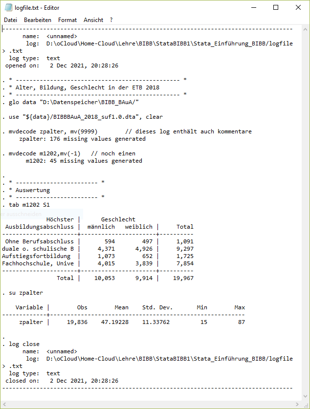

# Anhang - fortgeschrittene Themen {#appendix} 

```{r setup31, echo = F, message=F, warning = F}
.libPaths("D:/R-library4")
knitr::opts_chunk$set(collapse = TRUE)
knitr::opts_chunk$set(dpi=800)
library(Statamarkdown)
library(tidyverse)
library(kableExtra)
# stataexe <- "C:/Program Files (x86)/Stata13/StataSE-64.exe"
stataexe <- "C:/Program Files/Stata16/StataSE-64.exe"
knitr::opts_chunk$set(engine.path=list(stata=stataexe))
# baua <- readstata13::read.dta13("D:/Datenspeicher/BIBB_BAuA/BIBBBAuA_2018_suf1.0.dta",convert.factors = F)
```


## Import und Aufbereitung aus Excel {#xlsimport}


```{r gendata, include=F,eval = F}
set.seed(26131)
data.frame(id = 1:15,
           x1 = sample(c(1:2,-4), size = 15,replace = T),
           x2 = sample(c(1,0,-4,-9),     15,replace = T),
           x3 = sample(c(1,0,-4,-9),     15,replace = T),
           x4 = sample(1:5,              15,replace = T)) %>% 
  xlsx::write.xlsx("./Stata_Einführung_BIBB/Rohdaten.xlsx",row.names = F)
```


### Datenimport aus Excel-Datei

Unter `file -> import -> excel spreadsheet` können wir einen Excel-Import erstellen, den Befehl aus dem Ausgabefenster können wir dann kopieren:

```{stata xl1, eval =F }
import excel "D:\oCloud\Home-Cloud\Lehre\BIBB\StataBIBB1\Stata_Einführung_BIBB\Rohdaten.xlsx", sheet("Sheet1") firstrow case(lower) clear
// oder:
cd "D:\oCloud\Home-Cloud\Lehre\BIBB\StataBIBB1\Stata_Einführung_BIBB\"
import excel "Rohdaten.xlsx", sheet("Sheet1") firstrow case(lower) clear
* Überblick gewinnen
list
browse
```

```{stata xl1b, echo = F}
qui import excel "Rohdaten.xlsx", sheet("Sheet1") firstrow case(lower) clear
list, clean
```

Hier eine kleine (Fantasie-)Doku zum Datensatz:


```{r xlsdoke,echo=F}
tribble(
    ~"Variablenname", ~"Beschreibung", ~"Details",
	 "id" ,		"Befragten-Identifikationsnummer", "",
	 "x1" ,		"Geschlecht", "1 = Frau, 2 = Mann, -4 keine Angabe",
	 "x2" ,		"Haustiere?", "0 = nein, 1 =  ja, -4  keine Angabe, -9 Datenfehler",
	 "x3" ,		"Frühaufsteher?", "0 = nein, 1 =  ja, -4  keine Angabe, -9 Datenfehler",
	 "x4"	,		"5er Likert-Skala: Stata macht Spaß", "1 = trifft überhaupt nicht zu",
	 ""	,		"", "5 = tifft voll zu"
) %>% 
  kable() %>% 
  kable_styling(bootstrap_options = "condensed", full_width = F,font_size = 12) %>% 
  column_spec(1,monospace = TRUE) 

```
	 
				
### Variablen umbenennen: `rename`

Dann benennen wir die Variablen in sprechendere Namen um `rename alt neu`:
```{stata xl2, eval = F}
rename x1 gender
rename x2 pets
rename x3 earlybird
rename x4 stata
```

```{stata xl2T, echo = F}
qui import excel "Rohdaten.xlsx", sheet("Sheet1") firstrow case(lower) clear
rename x1 gender
rename x2 pets
rename x3 earlybird
rename x4 stata
list, clean
```


### Variablenbeschreibung: `label variable`

```{stata xl3, eval = F}
label variable gender		  "Geschlecht"
label variable pets			  "Haustierbesitz?"
label variable earlybird	"Frühaufsteher"
label variable stata     	"Stata macht Spaß"
```
```{stata xl3T, echo = F}
qui import excel "Rohdaten.xlsx", sheet("Sheet1") firstrow case(lower) clear
rename x1 gender
rename x2 pets
rename x3 earlybird
rename x4 stata
label variable gender		  "Geschlecht"
label variable pets			  "Haustierbesitz?"
label variable earlybird	"Frühaufsteher"
label variable stata     	"Stata macht Spaß"
d
```

### Werte labeln `label values`

Mit  `.buchstabe` können wir fehlende Werte unterscheidbar halten, so können wir sowohl "keine Angabe" als auch "Datenfehler als Missing überschreiben und trotzdem beide Varianten unterscheidbar halten:

```{stata xl4, eval = F}
tab gender
replace gender = .k if gender == -4
tab gender
tab gender, m

label define gend_lab 1 "Frau" 2 "Mann" .k "keine Angabe"
lab val gender gend_lab
tab gender
tab gender, m
```

```{stata xl4T, echo = F}
quietly{
import excel "Rohdaten.xlsx", sheet("Sheet1") firstrow case(lower) clear
rename x1 gender
rename x2 pets
rename x3 earlybird
rename x4 stata
label variable gender		  "Geschlecht"
label variable pets			  "Haustierbesitz?"
label variable earlybird	"Frühaufsteher"
label variable stata     	"Stata macht Spaß"
  }
replace gender = .k if gender == -4
label define gend_lab 1 "Frau" 2 "Mann" .k "keine Angabe"
lab val gender gend_lab
tab gender, nol
tab gender, m
```

Für die weiteren Variablen können wir ähnlich vorgehen: 
```{stata xl5, eval = F}
lab def dummy_lab 0 "Nein" 1 "Ja" .k "keine Angabe" .d "Datenfehler"
lab val earlybird dummy_lab

tab earlybird
recode  earlybird (-9=.d) (-4=.k)
	* oder:
	replace earlybird = .k if earlybird == -4
	replace earlybird = .d if earlybird == -9
tab earlybird,m
```
```{stata xl5T, echo = F}
quietly{
import excel "Rohdaten.xlsx", sheet("Sheet1") firstrow case(lower) clear
rename x1 gender
rename x2 pets
rename x3 earlybird
rename x4 stata
label variable gender		  "Geschlecht"
label variable pets			  "Haustierbesitz?"
label variable earlybird	"Frühaufsteher"
label variable stata     	"Stata macht Spaß"
  }
lab def dummy_lab 0 "Nein" 1 "Ja" .k "keine Angabe" .d "Datenfehler"
lab val earlybird dummy_lab
recode  earlybird (-9=.d) (-4=.k)
tab earlybird,m
```


und wir verwenden eine fortgeschrittene Programmierung: foreach-Schleife
```{stata xlloop, eval = F}
foreach v of varlist earlybird pets {
	replace `v' = .k if `v' == -4
	replace `v' = .d if `v' == -9	
	lab val `v' dummy_lab
}
// oder
foreach v of varlist earlybird pets {
	recode  `v' (-9=.d) (-4=.k)
	lab val `v' dummy_lab
}
```


```{stata xlloopT, echo = F}
quietly{
import excel "Rohdaten.xlsx", sheet("Sheet1") firstrow case(lower) clear
rename x1 gender
rename x2 pets
rename x3 earlybird
rename x4 stata
label variable gender		  "Geschlecht"
label variable pets			  "Haustierbesitz?"
label variable earlybird	"Frühaufsteher"
label variable stata     	"Stata macht Spaß"
}
foreach v of varlist earlybird pets {
	recode  `v' (-9=.d) (-4=.k)
	lab val `v' dummy_lab
}
```


### exportieren
```{stata xlexp, eval = F}
compress // variablen auf minimale speichergröße bringen
save "Datensatz_ready.dta", replace
```
Dieser Datensatz kann mit `use` geladen werden.

## `adopath`

Mit `adopath` können wir die Ordner anzeigen, wo die `ado`s liegen.
Mit `which` können wir den Speicherort eines `ado` ansehen:
```{stata ado, eval = F}
which mdesc
```
```{stata ado2, echo = F}
dis ""
which mdesc
```

Mit `adopath ++ PFAD` können wir `ado` aus zusätzlichen Ordner verwenden:
```{stata ado3, eval = F}
adopath ++ "D:\oCloud\Home-Cloud\Lehre\BIBB\StataBIBB1\Stata_Einführung_BIBB/u"
```


## log file

Mit log-Files können wir alles mitprotokollieren, was im Outputfenster passiert. Wir starten ein log-File mit `log using dateiname`. Ab dann wird alles in dieser Datei mitgeschrieben, was wir uns im Outputfenster anzeigen lassen:
```{stata s100, eval = F}
log using "C:\Pfad\zum\Ordner/log/logfile.txt", text replace // mit replace wird die Datei ggf überschrieben
* ------------------------------------------------ *
* Alter, Bildung, Geschlecht in der ETB 2018
* ------------------------------------------------ *
glo data "D:\Datenspeicher\BIBB_BAuA/"
use "${data}/BIBBBAuA_2018_suf1.0.dta", clear
mvdecode zpalter, mv(9999)	  // dieses log enthält auch kommentare
mvdecode m1202,mv(-1)   // noch einen 

* ------------------------ *
* Auswertung
* ------------------------ *
tab m1202 S1
su zpalter 

log close
```

```{r logfile, echo = F,out.width = "100%",out.height="100%", fig.align="center"}

```


## Beobachtungen markieren mit `gen` & `if`

Die Kombination aus `gen` und `if` hilft uns, wenn wir eine Variable nur für einige Zeilen erstellen wollen. Das hilft insbesondere, wenn wir bestimmte Beobachtungen markieren wollen. Beispielsweise Frauen (`S1` = 1), die einer Nebentätigkeit (`nt` = 1) nachgehen:

```{stata genif, eval = F}
gen nt_frauen = 1 if S1 == 1 & nt == 1
```
```{stata genifb2,echo = F}
qui use "D:\Datenspeicher\BIBB_BAuA/BIBBBAuA_2018_suf1.0.dta", clear
gen nt_frauen = 1 if S1 == 1 & nt == 1
```

Nur wenn beide Bedingungen zutreffen, wird unter `nt_frauen` eine 1 abgelegt:
```{stata genif2, eval = F}
list S1 nt nt_frauen in 19671/19675, clean noobs abb(12) 
```
```{stata genifb,echo = F}
qui use "D:\Datenspeicher\BIBB_BAuA/BIBBBAuA_2018_suf1.0.dta", clear
qui gen nt_frauen = 1 if S1 == 1 & nt == 1
list S1 nt nt_frauen in 19671/19675, clean noobs abb(12) 
```

In der alltäglichen Arbeit hilft das manchmal, wenn man spezielle Fälle immer wieder aufrufen möchte und nicht immer die "ausgeschriebenen" `if`-Bedingungen verwenden möchte.


## Index bilden

In Kapitel 5 hatten wir mit [`recode`](#recode) eine Möglichkeit kennen gelernt, wie Codierungen verändert werden können.
Ein typischer Fall ist das "Umdrehen" von Skalen in einer Item-Batterie, sodass in beiden/allen Variablen höhere Werte auch inhaltlich das gleiche bedeuten.
In der BIBB/BAuA 2018 könnten wir bspw. einen Index für die Autonomie/Einbindung am Arbeitsplatz erstellen, indem wir die Antworten aus den folgenden beiden Fragen addieren:
 + `F700_02`: Wie häufig kommt es vor, dass Sie Ihre eigene Arbeit selbst planen und einteilen können?
 + `F700_08`: Wie oft kommt es vor, dass Sie nicht rechtzeitig über einschneidende Entscheidungen, Veränderungen oder Pläne für die Zukunft informiert werden?

Hier wäre es also so, dass der niedrigste Wert (1 = Häufig) jeweils etwas anderes bedeutet. Im Fall von `F700_08`
Variable betrachten, sehen wir
```{stata recode10, eval = F}
recode F700_02 (4=1) (3=2) (2=3) (1=4), into(F700_02_rev)
```


```{stata recode10a, eval = F}
gen index = (F700_02_rev + F700_10)/2
```

> <span style="color:#FFA500FF"><i>Inhaltlich ist das sicher nicht 100% überzeugend - hier geht's um die technische Umsetzung</i></span>

***

**Tipp**

Man kann in diesem speziellen Fall einer "umgedrehten" Skala können wir auch einfach "höchster Wert + 1 minus Variablenwert rechnen". Im Fall von `F700_02` ist der höchste Wert 4, also würden wir 4-`F700_02` rechnen:
```{stata revert, eval =F}
gen F700_02_rev2 = 5 - F700_02 
```

***