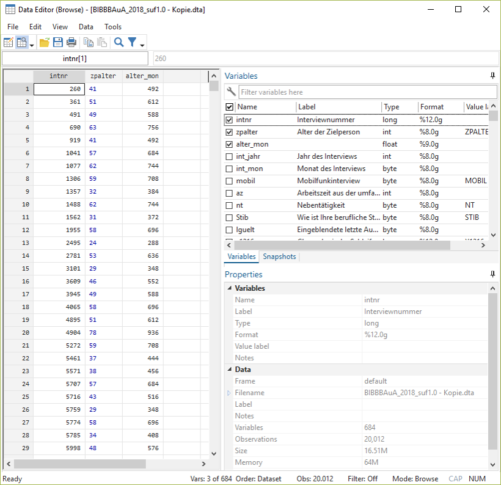

## Hilfe

Mit `help` bekommen wir eine Hilfeseite angezeigt, hilfreich sind dabei vor allem die Beispiele ganz unten:
```{stata help_desc, eval = F}
help describe
```

```{r help_ansicht, echo = F,out.width = "40%",fig.height= 2.5, fig.align="center"}
knitr::include_graphics("02_help_describe.PNG")
```

Kommandos in Stata sind zeilenbasiert. D.h. alles was zu einem Kommando gehört, muss in der gleichen Zeile stehen. Umgekehrt wird auch alles, was in einer Zeile steht als Teil des Kommandos verstanden:
```{stata rowbased, eval = F}
describe pv01 age sex, short
```

```{stata rowbased1, echo = F}
set linesize 80
qui use "D:\oCloud\Home-Cloud\Lehre\Methodenseminar\Allbus2018.dta", clear
describe pv01 age sex, short
```

Funktioniert nicht:
```{stata rowbased2, eval = F}
d pv01 age 
sex
```
```{stata rowbased2b, echo = F}
set linesize 80
qui use "D:\oCloud\Home-Cloud\Lehre\Methodenseminar\Allbus2018.dta", clear
d pv01 age 
sex
```

Mit `///` können wir Zeilen verknüpfen:
```{stata rowbased3, eval = F}
d pv01 age /// 
sex
```
```{stata rowbased3b, echo = F}
set linesize 80
qui use "D:\oCloud\Home-Cloud\Lehre\Methodenseminar\Allbus2018.dta", clear
d pv01 age ///
sex
```

Außerdem können wir mit `//` Kommentare in unsere DoFiles einfügen. `//` blendet  alles folgende am Ende der Zeile aus:
```{stata comment, eval = F}
d pv01 age sex // dies ist ein kommentar
```
```{stata comment2, echo = F}
set linesize 80
qui use "D:\oCloud\Home-Cloud\Lehre\Methodenseminar\Allbus2018.dta", clear
d pv01 age sex
```

`///` kann auch zum Kommentieren verwendet werden:
```{stata comment3, eval = F}
d pv01 age /// hier kann ein kommentar stehen
sex // hier geht es weiter
```
```{stata comment4, echo = F}
set linesize 80
qui use "D:\oCloud\Home-Cloud\Lehre\Methodenseminar\Allbus2018.dta", clear
d pv01 age /// hier kann ein kommentar stehen
sex // hier geht es weiter
```


+ Welche Information ist in der Variable `respid` abgelegt? 
  + Wie können Sie sich die Zeile anzeigen lassen, welche den/die Befragte*n mit der `respid` 3469 enthält?
  + Wie alt ist der/die Befragte mit der `respid` 3469? Welches Geschlecht und welche Wahlabsicht hat die Person angegeben? Tipp: Das Alter ist in `age` ablegt, die Wahlabsicht in `pv01`.
  
  
  
  
  

## Neue Variablen erstellen

Natürlich sind wir nicht nur darauf beschränkt, bestehende Variablen anzusehen, sondern wir können auch neue Variablen erstellen. Das geht mit `gen`. Dazu geben wir erst den neuen Variablennamen an und nach `=`, wie die neue Variable bestimmt werden soll:
```{stata gen, echo = T, eval = F }
gen alter_mon = zpalter * 12
su zpalter
```

```{stata gen_b, echo = F}
set linesize 80
qui use "D:\Datenspeicher\BIBB_BAuA/BIBBBAuA_2018_suf1.0.dta", clear
gen alter_mon = zpalter * 12
su alter_mon
```

Wenn wir eine Variable überschreiben möchten, dann müssen wir diese erst mit `drop` löschen, bevor wir sie überschreiben. Würden wir den `gen` Befehl von gerade nochmal verwenden, dann bekommen wir eine Fehlermeldung:
```{stata gen2, eval = F}
gen alter_mon = zpalter * 12
```
```{stata gen2_b, echo = F}
set linesize 80
qui use "D:\Datenspeicher\BIBB_BAuA/BIBBBAuA_2018_suf1.0.dta", clear
gen alter_mon = zpalter * 12
```
Wir müssen den Namen `age_mon` also erst wieder frei machen, dann funktioniert der Befehl auch:
```{stata, eval = F}
drop alter_mon
gen alter_mon = zpalter * 12
```

Eine weiteren Option, neue Variablen zu erstellen ist `egen` "Extensions to generate". Hier stehen dann eine ganze Menge an Funktionen zur Verfügung. Wir werden beispielsweise Optionen zur Einteilung in Gruppen (`cut`) kennenlernen.

So könnten wir bspw. eine Variable `age_mean` mit dem Mittelwert für `age` erstellen:
```{stata, eval = F}
egen age_mean = mean(age)
```
Eine Liste aller Optionen für `egen` findet sich unter `help egen`.

## Bestehende Variablen verändern
Alternativ können wir auch mit `replace` explizit eine bestehende Variable überschreiben:
```{stata rep, eval = F, echo = T}
replace age_mon = age * 12
```

Hier können wir aber nur bestehende Variablen ansprechen, sonst bekommen wir auch hier eine Fehlermeldung:
```{stata replace2, eval = F}
replace age_mon12 = age * 12
```

```{stata replace2b, echo = F}
set linesize 80
qui use "D:\Datenspeicher\BIBB_BAuA/BIBBBAuA_2018_suf1.0.dta", clear
replace age_mon12 = age * 12
```


## gen ist gut, Kontrolle ist besser

Wie gerade gesehen gibt uns Stata aber keinerlei Erfolgsmeldungen. Nach der Bearbeitung oder Neuurstellung von Variablen sollte ein Blick in die Daten folgen. Dazu empfiehlt es sich, wieder auf den `browse` Befehl zurückzugreifen:

```{stata bro_ansicht_cmd, eval = F}
browse intnr zpalter alter_mon 
```


```{r bro_ansicht, echo = F,out.width = "40%",fig.height= 2.5, fig.align="center"}

```  